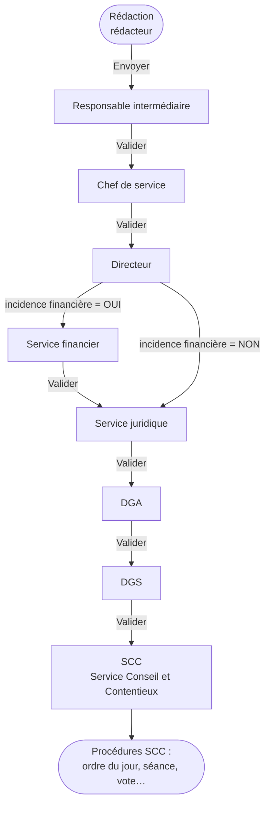
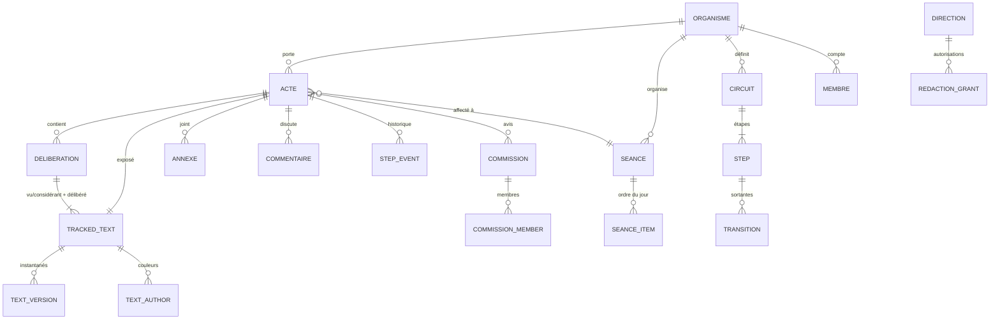

# MANIFEST — VibeDélib : gestion des délibérations

> **Statut : v1.42 — validée le 2026-09-19 (v1.0), mise à jour au fil du développement (voir le journal, section 34).** Le développement démarre par le **lot 0** (voir `LOT0.md`) ; toute évolution du périmètre passe par ce manifeste (journal en section 34).
> Chaque exigence porte un identifiant (`CRE-03`, `CIR-12`…) pour pouvoir être référencée dans les tickets et les tests.
> Tout ce qui est **hypothèse** est marqué `[H]` ; tout ce qui attend une réponse est renvoyé vers la section 32 (`Q29`, `Q33`…). Les décisions déjà prises sont en section 0.

Sources analysées pour ce document :

| Source | Apport |
|---|---|
| `workflow.png` | circuit de validation documentaire cible |
| `rubriquess.png`, `rubrique 2.png`, `rubrique 3.png`, `natures.png` | listes complètes de rubriques et de natures d'AirsDelib |
| `SL-DOC-API.pdf` | documentation de l'API S²LOW v5.1 du 05/02/2025 (chapitre 4, module ACTES) |
| `Tuto AirsDelib v6 Final.pdf` | parcours actuel de création d'une délibération (logiciel à remplacer) |
| `matieres.txt` | nomenclature des matières (193 lignes, 4 niveaux) |
| `GUIDE_NOUVELLE_APP_VILLE.md` | stack, PostgreSQL, API APM, API Hub DSI, bonnes pratiques |
| `C:\dev\appdsi` — module `transcriptmanager` | principe de suivi des modifications (à reprendre), palette d'auteurs, brouillons |
| `C:\dev\appdsi` — modules `rh`, `ville`, `parapheur` | référentiel RH, élus, signature électronique (phase ultérieure) |

---

## 0. Décisions validées

| # | Décision | Où |
|---|---|---|
| **D0** | **Aucun import/export Word.** Tout se rédige et se modifie **en ligne** dans le navigateur. | 11, 12 |
| **D1** | Les **rubriques** sont une liste thématique de **40 valeurs** (fournie, complète). | 7.4 |
| **D2** | Mise en page = **PDF de fond de page paramétrable** : un seul, ou **un pour la première page et un pour les suivantes**. Option A (fond PDF + gabarit HTML/CSS) retenue sauf objection. | 12 |
| **D3** | **Titulaires** (chef de service, directeur, DGA, DGS, groupes) et lien direction → DGA **paramétrés à la main**. | 9.4 |
| **D4** | L'étape **Responsable intermédiaire** est **optionnelle**. | 9 |
| **D5** | **1 dossier → 1 exposé → n délibérations.** | 7, 11 |
| **D6** | **Natures** = les 6 valeurs fournies (nomenclature ministérielle). | 7.4 |
| **D7** | Chaque **conseil a une date limite de rédaction** ; **système complet de notifications et de relances**. | 16, 22 |
| **D8** | Après la date limite de rédaction : **blocage**, levé par une **dérogation** du SCC ou d'un supérieur (DGS). | 22.1 |
| **D9** | **Paliers de relance et d'escalade proposés par défaut**, tous paramétrables. | 22.3 bis |
| **D10** | **Chaque délibération a son numéro** ; le **SCC définit l'ordre de passage** par glisser-déposer. | 16.2 |
| **D11** | **Cahier de séance** unique, prêt à imprimer. | 16.3 |
| **D12** | **Multi-organismes** (Ville, CCAS…) : élus/administrateurs **par organisme** (API ou saisie manuelle), **agents communs et tous identifiés**, **workflow propre à chaque organisme**. | 5 |
| **D13** | **Espace élus** : frontend dédié **en DMZ** ; consultation avant et pendant la séance ; **annotations partageables** (groupe, un élu). | 18 |
| **D14** | **Convocation des élus** et **mise à disposition** des projets d'actes. | 17 |
| **D15** | **Post-conseil** : saisie des votes, texte adopté, registre ; **préparation de l'envoi au contrôle de légalité via l'API S²LOW** (préparation puis confirmation par défaut). | 19 |
| **D16** | **Moteur de recherche interne** des actes passés (plein texte, dates, rapporteur, thématique…). | 20 |
| **D17** | **Assistant IA** en 4 niveaux (simple, complexe, expert, propositions) via l'**IA interne**. | 21 |
| **D18** | **Numérotation par séance** (le compteur repart à chaque séance) ; le **format est entièrement personnalisable**. | 16.2 |
| **D19** | **Pas de signature électronique pour le moment** : le mécanisme est prévu (`SignaturePort`, statuts optionnels), non branché. L'acte est transmis sans signature. | 19.4 |
| **D20** | **Pas encore d'accès à l'API S²LOW** : développement d'après la spécification avec un **simulateur**, puis branchement ; l'authentification se fait par **certificat P12**. | 19.5 |
| **D21** | **IA : elle propose, l'agent valide toujours.** Usage autorisé sur les actes avant le vote. | 21 |
| **D22** | **CCAS** : agents identifiés dans l'**AD** ; **leur organisme se déduit de leur direction** dans l'organisation du Hub DSI (`/api/directions-services`) ; **membres non élus saisis à la main**. | 5 |
| **D23** | **DMZ** : domaine, port et pare-feu **paramétrés ultérieurement** (variables d'environnement, rien en dur). | 18.1 |
| **D24** | **L'interface graphique est conçue avec Stitch** ; le manifeste fixe les comportements, Stitch fixe l'apparence. Livraison : HTML exporté + captures + jetons de design dans `design/` (23.1). | 23.1 |
| **D25** | **Un valideur peut déléguer ses décisions lui-même** (portée, durée, droits transmis, révocation), avec traçabilité « par X, délégué de Y ». | 9.5 |
| **D26** | **Circuit** : un refus peut viser **n'importe quelle étape antérieure** ; la **reprise (directe ou complète) est choisie par le refuseur** ; le circuit est **modifiable par l'administrateur et par le SCC** ; un **Vœu suit le même circuit** qu'une délibération. | 9 |
| **D27** | **Séance visée** proposée par le rédacteur, **modifiable par la hiérarchie** ; le SCC fait l'affectation définitive à l'ordre du jour. | 7.2, 16 |
| **D28** | **Visibilité et droits** : personnes du circuit ; **brouillon visible du service du rédacteur** ; droits de rédaction accordés par le responsable de service **pour son service** ; un rédacteur autorisé hors de sa direction **choisit le service porteur**. | 8, 10 |
| **D29** | **Toutes les commissions sont « pour avis »** (0 à n) ; un acte peut être **hors commission**. | 15 |
| **D30** | **Acceptation / rejet modification par modification** : fonction **disponible et paramétrable**. | 11 |
| **D31** | **Titulaires** saisis par l'**admin** et par le **directeur / chef de service** pour leur périmètre. | 9.4 |
| **D32** | **Dérogation** après la date limite de rédaction : **SCC + DGS** (liste paramétrable). | 22.1 |
| **D33** | **Délégation** : co-détention (le délégant garde ses droits), **DGS non déléguable**, délégué = tout agent actif de l'organisme, **pas de sous-délégation**. | 9.5 |
| **D34** | **CCAS** : circuit court de 3 à 4 étapes, **défini avec le CCAS** au moment du paramétrage (aucun impact sur le développement). | 5 |
| **D35** | **Le développement commence par le backend seul** (API documentée Swagger, tests) ; le **frontend démarre quand les maquettes Stitch sont terminées**. Stitch peut être consulté par le navigateur de l'utilisateur (Chrome), en lecture. | 28, 23.1 |
| **D36** | **Ports par défaut** : backend **3021**, frontend **5160**, espace élus en DMZ **5161** ; schéma PostgreSQL **`ivrydelib`**. | 3, 30 |
| **D37** | **Tutoriel de première connexion**, ludique, propre à chaque profil, conçu dans Stitch (23.2). | 23.2 |
| **D38** | **Développement lancé le 2026-09-19** : backend d'abord ; le frontend suit **dès que l'accès à Stitch est établi** (D35). | 28 |

---

## 1. Vision

Remplacer AirsDelib (Digitech) par un outil **web, ergonomique et paramétrable** qui couvre le cycle de vie d'un acte destiné au Conseil municipal, en commençant par la **rédaction collaborative et sa validation hiérarchique**, puis en s'étendant aux commissions, aux séances, et plus tard au vote, à la signature et à la télétransmission.

### Objectifs

- **O1** — Un rédacteur crée et rédige un acte **entièrement dans le navigateur**, sans aller-retour Word.
- **O2** — Tout le monde voit **ce qui a été modifié, par qui, quand**, à chaque étape (suivi des modifications coloré par auteur).
- **O3** — Le circuit de validation est **exécuté et tracé par le logiciel** (valider / demander une modification), avec notifications.
- **O4** — Les commissions et les conseils municipaux sont gérés (calendrier, mise à disposition, avis, ordre du jour).
- **O5** — L'outil est **multi-organismes** (Ville, CCAS…) et **adaptable à d'autres communes** : tout ce qui est propre à un organisme est de la configuration, jamais du code.
- **O6** — Les élus consultent, annotent et partagent leurs dossiers dans un **espace dédié en DMZ** et reçoivent leur **convocation** dématérialisée.
- **O7** — Après la séance : **votes, texte adopté, registre**, puis **préparation de l'envoi au contrôle de légalité via S²LOW**.
- **O8** — Retrouver un acte passé par **recherche plein texte** ou par critères.
- **O9** — Aider à rédiger par une **assistance IA** (français, style, contrôle des visas et considérants) sans jamais décider à la place de l'agent.

### Non-objectifs du premier développement

Le **premier lot de développement** couvre la rédaction et le circuit. Tout le reste est **déjà spécifié** (sections 16 à 21) et livré par lots (section 28) : commissions et séances, convocation, espace élus, votes et post-séance, télétransmission S²LOW, recherche, IA ; la **signature électronique est reportée** (mécanisme prévu). Restent **hors périmètre** : publication, recueil des actes administratifs et archivage (points d'accroche prévus).

### Principes directeurs

1. **Ergonomie d'abord** : un seul écran de dossier, un bouton d'action explicite, zéro icône cryptique.
2. **Transparence** : quiconque participe au circuit d'un acte le voit dès sa création.
3. **Traçabilité** : rien n'est écrasé ; tout changement est un événement horodaté et attribué.
4. **Paramétrable par défaut** : circuits, référentiels, champs, délais, libellés, gabarits.
5. **Référentiels maîtrisés ailleurs = lecture seule** (RH, AD, élus : Hub DSI/APM). On ne les recopie pas, on les met en cache.
6. **Aucun secret, aucune URL en dur** : tout passe par `.env` (règle impérative du guide, §1.1).

---

## 2. Constat sur AirsDelib v6 (ce qu'on garde, ce qu'on corrige)

Lu dans le tutoriel de formation (18 pages).

| Constat AirsDelib | Décision VibeDélib |
|---|---|
| Un « rapport » est **créé à l'intérieur d'une séance** (fil d'Ariane *Séances > CM du 22/02/2024 > Création*). | La séance est **optionnelle à la création** (séance visée) ; c'est le SCC qui affecte. |
| 5 onglets à parcourir dans l'ordre : Fiche → **enregistrer** → Commissions → Rapport et Délibérations → Annexes → Commentaires. | **Un seul écran** avec sections ; commissions choisies dans la fiche. |
| Exposé des motifs et délibération = **fichiers Word** à télécharger, éditer, **ne pas renommer**, ne pas changer la police, fermer, puis **re-téléverser** (icône « planète »). | Éditeur intégré, mise en forme minimale, **mise en page automatique** au rendu. |
| Une délibération = **deux fichiers** : « Vu et considérant » et « Délibéré ». | Deux zones de texte dans la même vue (les deux sont suivies). |
| Un rapport peut contenir **plusieurs projets de délibération** (« Ajouter délibération »). | On garde : **1 dossier → 1 exposé → 1..n délibérations** (décision D5). |
| Champs *Numéro de suivi* (« Dossier 7771 »), *Organisation*, *Rapporteur*, *Rapporteur complémentaire*. | Repris. Organisation = **déduite du rédacteur** (et choix si droit étendu). |
| **Champs paramétrables** : Rubrique\*, Incidence financière\*, Date de publication *(réservé SCC)*, Date d'AR Préfecture *(réservé SCC)*, Classement ODJ *(réservé SCC)*. | Moteur de **champs personnalisés** avec droits de saisie **par rôle et par étape**. |
| Commissions : liste déroulante (*Hors commission*, *La Ville qui débat*, *La Ville en transition*, *La Ville qui émancipe*, *La Ville solidaire*). | Multi-sélection ; « hors commission » = aucune sélection, affiché explicitement. |
| Annexes : nom, type d'annexe, type de pièces complémentaires, ordre. | Repris (titre, type, ordre) + PDF uniquement (glisser-déposer). |
| Commentaires : titre **et** description obligatoires, visibles de tous les acteurs du circuit. | Repris ; titre facultatif, **fil de discussion**, mentions. |
| Envoi au circuit par une **coche verte** ; icônes disquette / flèches vertes-rouges non explicites. | Boutons libellés : « Valider et envoyer à *Prénom Nom (Directeur)* ». |
| Liste « Rapports en cours » avec étape, titre, n° de suivi, organisation, et **traitement par lot**. | Repris : **validation par lot** (tableau de bord). |
| Menu : Séances · Recherche · Avancement · Documents · Convocation · Télétransmission · Parapheur. | Mêmes grandes fonctions, activées par phases. |
| Connexion avec login Windows, **sensible à la casse** (`MDupont`). | AD via APM, **insensible à la casse**. |
| Sélecteur « agir en tant que » dans l'en-tête. | Délégations explicites et tracées (CIR-30). |
| Périmètre AirsDelib exact (modules, exports, ODJ, convocations, PV…). | **À confronter** : je n'ai que le tuto de rédaction ; demander captures ou CR de formation des autres modules (Q22). |

---

## 3. Contexte technique imposé (guide « Nouvelle app Ville »)

- **Backend** : Node.js + Express 5, CommonJS, modulaire (`modules/<domaine>/{controller,routes,service,repository}.js`), fichiers < ~300 lignes.
- **Frontend** : React 18 + TypeScript strict + Vite + Tailwind + `react-router-dom`, `axios`, `lucide-react`, `framer-motion`.
- **Base** : PostgreSQL partagé de la Ville (`ivry_admin`), **un schéma dédié** (proposé : `ivrydelib`), tables préfixées, requêtes paramétrées `$1…`, migrations numérotées, `TIMESTAMPTZ`, fuseau `Europe/Paris`, UTF-8.
- **Trois jetons séparés** : `APM_API_KEY` (X-API-KEY, services transverses), `HUBDSI_API_KEY` (`dsk_…`, données Ville), JWT applicatif propre. Aucun côté frontend.
- **API** : préfixe `/api/v1`, Swagger `/api-docs`, `GET /api/status`, pagination `limit/offset`, erreurs `{ error }`.
- **Déploiement** : Docker Compose (backend + frontend), `restart: always`, ports **propres** (hors 3001/5173-5177 déjà pris par appdsi) : **backend 3021, frontend 5160, DMZ 5161** (D36), reverse-proxy HTTPS.
- **Divergences à noter** : appdsi utilise React 19 et du CSS inline ; le guide impose React 18 + Tailwind → **on suit le guide** (Q24).
- **Espace élus en DMZ** : conteneur distinct sur le modèle de `C:\dev\appdsi\parapheur-dmz` (front minimal + nginx à liste blanche vers un seul port du backend LAN) ; section 18.
- **Multi-organismes** : une installation, plusieurs organismes (Ville, CCAS…), annuaire d'agents commun ; section 5.

### Services externes réutilisés (jamais réimplémentés)

| Besoin | Source | Détail |
|---|---|---|
| Authentification agents | APM `POST /api/v1/ad/authenticate` (`ad_auth`) | puis JWT applicatif |
| Recherche/identité AD | APM `GET /api/v1/ad/search`, `/ad/user` | `ad_search`, `ad_read` |
| Lien RH (matricule, poste, direction, service) | APM `POST /api/v1/oracle/query` (`oracle_query`) **ou** Hub DSI | tables `oracle.rh_*` lues côté Hub ; les titulaires sont saisis à la main (D3, CIR-25) ; RH = suggestion |
| Organisation (direction → service → secteur) | Hub DSI `GET /api/admin/rh/services-tree` (19 directions, dont `J = DIRECTION CCAS`) et `/api/admin/rh/organisation-chart` (avec responsables) — **accessibles en clé `dsk_`, vérifié**. ⚠ `/api/directions-services` **n'est pas** l'organigramme (liste dérivée des réunions) : non utilisé | source RH SIIM `rh_siim_organigramme_v2` ; les codes commençant par `$` sont des placeholders ignorés |
| Agents et organisation RH | **Hub DSI**, clé `dsk_` : `/api/admin/rh/services-tree`, `/api/admin/rh/organisation-chart`, `/api/infra/rh-studio/agents/search`, `/api/infra/agents/presence` | **vérifié au spike du lot 0 (Q55 résolue)** ; la direction d'un agent est un **libellé**, résolu en code par l'organigramme ; l'API RH Studio en direct redirige vers une authentification et n'est pas utilisée |
| Élus | Hub DSI `GET /api/ville/elus` | champs : nom, prénom, email, téléphone, rôle, délégation ; **pas** de groupe politique ni de commission |
| Envoi de mail | APM `POST /api/v1/mail/send` (`mail_send`) | le corps est enveloppé dans le gabarit institutionnel ; pied de page en paramètres `footer1..3`, `footerColor` |
| SMS (urgences, option) | APM `POST /api/v1/sms/send` | |
| Signature électronique (phase ultérieure) | module `parapheur` d'appdsi | signataires, OTP mail, certificats, QR de vérification |
| IA interne | APM `POST /api/v1/ai/query`, `GET /api/v1/ai/models`, `query-async` + `query-progress` | clé `X-API-KEY` avec la permission IA (à demander) ; section 21 |
| Télétransmission au contrôle de légalité | **S²LOW**, module ACTES (`SL-DOC-API.pdf` v5.1) | certificat client **P12** (+ login) ; **accès à obtenir** ; section 19.5 |
| Vérification des textes en vigueur (option) | API Légifrance (PISTE, DILA) | IA-31 |

---

## 4. Glossaire et acteurs

| Terme | Définition |
|---|---|
| **Acte / dossier** | Objet suivi dans l'outil : fiche + exposé des motifs + 1..n délibérations + annexes + commentaires. AirsDelib l'appelle « rapport » ou « dossier ». |
| **Exposé des motifs** | Note de présentation (rapport de synthèse) qui accompagne la délibération. |
| **Délibération** | Texte soumis au vote : *Vu / Considérant* + *Délibéré* (dispositif). |
| **Vœu** | Acte exprimant une position sans effet juridique direct (type d'acte distinct). |
| **Circuit** | Suite d'étapes de validation d'un acte. |
| **Étape** | Un poste du circuit tenu par un acteur ou un groupe. |
| **Matière** | Code de la nomenclature ministérielle (ex. `7.5 Subventions`). |
| **Rubrique** | Catégorie thématique de l'acte (ACTION SOCIALE, FINANCES, CULTURE…), obligatoire, reprise dans « OBJET : {rubrique} » du PDF. |
| **Commission** | Instance d'élus qui prend connaissance des projets avant le Conseil (avis). |
| **SCC** | *Service Conseil et Contentieux* (lu sur la capture AirsDelib : « Service Conseil et Contentieux - BB2 ») : dernier maillon du circuit, gère les séances, l'ODJ, la publication. |
| **DGS / DGA** | Direction générale des services / adjoint(e). |
| **Organisme** | Entité gérée dans l'outil : Ville, CCAS… (section 5). |
| **Instance** | Assemblée délibérante d'un organisme : Conseil municipal, Conseil d'administration… |
| **Mise à disposition** | Ouverture d'un dossier à une audience (commission, Conseil) à un instant précis (section 17). |
| **Pouvoir / procuration** | Délégation de vote d'un élu absent à un autre élu (un seul pouvoir par mandataire). |
| **NPPV** | « Ne prend pas part au vote ». |
| **S²LOW / ACTES** | Tiers de télétransmission et protocole de transmission des actes à la préfecture (contrôle de légalité). |
| **ARActe** | Accusé de réception de la préfecture ; sa date devient la « date d'AR préfecture ». |
| **DMZ** | Zone réseau exposée où tourne le frontend des élus, sans base de données ni secret. |

### Rôles applicatifs

| Rôle | Portée | Source |
|---|---|---|
| **Rédacteur** | Tout agent autorisé à rédiger pour une direction | RH + autorisations (section 8) |
| **Valideur** | Détenteur d'une étape du circuit | résolu dynamiquement (CIR-20) |
| **Membre de groupe** | Service financier, Service juridique, SCC… | groupe configuré |
| **Secrétaire de commission** | Saisit les avis, gère l'ODJ de commission | admin commissions |
| **Élu / administrateur** | Consulte, annote et partage les projets mis à disposition (espace DMZ, section 18) | par organisme : Hub DSI, saisie manuelle ou CSV (MOR-07) |
| **Administrateur** | Paramétrage complet, reprise en main d'un dossier | rôle applicatif |
| **Lecteur** | Consultation seule (audit, contrôle) | rôle applicatif |
| **Administrateur de plateforme** | Crée les organismes, paramètres globaux | rôle applicatif (global) |
| **Administrateur d'organisme** | Paramètre son organisme (circuits, référentiels, membres…) | rôle par organisme |
| **Secrétaire de séance** | Élu désigné pour la séance | saisi par le SCC |
| **Télétransmission** | Prépare et confirme l'envoi au contrôle de légalité | rôle par organisme |

### Identité de l'organisme et logo (D50)

- **IDT-01** — Écran **Identité & logo** (administrateur d'organisme) : nom, adresse, complément, code postal, ville, téléphone, e-mail, site web, SIREN, **signataire** et sa qualité.
- **IDT-02** — **Logo** PNG ou JPEG (1,5 Mo au plus, signature vérifiée) : affiché dans l'en-tête de l'application, la page de connexion (avant authentification : point d'accès public ne renvoyant que le nom et le logo de l'organisme par défaut) et comme **icône de l'onglet**.
- **IDT-03** — Dans les **PDF**, option de gabarit `logo` (`auto` par défaut : affiché seulement s'il n'y a pas de PDF de fond ; largeur et alignement réglables) ; les coordonnées sont des **variables de gabarit** (`{organisme}`, `{adresse}`, `{ville}`, `{code_postal}`, `{telephone}`, `{email}`, `{site_web}`, `{signataire}`).

### « Afficher en tant que » (D47)

- **ACT-01** — Menu utilisateur → **« Afficher en tant que… »** (visible de l'administrateur de plateforme, de l'administrateur d'organisme et du SCC) : on choisit un agent par autocomplétion (D48) ; l'application se recharge avec **exactement les droits de cet agent**.
- **ACT-02** — Un **bandeau permanent** (« Vous voyez VibeDélib en tant que… ») rappelle le mode et permet de **revenir à son compte** en un clic ; le mode ne survit pas à la déconnexion.
- **ACT-03** — **Plafonds** : administrateur de plateforme → tout agent ; administrateur d'organisme → agents de ses organismes, **jamais** un administrateur de plateforme ; SCC → agents **ordinaires** de ses organismes (pas d'administrateur, pas de SCC). Pas d'enchaînement de deux « en tant que » ; l'en-tête est ignoré sur les routes d'authentification.
- **ACT-04** — **Traçabilité** : début et fin du mode sont audités (`auth.act_as`, `auth.act_as_end`) ; toute action faite dans le mode est enregistrée avec **le vrai acteur** (`actor`) et l'utilisateur usurpé (`on_behalf_of`) ; les écrans métier montrent l'utilisateur affiché.
- **ACT-05** — Techniquement, chaque requête porte l'en-tête `X-Act-As` ; le serveur **revérifie à chaque requête** que l'appelant a le droit d'agir en tant que cet utilisateur (jamais de confiance dans le client).

### Autocomplétion des agents (D48)

- **AUT-01** — Tout champ « agent » (configuration) est un **champ à autocomplétion** : deux lettres suffisent, recherche par nom, prénom, identifiant ou e-mail, avec ou sans `@`, flèches et Entrée au clavier.
- **AUT-02** — Dans la **discussion** et tout champ de texte libre destiné à des collègues, taper `@` puis des lettres ouvre la liste ; le choix insère `@identifiant`, et la personne est notifiée (règle « mention »).
- **AUT-03** — La liste montre d'abord les agents **déjà connectés**, puis ceux de l'**annuaire RH** (marqués « jamais connecté ») ; l'identifiant proposé est l'**identifiant de connexion** (partie locale de l'e-mail).
- **AUT-04** — Une panne de l'annuaire RH ne bloque pas la recherche : seuls les agents connus localement sont proposés.

### Administration des utilisateurs et des rôles (D41)

- **USR-01** — Écran **Utilisateurs** (administrateur d'organisme ; administrateur de plateforme pour les rôles de plateforme) : recherche d'un agent (annuaire commun + agents déjà connectés), fiche (identité RH, direction, service, dernière connexion), **rôles par organisme** avec ajout / retrait.
- **USR-02** — Rôles gérables : **administrateur de plateforme**, **administrateur d'organisme**, **SCC**, **télétransmission**, **lecteur** ; les fonctions de validation (chef de service, directeur, DGA, DGS) et les groupes restent gérés par l'écran **Titulaires** (D31).
- **USR-03** — Vue **« Accès d'un utilisateur »** : organismes accessibles et pourquoi (rôle, direction rattachée), titulaires et groupes dont il fait partie, autorisations de rédaction, délégations actives.
- **USR-04** — Un administrateur d'organisme ne peut **ni retirer son dernier rôle d'administrateur, ni attribuer** un rôle de plateforme ; l'administrateur de plateforme est protégé contre l'auto-suppression ; toute modification est **auditée** (avant / après).
- **USR-05** — Désactiver un agent (départ) retire ses accès et **déclenche la réaffectation** de ses étapes en cours (CIR-32) ; aucune donnée n'est supprimée.

---

## 5. Multi-organismes (Ville, CCAS…)

Une **seule installation** sert **plusieurs organismes** : la Ville, le CCAS, et d'autres si besoin (caisse des écoles, syndicat…). Chaque organisme a **ses propres instances, séances, élus ou administrateurs, workflows, référentiels, gabarits, numérotation et télétransmission**, tout en **partageant l'annuaire des agents**, qui sont tous identifiés.

| Élément | Portée |
|---|---|
| Identité des agents (AD / RH) | **commune** à tous les organismes (un seul `DirectoryPort`) |
| Rattachement des agents à un organisme | correspondance **direction (Hub DSI) → organisme**, paramétrable (par défaut : Ville) |
| Organisme (nom, SIREN, signataire, logo, vocabulaire) | propre |
| Instances délibérantes et séances (Conseil municipal, Conseil d'administration…) | propres |
| **Élus / administrateurs (membres)** | **propres, avec une source par organisme : API ou saisie manuelle** |
| Groupes politiques, commissions | propres |
| Types d'actes, **circuits (workflow)**, titulaires, SLA, relances | **propres** |
| Référentiels (natures, matières, rubriques, types d'annexes) | **jeu commun par défaut**, surchargeable par organisme |
| Gabarits PDF, numérotation, convocations, délais, quorum | propres |
| Notifications, pied de page des mails, IA (règles, bibliothèque de visas) | propres, avec héritage |
| Télétransmission S²LOW (compte, certificat, SIREN) | **propre** |
| Rôles, autorisations de rédaction | **par organisme** |

- **MOR-01** — Entité **organisme** : code, nom, type (commune, CCAS, autre), SIREN, adresse, logo, couleurs, vocabulaire, fuseau, actif. Créée et désactivée par l'**administrateur de la plateforme** ; l'organisme « Ville » est créé au démarrage.
- **MOR-02** — **Isolation stricte des données** : chaque enregistrement métier porte `organisme_id` ; toutes les requêtes passent par une **couche d'accès unique** qui filtre selon les organismes autorisés de l'utilisateur, avec des **tests automatisés d'étanchéité** ; *Row-Level Security* PostgreSQL en défense supplémentaire `[H]`.
- **MOR-03** — **Rôles par organisme** : administrateur de plateforme (global), administrateur d'organisme, SCC de l'organisme, rédacteur, valideurs (résolus par le circuit)… Un agent peut avoir des rôles dans **plusieurs** organismes ; **aucune visibilité inter-organismes** sans rôle explicite.
- **MOR-04** — **Contexte d'organisme** : sélecteur dans l'en-tête (mémorisé) qui pilote listes, création, droits, vocabulaire et thème ; vue **« tous mes organismes »** pour les tableaux de bord et la recherche.
- **MOR-05** — **Rattachement des agents** : l'identité de tous les agents vient de l'annuaire commun ; l'**organisme d'un acte** est proposé d'après la **direction** du rédacteur (table de correspondance **direction du Hub DSI → organisme**, paramétrée à la main ; le CCAS est une **direction** de l'organisation). Les agents de tous les organismes, CCAS compris, sont dans l'AD (D22) ; un agent autorisé dans plusieurs organismes **choisit l'organisme** à la création. Les droits de rédaction (section 8) sont **par organisme et par direction**.
- **MOR-06** — **Workflow propre à chaque organisme** : circuits, étapes, titulaires, SLA, règles de relance et droits par étape sont définis **par organisme**, avec l'éditeur de circuit (CIR-60 à 69) ; **import / export** entre organismes (CIR-67) pour partir d'un modèle. Modifier le circuit du CCAS n'a **aucun effet** sur celui de la Ville.
- **MOR-07** — **Membres des instances (élus, administrateurs)** : **source paramétrable par organisme** — **(a) API Hub DSI** (`/api/ville/elus`, cas de la Ville), **(b) saisie manuelle** (cas du CCAS), **(c) import CSV**. Entité `membre` : personne, organisme, instance, fonction, type (*élu* ou *nommé / personne qualifiée*, le conseil d'administration d'un CCAS comprenant des non-élus), dates de mandat, source, identifiant externe. Les **données locales** (groupe politique, commissions, mode de convocation, mobile) forment une **surcouche jamais écrasée** par la synchronisation ; les écarts sont signalés à l'administrateur.
- **MOR-08** — **Personne unique** : une personne qui siège dans plusieurs organismes (conseillère municipale et administratrice du CCAS) a **une seule identité et un seul compte** dans l'espace élus, avec bascule d'organisme ; rapprochement par e-mail ou manuel.
- **MOR-09** — **Vocabulaire par organisme** : « Conseil municipal / Conseil d'administration », « Maire / Président·e », « conseiller / administrateur », « délibération / décision »…
- **MOR-10** — **Référentiels avec héritage** : natures, matières, rubriques, types d'annexes et types d'actes existent en **jeu commun** ; chaque organisme peut **hériter, désactiver, renommer ou ajouter** des valeurs (ex. rubriques d'action sociale pour le CCAS) sans toucher aux autres.
- **MOR-11** — **Paramètres hiérarchiques** : plateforme → organisme → instance ou type d'acte ; la valeur **la plus spécifique l'emporte** ; l'écran d'administration indique l'**origine** de chaque valeur (« hérité de : plateforme »).
- **MOR-12** — **Instances par organisme** : instances délibérantes, séances, commissions, délais de convocation, règles de quorum, gabarits de convocation, de registre et de cahier.
- **MOR-13** — **Numérotation et registres séparés** par organisme (et par instance).
- **MOR-14** — **Télétransmission par organisme** : compte S²LOW, certificat, SIREN, département, arrondissement, mode A/B et classification importée propres (TLT-13).
- **MOR-15** — **Marque et mails** : logo, couleurs, pied de page (`footer1..3`, `footerColor` d'APM) et gabarits de mails propres à l'organisme.
- **MOR-16** — **IA** : règles de contrôle et **bibliothèque de visas** par organisme (le CCAS relève notamment du code de l'action sociale et des familles).
- **MOR-17** — **Recherche et statistiques** filtrées par organisme, avec **facette « organisme »** et recherche transverse pour qui a des droits sur plusieurs.
- **MOR-18** — **Actes liés** : un acte appartient à **un seul organisme** ; un **lien** vers un acte d'un autre organisme (ex. convention Ville–CCAS) est possible, sans partage de contenu `[H]` (Q51).
- **MOR-19** — **Création d'un organisme** guidée : assistant (organisme, instance, membres, circuit à partir d'un modèle, gabarits, numérotation, S²LOW) et **duplication** de la configuration d'un organisme existant.
- **MOR-20** — Héberger des organismes d'**une autre collectivité avec un annuaire distinct** est **hors périmètre** de cette phase (l'architecture en `DirectoryPort` le permettrait plus tard) `[H]` ; une autre commune déploie sa propre installation.

---

## 6. Périmètre fonctionnel — vue d'ensemble

```
Paramétrage ──► Création d'un acte ──► Rédaction (exposé + délibération(s) + annexes)
                                           │  aperçu à tout moment
                                           ▼
                             Circuit de validation (suivi des modifications)
                                           │
                                           ▼
                        Validation DGS ► SCC ► Mise à disposition commission(s) ► avis
                                                                │
                                                                ▼
                                           Inscription à l'ordre du jour d'un Conseil municipal
                                           (SCC : classement et numérotation)
                                                                │
                                                                ▼
                        Convocation des élus ► Mise à disposition (espace élus en DMZ, annotations)
                                                                │
                                                                ▼
                        Séance : présences, votes ► Texte adopté ► Signature ► Contrôle de légalité (S²LOW)
                        (Cahier de séance · Recherche des actes passés · Assistant IA · Multi-organismes)
```

---

## 7. Création d'un acte

### 7.1 Types d'actes (paramétrable — `ref_types_acte`)

Valeurs initiales : **Délibération**, **Vœu**. Chaque type porte : son **circuit par défaut**, ses **composants obligatoires** (exposé oui/non, nb de délibérations, annexes), ses **champs personnalisés** et son **gabarit de mise en page**. Un **Vœu suit le même circuit** qu'une délibération par défaut (D26) ; le circuit reste modifiable par type d'acte.

### 7.2 Champs de la fiche

| Champ | Type | Obligatoire | Source / règle |
|---|---|---|---|
| Numéro de suivi | auto | — | séquence (`Dossier 7771`), attribué à la création |
| Type d'acte | liste | oui | `ref_types_acte` |
| **Rédacteur** | agent | auto | utilisateur connecté (AD) |
| **Direction porteuse** | liste | oui | **déduite du rédacteur** ; choix seulement s'il a plusieurs droits (DRO-03) |
| Service | liste | oui | service du rédacteur si dans la direction ; sinon à choisir |
| Titre / objet | texte | oui | |
| **Nature** | liste | oui | 6 valeurs fournies (7.4), pré-remplie selon le type d'acte (« Délibérations ») |
| **Matière** | arbre | oui | nomenclature importée depuis `matieres.txt` (section 7.3) |
| **Incidence financière** | oui / non | oui | **pilote le circuit** (CIR-15) ; optionnel : montant, imputation |
| **Rubrique** | liste | oui (comme AirsDelib) | liste thématique fournie (7.4) |
| **Élu rapporteur** | élu | oui | Hub DSI ; suggestion par direction (table de tutelle, CRE-06) |
| Élu rapporteur complémentaire | élu | non | repris d'AirsDelib |
| **Commission(s) pour avis** | multi | non | 0..n ; 0 = « hors commission » |
| **Séance visée** | séance | recommandée pour un acte destiné au Conseil | **proposée par le rédacteur**, **modifiable par tout valideur de la hiérarchie** ; le SCC fait l'affectation définitive à l'ordre du jour (D27) |
| Urgence / date limite | drapeau + date | non | déclenche un suivi renforcé |
| Confidentialité | liste | non | ex. huis clos ; filtre la visibilité `[H]` |
| **Exposé des motifs** | texte suivi | selon type | section 11 |
| **Délibération(s)** | texte suivi ×2 | selon type | *Vu et considérant* + *Délibéré* |
| **Annexes** | PDF | non | section 13 |
| **Commentaire** | fil | non | section 14 |
| Champs *réservés SCC* | date, date, entier | non | date de publication, date d'AR préfecture, classement ODJ (droits par rôle, CRE-08) |
| Champs personnalisés | divers | selon config | section 25 |

- **CRE-01** — La création n'exige que : type, titre, matière, incidence financière (le reste peut être complété avant l'envoi au circuit). Un brouillon est enregistré automatiquement.
- **CRE-02** — Un **contrôle de complétude** (« Il manque : élu rapporteur, exposé des motifs ») bloque le bouton « Envoyer au circuit ».
- **CRE-03** — La direction est **déduite de l'identité RH** du rédacteur, jamais saisie à la main dans le cas standard.
- **CRE-04** — Action **Dupliquer** un acte existant (reprise d'une délibération antérieure).
- **CRE-05** — Action **Abandonner / retirer** un acte (motif obligatoire, réversible par l'admin, jamais de suppression physique).
- **CRE-06** — Table `direction → élu(s) de tutelle` (paramétrable) pour **pré-remplir** le rapporteur.
- **CRE-07** — Le n° de suivi est attribué à la création ; le **n° de délibération définitif** est attribué plus tard (SCC/séance) selon un motif configurable (`{ANNEE}-{SEANCE}-{ORDRE}`).
- **CRE-08** — Chaque champ a une matrice de droits `(rôle × étape) → lecture / écriture / masqué` ; les champs « réservés SCC » sont en écriture uniquement au SCC.
- **CRE-09** — **Séance visée** : le rédacteur la propose ; le chef de service, le directeur et les autres valideurs peuvent la **modifier** pendant le circuit (motif facultatif, changement tracé et notifié au rédacteur). Tout changement **recalcule** les jalons et les rappels (NOT-05) et reste soumis au blocage après la date limite de rédaction (NOT-04).

### 7.3 Nomenclature des matières (`matieres.txt`)

Le fichier reprend la **nomenclature ministérielle des matières** utilisée pour le contrôle de légalité (9 domaines, jusqu'à 4 niveaux : `1.1.2.1 fournitures`).

- **MAT-01** — Import **idempotent** depuis le fichier : code = ce qui précède le premier espace ; parent = code tronqué au dernier point ; niveau = nombre de segments.
- **MAT-02** — **Tri numérique** par segment (le fichier place `1.2.1.10` avant `1.2.1.2`, ordre lexicographique erroné).
- **MAT-03** — Correction possible du libellé sans casser le code ; le code exporté vers une future télétransmission est normalisé (`1.1.2.1` → `1-1-2-1`) `[H]`.
- **MAT-04** — Sélection en **arbre** avec recherche plein texte ; par défaut **feuilles uniquement** (les nœuds ayant des enfants ne sont pas sélectionnables) ; réglable.
- **MAT-05** — La nomenclature est **versionnée** (les actes existants conservent le code d'origine si un nœud est désactivé).
- **MAT-06** — Anomalies relevées dans le fichier : coquille « pourvoirs de police » (6), « Domaines de competences » sans accent, absence d'accents généralisée ; correction proposée à l'import, validée par l'admin.
- **MAT-07** — **Classification de la préfecture** : le `classification.xml` récupéré par S²LOW (natures, matières sur 5 niveaux, types de pièces) est la **référence** pour la télétransmission ; il est **rapproché automatiquement** de `matieres.txt` (codes manquants, libellés divergents, matières supprimées) et les écarts sont soumis à l'administrateur (TLT-04).

### 7.4 Référentiels initiaux fournis

**Natures** (`natures.png`, ce sont les natures de la nomenclature ministérielle utilisée pour la transmission au contrôle de légalité) :

`Délibérations` · `Actes réglementaires` · `Actes individuels` · `Contrats, conventions et avenants` · `Documents budgétaires et financiers` · `Autres`

- **REF-01** — Chaque nature porte un **code** issu de la **classification de la préfecture** (import S²LOW, TLT-04) et un statut actif/inactif ; éditable en administration, avec héritage et surcharge par organisme (MOR-10).
- **REF-02** — Le type d'acte « Délibération » pré-sélectionne la nature « Délibérations ».

**Rubriques** (`rubriquess.png`, `rubrique 2.png`, `rubrique 3.png` — liste complète, 40 valeurs) :

`ACTION SOCIALE` · `ASSURANCES` · `CITOYENNETÉ` · `COMMERCE` · `COMMUNICATION` · `CONTENTIEUX` · `COOPÉRATION INTERNATIONALE` · `CULTURE` · `DÉLÉGATION DE SERVICE PUBLIC` · `DISPOSITIONS ORGANIQUES` · `ENFANCE` · `ENSEIGNEMENT` · `ENVIRONNEMENT` · `ÉQUIPEMENTS PUBLICS` · `ESPACES PUBLICS` · `ÉTAT CIVIL` · `FINANCES` · `GESTION FONCIÈRE` · `GRAND PARIS` · `INTENDANCE GÉNÉRALE` · `INTERCOMMUNALITÉ` · `JEUNESSE` · `LOGEMENT` · `NOUVELLES TECHNOLOGIES` · `OBSERVATOIRE LOCATIF` · `PERSONNEL` · `PETITE ENFANCE` · `POLITIQUE DE LA VILLE` · `PRÉVENTION` · `RÉGIE PUBLIQUE DE L'EAU` · `RELATIONS PUBLIQUES` · `RESSOURCES HUMAINES` · `SANTÉ` · `SÉCURITÉ PUBLIQUE` · `SPORTS` · `SYNDICATS INTERCOMMUNAUX` · `URBANISME` · `VACANCES` · `VIE ASSOCIATIVE` · `VŒU`

- **REF-06** — Une rubrique « VŒU » existe déjà : elle ne remplace pas le **type d'acte** « Vœu » (Q17).

- **REF-03** — Liste **plate**, triée alphabétiquement sans tenir compte des accents, éditable (ajout, renommage, désactivation sans perte des actes existants).
- **REF-04** — La rubrique est rendue dans l'en-tête du document (« OBJET : {rubrique} »).
- **REF-05** — Import/export CSV de tous les référentiels.

---

### 7.5 Copie d'une délibération assistée par l'IA (D40)

- **CPY-01** — Depuis un acte existant (de n'importe quelle séance passée, y compris archivé), « **Copier pour un nouveau dossier** » crée un **brouillon** (fiche, exposé, visas, dispositif ; annexes en option) : c'est la copie simple, sans IA.
- **CPY-02** — Option « **Adapter au nouveau contexte avec l'IA** » : l'agent décrit le contexte (nouvel objet, bénéficiaire, montant, dates, différences) ; l'IA renvoie une **liste de propositions** (texte à remplacer → texte proposé, avec la raison), par texte du dossier.
- **CPY-03** — **L'IA propose, l'agent valide** (D21) : chaque proposition s'accepte, se refuse ou s'édite ; l'acceptation applique le remplacement dans le texte du brouillon ; **rien n'est appliqué automatiquement**. Les propositions et décisions sont conservées (`ai_suggestions`).
- **CPY-04** — L'IA signale aussi les **éléments à vérifier** (montants, dates, noms propres, références de textes, séance) qu'elle n'a pas pu adapter ; ils s'affichent comme alertes, jamais comme modification.
- **CPY-05** — Le contenu envoyé à l'IA passe par le **port `AiPort`** (API IA interne de l'APM) ; aucune donnée ne quitte l'infrastructure de la Ville ; si l'IA est indisponible, la copie simple reste possible.

## 8. Droits de rédaction (règle validée)

> Par défaut, un agent peut rédiger un acte **pour sa direction**. Pour chaque direction, on peut **autoriser d'autres agents d'autres directions** à rédiger. Ces autorisations sont gérées par le **responsable de service**, le **directeur**, ou l'**administrateur** du logiciel.

- **DRO-01** — **Droit par défaut** : tout agent actif (RH) rattaché à la direction D peut créer un acte *pour D*.
- **DRO-02** — **Autorisation étendue** : un agent A (direction X) peut être autorisé à rédiger pour la direction D (≠ X). Enregistrement : `(direction, agent, accordé_par, date, expiration?, motif?, révoqué?)`.
- **DRO-03** — Un agent qui a plusieurs droits choisit la **direction porteuse** à la création (défaut : sa propre direction). **Le circuit est résolu à partir de la direction porteuse**, pas de la direction d'origine du rédacteur (le chef de service, le directeur et le DGA sont ceux de D).
- **DRO-04** — Qui peut accorder/révoquer :
  - le **directeur** de D (toute la direction) ;
  - le **responsable de service** (limité à son service, D28) ;
  - l'**administrateur** (toutes directions).
  Les quatre autres profils ne voient pas l'écran.
- **DRO-05** — Granularité paramétrable : autorisation au niveau **direction** (défaut) ou **service** ; durée illimitée ou **bornée** (date de fin).
- **DRO-06** — Écran **« Autorisations de rédaction »** : liste par direction, recherche d'un agent (AD/RH), ajout/retrait, historique. Un directeur ne voit que sa direction.
- **DRO-07** — Les autorisations sont **auditées** (qui a accordé quoi à qui, quand) et **notifiées** à l'agent autorisé et au directeur concerné.
- **DRO-08** — Si le service de rattachement n'existe pas dans D (agent extérieur), le rédacteur **choisit le service porteur** de D (confirmé, D28) ; c'est celui-ci qui détermine le chef de service du circuit.
- **DRO-09** — Un agent dont la fiche RH devient inactive **perd** ses droits par défaut ; ses autorisations étendues sont suspendues et signalées à l'administrateur. Ses actes en cours restent lisibles et **réaffectables** (CIR-32).
- **DRO-10** — Paramètre de collectivité : politique de base `direction` (défaut) | `service` | `explicite-seulement`.
- **DRO-11** — Les droits de rédaction, les rôles et les titulaires sont **propres à chaque organisme** (section 5, MOR-05).

---

## 9. Circuit de validation

### 9.1 Circuit par défaut (repris de `workflow.png`)



Retours (« Demande de modification »), tels que dessinés : Chef de service → Responsable intermédiaire ; Directeur → Chef de service ; DGA → Directeur ; DGS → DGA. **Généralisation demandée** : à *toute* étape, valider **ou** refuser, en revenant à **l'étape précédente** ou à **la première** (le rédacteur).

### 9.2 Moteur de circuit

Le circuit est une **donnée**, pas du code : `circuit_definitions → circuit_steps → circuit_transitions`.

- **CIR-01** — Un circuit est rattaché à un **organisme** (section 5, MOR-06) et à un **type d'acte** (surcharge possible par direction ou par commission). Plusieurs versions ; un acte en cours garde la version avec laquelle il a démarré.
- **CIR-02** — Une étape définit : libellé, **résolveur de valideur** (CIR-20), **mode** (un seul valideur du groupe / tous / quorum), actions permises, **droit de modifier le texte** (oui/non), champs éditables, délai cible (SLA), possibilité d'**être sautée**.
- **CIR-03** — Une transition définit : étape source, action (`valider`), étape cible, **condition** optionnelle (prédicat sur les champs : `incidence_financiere = oui`, `montant > 50000`, `type = voeu`, `commission ≠ ∅`…).
- **CIR-04** — Les étapes actuelles (8) ne sont qu'un **jeu de données initial** : le circuit est **entièrement modifiable par l'**administrateur d'organisme et par le SCC** depuis l'interface** (section 9.6 bis), sans intervention technique ni redéploiement.
- **CIR-05** — Étapes **parallèles** possibles (ex. financier et juridique en même temps) : jonction « tous validés ». Défaut Ivry : séquentiel comme sur le schéma.

### 9.3 Actions

| Action | Effet | Conditions |
|---|---|---|
| **Valider** | l'acte passe à l'étape suivante (transition évaluée) ; notification du nouveau valideur | complétude (CRE-02) |
| **Refuser → étape précédente** | retour au dernier valideur/étape **réellement traversé** | motif obligatoire |
| **Refuser → première étape** | retour au rédacteur | motif obligatoire |
| **Refuser → étape au choix** | retour à **n'importe quelle étape antérieure** du parcours | motif obligatoire ; désactivable (CIR-13) |
| **Reprendre** | l'acte revient à l'étape qui a refusé (voir CIR-11) | après re-soumission |
| **Retirer / abandonner** | statut terminal réversible | rédacteur, DGS, admin |
| **Réaffecter** | change le valideur (absence, départ) | admin, directeur |

- **CIR-10** — « Étape précédente » est calculée à partir de l'**historique réellement parcouru**, pas du graphe statique (ex. après le Service juridique, la précédente est le Service financier **ou** le Directeur selon l'incidence financière).
- **CIR-11** — **Reprise après refus, au choix du refuseur** (D26) : à **chaque refus**, le refuseur choisit `direct` (l'acte revient **directement à l'étape qui a refusé**, sans repasser par les étapes intermédiaires) ou `complet` (l'acte repasse par **tout le circuit**). Une valeur par défaut est présélectionnée (paramétrable par type d'acte), mais **le refuseur tranche**. Avec `direct`, l'étape refuseuse reçoit un **rappel visuel des modifications** faites depuis son refus.
- **CIR-12** — Le **motif de refus est obligatoire**, saisi dans le fil de commentaires et visible de tous (section 14).
- **CIR-13** — Le refus peut viser **n'importe quelle étape antérieure** du parcours ou la première (D26). Ces options restent **désactivables** par paramètre, par type d'acte.
- **CIR-14** — Un changement de champ **pilotant le circuit** (incidence financière) après une étape déjà franchie **recalcule** le chemin restant et prévient les acteurs concernés (« Le Service financier est ajouté au circuit »).
- **CIR-15** — Incidence financière = `oui` → passage obligatoire par le **Service financier** avant le **Service juridique** ; `non` → direct au juridique.
- **CIR-16** — L'étape « Rédaction » (dite **étape 0**) est celle du rédacteur : il peut modifier librement, ajouter des annexes, et clique sur **Envoyer au circuit**. L'étape **Responsable intermédiaire** est **optionnelle** (D4) : elle n'est déclenchée que si un titulaire est désigné pour le service porteur.

### 9.4 Résolution des valideurs

- **CIR-20** — Résolveurs configurables par étape :
  | Résolveur | Signification |
  |---|---|
  | `n_plus_1` | supérieur hiérarchique direct du rédacteur (RH) |
  | `responsable_service(service_porteur)` | chef du service porteur (RH : poste *RESPONSABLE DU SERVICE…*) |
  | `directeur(direction_porteuse)` | directeur de la direction porteuse (RH : poste *DIRECTEUR·TRICE D…*) |
  | `dga_de(direction)` | DGA de tutelle — **table de rattachement direction → DGA saisie à la main** (D3) |
  | `groupe(nom)` | membres d'un groupe (Service financier, Service juridique, SCC) |
  | `agent(username)` | personne nommée (DGS) |
- **CIR-21** — Si un résolveur ne renvoie personne (ex. pas de responsable intermédiaire), l'étape est **sautée** et tracée « étape sans titulaire — ignorée » ; si l'étape est déclarée obligatoire, l'acte est bloqué et l'admin alerté.
- **CIR-22** — Un même agent titulaire de plusieurs étapes consécutives est **dédupliqué** (option) : il valide une seule fois, l'événement est tracé pour chaque étape.
- **CIR-23** — Les titulaires sont **résolus à l'entrée dans l'étape** puis figés ; un changement RH ultérieur n'altère pas un acte déjà positionné (une réaffectation manuelle reste possible).
- **CIR-25** — **Table des titulaires** (décision D3, saisie manuelle) : propre à chaque **organisme**, pour chaque périmètre *(organisme, direction, service)* et chaque fonction *(responsable intermédiaire, chef de service, directeur, DGA, DGS)*, un ou plusieurs agents, éventuellement un **suppléant** et des **dates de validité**. Elle alimente les résolveurs ci-dessus ; un titulaire est choisi par recherche dans l'AD/RH (jamais saisi en texte libre).
  - Modifiable par l'**administrateur**, et par le **directeur** (ou le chef de service) pour **son périmètre** ; toute modification est auditée et notifiée.
  - **Pré-remplissage RH** (poste *DIRECTEUR·TRICE D…*, *RESPONSABLE DU SERVICE…*) proposé comme **suggestion** à valider, jamais appliqué seul : c'est un confort ultérieur, pas un prérequis.
  - Alerte à l'administrateur quand un titulaire est **inactif en RH** ou quand un périmètre n'a **aucun titulaire** pour une étape obligatoire.
- **CIR-24** — Le rédacteur ne peut pas valider **sa propre** étape si le résolveur le désigne (auto-validation interdite, sauf paramètre).

### 9.4 bis Organisation des responsables, vacances et validations implicites (D66 à D71)

- **ORG-01** — **Poste de DGA** : libellé (« DGA Ressources »), titulaire, suppléant éventuel, ou **vacant**. Un DGA **encadre plusieurs directions** et **répond toujours à la DGS** (l'étape DGA précède toujours l'étape DGS). On ne peut supprimer un poste tant qu'il encadre des directions.
- **ORG-02** — **Rattachement** de chaque direction : à un **poste de DGA** ou **directement à la DGS** (choix d'organisation défini par l'administrateur). Sans rattachement défini, la table des titulaires « DGA » (CIR-25) s'applique ; un DGA voit les dossiers des directions qu'il encadre (VIS-03).
- **ORG-03** — **Direction rattachée à la DGS** : pas d'étape DGA ; l'étape est contournée et affichée « direction rattachée directement à la DGS ».
- **ORG-04** — **Poste vacant** : un titulaire peut être déclaré **vacant** (sans personne). Une étape dont le responsable est vacant est **contournée automatiquement**, tracée « poste vacant — étape ignorée » et **affichée comme telle** dans la représentation du circuit. Quand personne n'est désigné, la **vacance signalée par l'organigramme RH** vaut vacance. **Jamais pour la DGS.**
- **ORG-05** — **Service de même nom que sa direction** (comparaison sans accent ni casse), ou dossier sans service : le **chef de service est le directeur**.
- **ORG-06** — **Validation implicite** : si la personne qui vient de valider figure aussi parmi les valideurs de l'étape suivante (étape à un seul valideur requis), cette étape est **validée implicitement** (décision « auto », tracée et affichée « validée implicitement »), et ainsi de suite. Une étape à validation par tous ou par quorum n'est jamais implicite. Paramètre `circuit.dedupe` (vrai par défaut).
- **ORG-07** — **Vue « Organisation »** (`GET /organisation`) : DGS, postes de DGA, directions et services ; pour chaque rôle son état — `personne`, `vacant`, `implicite` (chef de service = directeur), `direct_dgs`, `non_defini` (rattachement à définir), `non_renseigne` (**le circuit serait bloqué**) — la proposition de l'organigramme RH (responsable, poste, vacance) et les actions (désigner, déclarer vacant, adopter la proposition RH, retirer). Résumé : nombre de postes à renseigner, de postes vacants, de directions sans rattachement.
- **ORG-08** — **Étape de refus** : pour chaque étape, `refusTo` désigne l'étape vers laquelle le dossier repart en cas de refus ; elle doit être **en amont** de l'étape. **Sans définition : l'étape précédente réellement traversée (−1).** Le refuseur peut toujours choisir une autre cible si le paramétrage l'autorise (CIR-11).
- **ORG-09** — **CRUD des circuits** : création (modèle, import, vide), modification des propriétés (nom, type d'acte, direction), duplication, suppression, gestion des versions (brouillon, publication, suppression d'un brouillon). Suppression refusée si un dossier utilise le circuit ou s'il est le dernier circuit publié.

- **ORG-10** — **Frise du circuit, rédacteur qui détient des étapes** : quand le rédacteur est lui-même titulaire des étapes qui suivent la rédaction (il est directeur, ou chef de service d'un service du même nom que sa direction…), ces étapes ne sont **pas affichées une à une** : elles **fusionnent avec la rédaction** en une seule carte « **Rédacteur / Directeur** » (avec le nom du rédacteur), et les étapes suivantes gardent leur ordre.
- **ORG-11** — **Noms des personnes** (D73) : l'annuaire RH ne cherche qu'**un terme à la fois** ; pour désigner le responsable indiqué par les RH ou pour afficher le nom d'un agent **jamais connecté** à l'outil, on **croise les termes** (nom complet) ou on cherche sur des **fragments de l'identifiant** ; le nom RH est affiché « Prénom NOM » (« Meriem KHAROUM »).
- **ORG-12** — **DGS et Direction générale** (D76) : la **DGS** (fonction) n'est pas la personne du jeu de démonstration (`demo.dgs`) mais le **responsable de la « DIRECTION GENERALE DES SERVICES »** de l'organigramme RH. Sans titulaire « DGS » désigné dans l'outil, le DGS est ce directeur (`via = direction_generale`) ; un titulaire désigné à la main reste prioritaire ; « Désigner » retrouve le responsable RH. La validation DGS n'est **jamais contournée** (ni vacance présumée). La direction est repérée par son libellé, ou par le réglage `organisation.direction_generale` (code de direction).
- **ORG-13** — **Affichage** : le service qui porte le nom de sa direction est marqué « **Directeur·trice** » (forme épicène de l'organigramme) ; le nom du responsable est toujours « Prénom NOM », y compris pour les noms composés à trait d'union (« Maryline MARTIAL-LUIT » retrouvé depuis « mmartialluit »).
- **ORG-14** — **Postes vacants visibles sans dérouler** (D79) : la ligne de chaque direction annonce le nombre de postes **vacants** (« 1 poste vacant ») et de rôles **à renseigner**, sans qu'il faille l'ouvrir. Quand l'organigramme RH nomme le **directeur** comme responsable d'un service qui ne porte pas le nom de la direction, l'outil l'indique (« les RH indiquent le directeur… : pas de chef de service propre ») et **ne le propose pas** comme chef de service à désigner.

### 9.5 Délégations et absences

- **CIR-30** — **Un valideur peut déléguer ses décisions lui-même**, en libre-service, depuis « Mes délégations » ou directement depuis un acte (« Déléguer cet acte »). **Portée** au choix : toutes ses étapes, une étape, un type d'acte, une direction, ou **un acte précis**. **Durée** : du… au…, ou jusqu'à révocation ; effet immédiat ou différé. La délégation vaut pour les actes **déjà en attente** à la date d'effet et pour les suivants.
- **CIR-31** — Absence RH connue ⇒ suggestion de délégation ; sinon **relance** et escalade (CIR-40).
- **CIR-32** — L'admin (et le directeur pour sa direction) peut **réaffecter** une étape et un acte dont le rédacteur a quitté la collectivité.
- **CIR-33** — Les délégations réutilisent le modèle du module `parapheur` d'appdsi (`delegations`).
- **CIR-34** — **Choix du délégué** : recherche dans l'annuaire (AD/RH), agent **actif** de l'organisme ; **jamais le rédacteur de l'acte** (auto-validation interdite, CIR-24). Restriction paramétrable des délégués possibles par étape (même direction seulement, ou tout agent, ou liste nommée).
- **CIR-35** — **Droits transmis**, paramétrables et choisis à la création : *valider*, *demander une modification*, *commenter*, *modifier le texte* (seulement si l'étape l'autorise). Une étape peut être déclarée **non déléguable** (ex. DGS) ; le paramètre est alors bloquant.
- **CIR-36** — **Co-détention** (défaut) : le délégant **conserve ses droits** ; l'acte figure dans **les deux files** et **la première action clôt la tâche de l'autre**. Option : droits du délégant **suspendus** pendant la délégation.
- **CIR-37** — **Traçabilité** : toute action porte la mention *« par X, délégué de Y »* dans l'historique, les mails, les notifications et les rapports ; création, modification et révocation de délégation sont **journalisées** et **notifiées** au délégué, au délégant et, selon paramétrage, au directeur. Les relances vont **au délégué** (et en copie au délégant si paramétré, NOT-12).
- **CIR-38** — **Garde-fous** : **sous-délégation interdite** par défaut (profondeur paramétrable), **cycles interdits** (A → B → A), **révocation immédiate** par le délégant, le directeur ou l'admin, **expiration automatique** avec rappel avant la fin, la délégation ne donne accès qu'aux actes **du périmètre** délégué.
- **CIR-39** — **Écrans** : *Mes délégations* (données et reçues, création en deux clics, mode « je m'absente du… au… → déléguer à… ») ; vue **directeur / admin** des délégations actives de sa direction ou de l'organisme, exportable. Les délégations sont **propres à chaque organisme**. La **délégation de signature** du parapheur reste un mécanisme distinct.

### 9.6 Délais et relances

- **CIR-40** — SLA par étape (paramétrable, en jours ouvrés ; valeurs par défaut en 22.3 bis) ; relance automatique au valideur ; escalade au supérieur après N jours ; indicateur « en retard ».
- **CIR-41** — **Date butoir issue de la séance** : chaque séance porte une **date limite de rédaction** et des jalons (section 16, NOT-01 à NOT-05). L'outil calcule un **rétroplanning par étape** et alerte si l'acte ne tiendra pas dans les temps.

### 9.6 bis Éditeur de circuit (paramétrage modifiable)

> Le paramétrage du workflow doit être **modifiable** : ajouter, retirer, réordonner une étape, changer son titulaire, sa condition ou ses règles de retour se fait dans l'application.

- **CIR-60** — **Éditeur visuel** (schéma type `workflow.png`, blocs et flèches glissables) et **vue liste** équivalente (accessible au clavier). Éléments modifiables :
  - **étapes** : ajouter, supprimer, renommer, réordonner, dupliquer ; résolveur de valideur (CIR-20) ; mode un/tous/quorum ; droit de modifier le texte ; champs éditables ; SLA ; étape obligatoire ou sautable ;
  - **transitions** : flèches de validation et de refus, **conditions** (constructeur de règles sans code : champ / opérateur / valeur, `ET`/`OU`) ;
  - **règles de retour** : cibles de refus autorisées, reprise directe ou complète (CIR-11) ;
  - **notifications** rattachées à chaque étape (gabarit, destinataires, relances).
- **CIR-61** — **Contrôles de cohérence avant publication** d'une modification : une seule étape initiale, toute étape atteignable, aucune impasse, un chemin mène à la fin, pas de boucle infinie, résolveurs valides, conditions évaluables. Les erreurs sont listées et bloquent la publication.
- **CIR-62** — **Simulation** : « que se passe-t-il pour un acte de type X, incidence financière oui, direction D ? » — l'outil déroule le circuit et affiche **les personnes réellement désignées** à chaque étape, avant publication.
- **CIR-63** — **Versionnage** : une modification crée une **nouvelle version en brouillon** ; sa **publication** est un acte explicite (date d'effet, auteur, commentaire de changement). Historique consultable, **comparaison** entre deux versions, **retour** à une version antérieure.
- **CIR-64** — **Effet sur les actes en cours** (choix à la publication, avec le nombre d'actes concernés affiché) :
  | Option | Comportement |
  |---|---|
  | `nouveaux-seulement` *(défaut, sûr)* | les actes en cours terminent avec la version d'origine |
  | `migrer` | les actes en cours basculent sur la nouvelle version ; leur étape courante est **mappée** (correspondance étape ancienne → nouvelle proposée, à confirmer) |
  Une étape supprimée alors qu'un acte s'y trouve exige une **réaffectation explicite** de cet acte.
- **CIR-65** — **Périmètres** : un circuit par type d'acte, avec **surcharges** par direction ou par commission ; héritage clair (« utilise le circuit par défaut » / « circuit spécifique »).
- **CIR-66** — **Droit de modification** : **administrateur d'organisme et SCC** (D26) ; **toute modification est auditée** (avant/après) et notifie les administrateurs. Effet par défaut sur les actes en cours : `nouveaux-seulement` (CIR-64).
- **CIR-67** — **Import/export JSON** d'un circuit (sauvegarde, transfert recette → production, partage avec une autre commune) ; **modèles de circuit** prêts à l'emploi (circuit Ivry, circuit simple à 3 étapes).
- **CIR-68** — Un acte **en cours** peut être **exceptionnellement** modifié individuellement par l'admin ou le DGS (ajouter/retirer une étape pour ce seul acte, ex. avis juridique complémentaire), avec motif tracé.
- **CIR-69** — L'éditeur **ne modifie jamais l'historique** : les événements passés d'un acte référencent la version de circuit qui les a produits.

### 9.7 États d'un acte

`Brouillon` → `En circuit (étape X)` ⇄ `Modification demandée` → `Validé DGS` → `En attente SCC` → `Mis à disposition commission` → `Avis rendu` → `Inscrit à l'ODJ` → *(phases ultérieures)* `Adopté / Rejeté / Retiré / Ajourné` → `Signé` *(si la signature est activée)* → `Transmis` → `Publié` / `Exécutoire`.
Statuts transverses : `Abandonné`, `Archivé`.

### 9.8 Validation par lot

- **CIR-50** — Un valideur peut sélectionner **plusieurs actes** de sa file et les valider ensemble (commentaire commun facultatif). Exclu si un acte est en cours d'édition par lui-même ou incomplet ; le refus reste unitaire.

---

## 10. Visibilité et droits

- **VIS-01** — **Chaque personne du circuit d'un acte le voit dès sa création**, y compris quand il n'est pas encore arrivé à son étape (lecture seule tant que ce n'est pas son tour). Le circuit étant résolu à l'avance (CIR-20), la liste des personnes concernées est connue dès l'envoi.
- **VIS-02** — Avant l'envoi au circuit (**brouillon**), l'acte est visible des **agents du service du rédacteur** (service porteur) et de leur hiérarchie (chef de service, directeur) (D28). **Modification** : le rédacteur et les **co-rédacteurs qu'il désigne** dans son service ; paramètre : `lecture seule` (défaut) ou `co-édition` pour tout le service.
- **VIS-03** — Paramètre de collectivité : portée de la visibilité (`personnes de ce circuit` par défaut | `tous les valideurs de la collectivité` | `toute la direction porteuse`).
- **VIS-07** — **Visibilité des actes (D72)** : en plus de ses actes (rédacteur, co-rédacteur, participant du circuit — VIS-01), un agent voit, selon un **paramètre général de l'outil**, **rien de plus** (`redacteur`), les actes de **son service** (`service`, défaut) ou de **sa direction** (`direction`). Ce réglage vaut pour **tous les états** de l'acte (brouillon, en circuit, terminé…) et **remplace** la règle « brouillons du service » de VIS-02.
- **VIS-08** — **Réglage par utilisateur** : l'administrateur peut fixer pour un utilisateur une visibilité **plus large ou plus restrictive** que le réglage général ; sans réglage personnel, l'utilisateur suit le général. Le réglage est audité. La **hiérarchie** (directeur, chef de service, DGA pour les directions qu'il encadre), le **SCC**, le **lecteur** et les **administrateurs** gardent leur périmètre, et les droits propres à l'acte (VIS-01) ne sont jamais retirés.
- **VIS-04** — Édition : **seul le détenteur de l'étape courante** (et l'admin) modifie le texte ; les autres lisent et commentent. Un verrou souple « en cours de modification par X » évite les conflits (versionnage optimiste en secours, TRK-13).
- **VIS-05** — Les élus n'accèdent, **par l'espace dédié en DMZ** (section 18), qu'aux dossiers **mis à disposition** de leur commission ou de l'instance où ils siègent, **dans l'organisme concerné**, en lecture seule (annotations privées à part).
- **VIS-06** — Matrice de droits complète :

| Fonction | Rédacteur | Valideur (tour) | Valideur (hors tour) | Groupe | Sec. commission | Élu | Admin |
|---|---|---|---|---|---|---|---|
| Créer un acte | ✔ (DRO) | | | | | | ✔ |
| Modifier textes/annexes | à l'étape 0 | si étape éditable | ✘ | ✔ si étape | ✘ | ✘ | ✔ |
| Voir l'acte en cours | ✔ | ✔ | ✔ (VIS-01) | ✔ | ✘ | ✘ | ✔ |
| Valider / refuser | | ✔ | ✘ | ✔ | | | ✔ |
| Commenter | ✔ | ✔ | ✔ | ✔ | ✔ | ✘ | ✔ |
| Saisir champs SCC | ✘ | ✘ | ✘ | SCC | ✘ | ✘ | ✔ |
| Saisir avis commission | | | | | ✔ | | ✔ |
| Paramétrage | | | | | | | ✔ |

---

## 11. Suivi des modifications (principe du Transcript Manager)

### 11.1 Ce que fait déjà appdsi (à reprendre)

`backend/modules/transcriptmanager/transcriptmanager.controller.js` :

- **Contenu cumulatif unique** stocké sous forme de **« spans »** `{text, type: text|insert|delete, color, author, at}` (`summary_annotated_spans`), jamais de diffs isolés (`applyDiffToSpans`, l. 326).
- **Diff mot-à-mot** avec `diffWordsWithSpace` (module npm `diff`) : les espaces sont des jetons à part entière, évitant des ré-attributions parasites.
- **Fusion à deux curseurs** : les portions inchangées conservent l'auteur/la couleur/la date d'origine, les nouvelles sont marquées `insert`, les retirées `delete` (recolorées pour l'amendeur courant).
- **Une couleur stable par auteur et par document** (table `amenders`, palette de 10 couleurs, `getOrAssignAmenderColor`, l. 276).
- **Journal léger** (`summary_amendments` : qui, quand) ; le contenu est dans les spans.
- **Brouillon privé** par auteur (`draft_text`) tant que les amendements ne sont pas validés (`saveAmendDraft`).
- **Rendu à la volée** en Markdown annoté `<ins>/<del>` (`renderAnnotatedMarkdown`, l. 384), y compris tableaux et images, et **mode « depuis la dernière diffusion »** (`sinceAt`).
- **Anti-dérive de l'aller-retour éditeur** : le front envoie `oldTextNormalized` (texte de départ passé par le même aller-retour Markdown→HTML→Markdown que le texte soumis) pour ne pas colorer à tort du texte non touché.
- **Pas de suivi avant le premier envoi** (`canAmendSummaryText`) : il n'y a pas encore de « version 1 » à amender.
- Front : `react-quill-new` + `turndown` + `marked`/`react-markdown` + `rehype-raw`.

### 11.2 Ce qu'on reprend, ce qu'on durcit

Un texte de délibération a une **valeur juridique** : on garde le principe, on retire la fragilité (le garde-fou d'appdsi *réinitialise silencieusement l'historique* si les spans se désynchronisent).

- **TRK-01** — Trois **textes suivis** par dossier : *Exposé des motifs* (1), *Vu et considérant* (par délibération), *Délibéré* (par délibération). Chacun a ses spans, ses versions, son verrou.
- **TRK-02** — Format canonique : **Markdown restreint** (titres, paragraphes, listes, gras, italique, souligné, tableaux simples ; pas d'image ni de police). Diff **côté serveur**, autoritaire (module `diff`).
- **TRK-03** — Le suivi **démarre à l'envoi au circuit** (baseline = version envoyée). Avant : rédaction libre, sans coloration. Paramètre `suivi_des_la_creation`.
- **TRK-04** — **Enregistrer** = *commit* : calcule le diff contre la dernière version commitée, fusionne dans les spans, attribue **un auteur, une couleur, un horodatage**. Un **brouillon privé auto-sauvegardé** existe entre deux commits ; il est commité automatiquement à la validation de l'étape.
- **TRK-05** — **Instantané immuable à chaque commit** (`text_versions` : texte complet + spans + auteur + étape + horodatage). Les spans sont une vue calculée reconstruisible ; **en cas de désynchronisation on reconstruit depuis les instantanés, on ne réinitialise jamais**.
- **TRK-06** — **Couleur par auteur et par acte** (palette configurable, 10+ couleurs, distinctes des rouges/ambres d'alerte) ; légende affichée avec le nom et le **rôle/étape** de l'auteur.
- **TRK-07** — **Trois modes d'affichage** : *avec suivi* (insertions colorées, suppressions barrées), *version propre* (texte final), *depuis ma dernière consultation* (n'affiche que ce qui a changé depuis la dernière visite de l'utilisateur, équivalent du `sinceAt`).
- **TRK-08** — **Comparer deux versions** quelconques ; filtrer par **auteur** ou par **étape** ; naviguer de modification en modification.
- **TRK-09** — Le **premier tour** d'un valideur est signalé (« 3 modifications depuis votre dernière visite ») dans la file de travail.
- **TRK-10** — **Figer** : à la consolidation par le SCC, une **version définitive propre** est produite (toutes les modifications acceptées) ; l'historique complet reste consultable en archive. **Acceptation / rejet modification par modification** : fonction **disponible et paramétrable** (D30), par organisme, type d'acte ou étape — soit *consolidation par le SCC* (défaut), soit *revue des modifications à chaque étape* : le valideur accepte ou rejette chacune, une modification rejetée revient à son auteur avec motif.
- **TRK-11** — Rendu **assaini** (DOMPurify) : le Markdown annoté est du HTML ; aucun contenu utilisateur n'est injecté brut (appdsi utilise `rehype-raw`, on y ajoute l'assainissement).
- **TRK-12** — **Coller depuis Word** = « coller uniquement le texte » par défaut (le tuto AirsDelib l'impose déjà) : styles, polices, couleurs supprimés ; structure (titres, listes) conservée si possible. **Aucun import ni export de fichier Word** (D0) : toute la rédaction se fait en ligne.
- **TRK-13** — **Concurrence** : verrou souple + numéro de version ; une sauvegarde sur version périmée est refusée avec fusion assistée.
- **TRK-14** — Les modifications de **champs de la fiche** (titre, matière, incidence…) sont aussi journalisées (avant/après) dans l'historique de l'acte, sans coloration.
- **TRK-15** — Les **annexes** ne sont pas différenciées mot à mot : elles sont **versionnées** (remplacement = nouvelle version, ancienne conservée et visible).

### 11.2 bis Éditeur en modale (D39)

- **EDI-01** — Un clic sur un texte (exposé, « Vu et considérant », « Délibéré ») ouvre une **modale plein écran** WYSIWYG ; la page du dossier n'affiche que l'aperçu du texte. Enregistrement automatique, indicateur d'état, version et auteur visibles, fermeture sans perte.
- **EDI-02** — Dans le **dispositif (« Délibéré »)** : chaque article est un bloc ; **« Article N »** (le mot et le numéro) est **saisi automatiquement**, **en gras**, et se renumérote quand on insère ou supprime un article ; **Entrée** = nouvel article, **Maj + Entrée** = simple retour à la ligne dans l'article.
- **EDI-03** — Les « Vu » et « Considérant » sont des paragraphes distincts (Entrée = nouveau paragraphe, préfixe « Vu » / « Considérant » proposé) ; l'exposé accepte gras, italique, listes.
- **EDI-04** — Le texte est **stocké en Markdown** (le suivi des modifications et le PDF en dépendent) ; le gras des articles s'écrit `**Article N :**`. La mise en page PDF reproduit le gras.
- **EDI-05** — En circuit, la modale affiche les modifications suivies en couleur (une couleur par auteur), avec accepter / rejeter modification par modification.

### 11.3 Décision d'éditeur (à trancher par un court prototype)

| Option | Pour | Contre |
|---|---|---|
| **A. Quill + Turndown + Markdown** (comme appdsi) | stack déjà maîtrisée, logique de diff prête | aller-retour non réversible (contourné par `oldTextNormalized`) |
| **B. Tiptap/ProseMirror** avec schéma restreint | plus robuste, collaboratif possible, verrous fins | on réécrit la couche de suivi |

**Recommandation** : A pour le lot 2 (réutilisation), avec instantanés (TRK-05) ; B seulement si le prototype montre des dérives.

---

## 12. Prévisualisation et mise en page

**Décision** : la mise en page repose sur un **PDF de fond de page** fourni par la collectivité (papier à en-tête), sur lequel le contenu est composé.

### 12.1 Solution retenue « mieux qu'un simple fond » (D2)

Un PDF de fond seul ne sait pas placer du texte : il faudrait gérer soi-même coupures de lignes, sauts de page, listes, tableaux, orphelines/veuves. On garde donc **le PDF de fond**, mais on le combine à un **gabarit HTML/CSS paramétrable** :

```
Contenu (Markdown restreint → HTML) + données du dossier
        │
        ▼
Gabarit HTML/CSS (blocs configurables, marges = zone utile du fond)
        │  moteur de rendu (Chromium headless) → PDF « contenu seul »
        ▼
Fusion page à page avec le PDF de fond (pdf-lib) : fond dessous, contenu dessus
        │
        ▼
+ filigrane « PROJET », pagination « Page x/y », empreinte SHA-256
```

| Option | Pour | Contre |
|---|---|---|
| **A. Fond PDF + HTML/CSS → PDF (Chromium) + fusion pdf-lib** *(recommandé)* | typographie soignée (justification, césure, listes, tableaux), gabarit paramétrable dans l'admin, aucun outil de bureautique | image Docker plus lourde (~+300 Mo) |
| B. Fond PDF + composition 100 % Node (`pdf-lib`/`pdfmake`) | léger | mise en page rudimentaire, tableaux et césure pénibles |
| C. Service externe de mise en page | déjà fait ailleurs | dépendance, contrat d'interface inconnu |

### 12.2 Exigences

- **PRE-01** — Un bouton **Aperçu** est présent dans l'en-tête du dossier à tout moment, pour l'exposé des motifs, chaque délibération et le **dossier complet** (exposé + délibérations + annexes).
- **PRE-02** — L'aperçu s'affiche **à côté de l'éditeur** (vue scindée) et reflète le contenu **non encore enregistré** (rendu à la demande, avec temporisation).
- **PRE-03** — Le rendu est un **port** `render(gabarit, donnéesDossier, contenu) → PDF`. Adaptateur par défaut : *fond PDF + HTML/CSS* (option A) ; un adaptateur « service externe » reste possible.
- **PRE-04** — **Écran d'administration « Gabarits de mise en page »**, par type de document (exposé, délibération, dossier complet, **page de garde, intercalaire et sommaire du cahier de séance, ordre du jour**) et par instance (Conseil municipal, CCAS…) :
  - **PDF de fond** déposé et versionné : **un seul fond pour toutes les pages, ou un fond pour la *première page* et un autre pour les *pages suivantes*** (D2), *dernière page* en option ;
  - **marges / zone utile** (haut, bas, gauche, droite) réglables avec **aperçu en direct** sur un texte d'exemple et grille de calibrage ;
  - police, corps, interligne, justification, césure ;
  - **blocs d'en-tête** à variables (ex. « EXTRAIT DU REGISTRE DES DÉLIBÉRATIONS », « SÉANCE DU {date_seance} », « OBJET : {rubrique} — {titre} ») ;
  - pied de page, pagination, numérotation des articles.
- **PRE-05** — Variables fournies au gabarit : n° de suivi/délibération, type, titre, rubrique, matière, nature, direction, rapporteur(s), séance (date, lieu), visas/considérants, dispositif, liste des annexes, état du dossier.
- **PRE-06** — Filigrane **« PROJET — non définitif »** tant que l'acte n'est pas adopté ; l'aperçu propose *version propre* ou *avec suivi des modifications* (mêmes couleurs que TRK-06).
- **PRE-07** — **Dossier complet PDF** = pages rendues + annexes PDF fusionnées (`pdf-lib`), avec sommaire ; téléchargeable.
- **PRE-08** — **Aucun export ni import Word** : le seul format de sortie est le PDF (décision D0). À rouvrir uniquement sur demande explicite.
- **PRE-09** — L'aperçu et le document final passent par **le même pipeline** ; chaque PDF généré enregistre la **version du gabarit** et son **empreinte**, pour pouvoir le régénérer à l'identique.
- **PRE-10** — **Contrôle du fond au dépôt** : PDF valide, format A4 (paramétrable), taille maximale ; alerte si le fond compte plusieurs pages sans variante déclarée.
- **PRE-11** — **Performance** : cache par (empreinte du contenu + version du gabarit) ; rendu asynchrone au-delà de N pages, avec indicateur de progression.
- **PRE-12** — Polices **embarquées** dans le PDF (licence à vérifier) ; option PDF/A pour l'archivage (phase aval).

---

## 13. Annexes

- **ANN-01** — **PDF uniquement** (contrôle du type par signature `%PDF`, pas seulement l'extension/MIME), taille max paramétrable (défaut 50 Mo, comme le parapheur), PDF non protégé par mot de passe.
- **ANN-02** — Ajout par **glisser-déposer** multiple ; par annexe : **titre**, **type d'annexe** (référentiel), **ordre** (glisser pour réordonner), numéro auto (« Annexe 1 »). Le **type d'annexe** est un code `CodeTypePJ` de la classification S²LOW lorsque l'annexe est transmissible (TLT-04).
- **ANN-03** — Aperçu intégré (`pdfjs-dist`), nombre de pages, empreinte **SHA-256** enregistrée.
- **ANN-04** — **Versionnement** : remplacer un fichier crée une nouvelle version ; l'ancienne reste consultable.
- **ANN-05** — Drapeaux par annexe : **communicable aux élus** / **publiable** (données personnelles, RGPD) `[H]`.
- **ANN-06** — Stockage via un **port** (volume dédié hors code, ou GED de la Ville) ; nettoyage des temporaires ; analyse antivirus optionnelle.
- **ANN-07** — « Type de pièces complémentaires » d'AirsDelib : sens à confirmer (Q21) ; modélisé comme second référentiel facultatif.
- **ANN-08** — Drapeau **« à transmettre »** par annexe (TLT-02) ; par défaut les annexes de la délibération sont transmissibles, sauf mention contraire.

---

## 14. Commentaires et discussion

- **COM-01** — Fil de discussion **par acte**, visible de **toutes les personnes du circuit** (VIS-01) ; auteur, date, étape à laquelle il a été posté.
- **COM-02** — Le commentaire rattaché à un **refus** est obligatoire et repris dans la notification.
- **COM-04** — **Réalisation** : une commission de type « autre » ne peut pas être rattachée à un acte (400) et n'est pas proposée dans le choix des commissions d'un dossier ; ses réunions reçoivent des **dossiers simples** (point libre avec **description** et **pièces jointes** : PDF, png, jpg, documents Office ou OpenDocument, **20 Mo** au plus, type contrôlé par l'extension **et** la signature du fichier) ; les pièces se gèrent depuis l'ordre du jour de la réunion (ajout, retrait, description) ; **après l'arrêt de l'ordre du jour, tout changement demande un motif**.
- **COM-05** — Le convoqué **consulte les pièces jointes** depuis son lien personnel (PDF dans la visionneuse, autres fichiers en téléchargement) ; seules les pièces de **sa version** de la convocation sont accessibles et **chaque consultation est journalisée** (évènement « pièce jointe consultée »). La convocation et l'ordre du jour en PDF reprennent la description et la liste des pièces.
- **COM-03** — Réponses imbriquées, **mentions `@agent`** (notification), résolution d'un commentaire (« traité »).
- **COM-04** — Commentaire **ancré sur un passage du texte** (sélection) : phase 2.
- **COM-05** — Pas de suppression : un commentaire peut être masqué par l'admin avec trace.
- **COM-06** — Le champ « commentaire » de la création est le **premier message du fil**.

---

## 15. Commissions

> Une commission est une **mise à disposition des projets de délibération après validation du DGS et avant le conseil municipal.**

### 15.0 Type de commission et dossiers simples (D74, D75)

- **COM-01** — Chaque commission a un **type** : **associée à la rédaction des actes** (elle est proposée pour avis sur les projets, CMN-04) ou **autre** (aucun lien avec les actes de la rédaction). Le type se règle à la création et se modifie ensuite.
- **COM-02** — L'**ordre du jour d'une réunion de commission** peut comporter des **dossiers simples** en plus des projets présentés : un dossier simple a un **nom**, une **description** et des **pièces jointes** (PDF et autres documents autorisés). Pour une commission « autre », ce sont les seuls points.
- **COM-03** — La **convocation** (CONV-10, D65) se fait **pour chaque commission** : convoqués = membres et secrétaires (et agents invités), liens personnels, suivi de lecture, logs et statistiques comme pour le Conseil ; les dossiers simples figurent dans la convocation et dans l'ordre du jour, et leurs **pièces jointes sont consultables** depuis le lien personnel (consultations journalisées).

### 15.1 Administration (module admin)

- **CMN-01** — CRUD commission (**propres à chaque organisme**, MOR-12) : nom, description, **président·e**, vice-président·e(s), **membres élus** (Hub DSI), **secrétaire(s)** (agents), matières et directions associées (suggestion à la création), couleur, actif/inactif, ordre d'affichage. Valeurs initiales observées : *La Ville qui débat / en transition / qui émancipe / solidaire*.
- **CMN-02** — Les élus viennent du Hub (`/api/ville/elus`), lecture seule ; l'appartenance aux commissions, le **groupe politique** et les dates de mandat sont conservés dans une **surcouche locale** (`elu_profiles`) car absents du Hub.
- **CMN-03** — **Séances de commission** : commission, date/heure, lieu, statut, ordre du jour = liste ordonnée de dossiers.
- **CMN-04** — Paramètre : le déclencheur de mise à disposition est **la validation DGS** (défaut) ou **la validation SCC**. Mécanisme commun décrit en section 17.2.

### 15.2 Cycle sur un acte

1. À la création : 0..n commissions **pour avis** (0 = « hors commission », affiché explicitement) ; **toutes les commissions sont « pour avis »** (D29) ; il n'y a **pas de commission principale**.
2. À la validation DGS (CMN-04), l'acte est **mis à disposition** : les membres reçoivent un mail avec lien ; il apparaît dans leur espace **en lecture seule** avec le *dossier complet* PDF.
3. Le secrétaire de commission saisit l'**avis** par commission : *Favorable / Défavorable / Réservé / Sans avis*, commentaire, date de passage.
4. L'avis est visible de tout le circuit et joint au dossier du Conseil.

- **CMN-05** — Un acte « hors commission » ne passe pas par la mise à disposition.
- **CMN-06** — Le retrait d'une commission après mise à disposition exige un motif et prévient ses membres.
- **CMN-07** — Si un acte est **refusé et renvoyé au rédacteur** après mise à disposition, la mise à disposition est **suspendue** et les membres prévenus.

---

### 15.3 Réunions de commission et projets présentés (D51, D53)

- **REU-01** — Une commission a un **calendrier de réunions** (date, heure, durée, lieu, visioconférence). Créer une commission crée son **instance de réunions** ; ses séances suivent le même moteur que le Conseil (ODJ-13).
- **REU-02** — L'**ordre du jour** d'une réunion est la liste des **projets présentés** : peuvent y être inscrits les actes mis à disposition **de cette commission** (après validation DGS) ; l'inscription **ne change ni le statut de l'acte ni sa séance du Conseil** ; retirer un projet de la réunion n'a pas d'effet sur l'acte.
- **REU-03** — Les **membres** (élus) et **secrétaires** sont **prévenus** par mail à la planification, à chaque modification (date, lieu, lien) et à l'annulation, avec le **lien Teams** ; un **rappel part à J−2 ouvrés**. Le nombre de **projets présentés** apparaît sur la réunion.
- **REU-04** — L'**avis** de la commission saisi sans date prend la **date de la réunion** où le projet a été présenté.
- **REU-05** — **Teams** : `auto` (création de l'évènement via Microsoft Graph, organisateur `TEAMS_ORGANIZER_UPN`), `lien` (lien `https://teams.microsoft.com/…` collé, contrôlé), `aucun`. Les **invitations Teams** ne sont envoyées qu'avec l'option explicite `inviter`. Un changement de date ou de lieu met la réunion Teams à jour ; l'annulation la supprime. Sans configuration Graph, seul le lien manuel est proposé.
- **REU-06** — Une **commission** porte aussi son **nombre de sièges** (dont opposition) et ses **thématiques** (D44).

## 16. Conseils municipaux : séances, ordre du jour, cahier

Le tuto montre un **calendrier de toutes les instances** (type *Conseil municipal*, séances *Ordinaire* de 2021 à 2024, « 13 séance(s) / 460 acte(s) en attente »).

### 16.1 Séances

- **SEA-01** — Entité **instance** (paramétrable : Conseil municipal par défaut ; extensible à CCAS, caisse des écoles, autre) et entité **séance** : instance, type (ordinaire, extraordinaire, budgétaire…), date/heure, lieu, statut (`planifiée → convoquée → tenue → close`).
- **SEA-02** — **Dates clés** de la séance : **date limite de rédaction** (D7, saisie par conseil, pré-remplie par un décalage paramétrable), puis jalons calculés ou saisis : date limite de validation DGS, de mise à disposition commissions, d'envoi de la convocation (*délai légal : 5 jours francs pour les communes de 3 500 hab. et plus — art. L2121-11 CGCT, à valider par le service juridique*).
- **SEA-04** — La **séance visée** est **proposée par le rédacteur** et modifiable par la hiérarchie (CRE-09) ; le SCC **affecte définitivement** l'acte à l'ordre du jour ; un acte **non affecté** apparaît dans un onglet « en attente d'affectation » (les « 460 actes en attente » d'AirsDelib).
- **SEA-05** — Un acte non traité lors d'une séance close peut être **reporté** à la suivante (avec trace).
- **SEA-06** — **Note explicative de synthèse** (art. L2121-12 CGCT) : l'exposé des motifs des dossiers de l'ODJ est compilable en un document unique joint à la convocation `[H]` (Q19).
- **SEA-07** — Phases ultérieures : présents/absents/procurations, votes, PV, extrait du registre (voir section 28).
- **SEA-08** — Un acte **dont la séance visée a une date limite de rédaction dépassée** est signalé dans la liste du SCC (« hors délai ») ; la **dérogation** ou le **report** se traitent selon NOT-04 à NOT-08.
- **SEA-09** — Instances, séances, numérotation et registres sont **propres à chaque organisme** (MOR-12, MOR-13).
- **SEA-10** — **Modifier une séance** (D80) : date et heure, lieu, durée, type et dates clés (les rappels des dossiers sont recalculés) ; depuis la carte de la séance et depuis son ordre du jour ; réservé au SCC et aux administrateurs.
- **SEA-11** — **Supprimer une séance** (D80) : l'écran annonce l'impact (dossiers qui visent la séance ou sont à son ordre du jour, séance suivante de l'instance, convocations déjà envoyées) et demande **ce que deviennent les dossiers** : **les reporter sur la prochaine séance** (ils la visent, le SCC les affectera) ou **les laisser sans affectation** (« en attente d'affectation ») ; un dossier n'est jamais perdu et l'historique du dossier garde la trace (report / retrait, motif). Refusé pour une séance **tenue** ou dont le **suivi est ouvert** ; des **convocations déjà envoyées** demandent une confirmation explicite (leur suivi est effacé). Audité.
- **SEA-12** — **Couleurs de l'ordre du jour selon l'avancement** (D84) : chaque ligne porte une barre et un fond qui suivent la vie du point — **préparation** (rédaction, en circuit, à corriger, prêt ; point libre en bleu-violet), puis **séance** (en cours de débat en bleu, **adopté** en vert, **rejeté** en rouge, retiré / ajourné en orange, traité sans vote en gris) avec une pastille de résultat et une légende.
- **SEA-13** — **Workflow de la séance (D105)** : comme un acte a son circuit, une séance a son **parcours** affiché en **frise en haut de la page** (même composant que la frise du circuit d'un dossier) : **① Rédaction** (les dossiers s'écrivent et se valident, la séance est planifiée) → **② Préparation** (ordre du jour en préparation, arrêté, cahier construit) → **③ Convocation** (convocation envoyée, projets mis à disposition) → **④ Séance** (suivi de séance ouvert, votes) → **⑤ Après la séance** (procès-verbal, extraits du registre, transmission au contrôle de légalité) → **⑥ Clôture** (séance close, tout archivé). Chaque étape porte son **état** (à venir, en cours, terminée), sa **date** et, quand elle est bloquée, la **raison** (« 3 dossiers pas encore validés », « ordre du jour non arrêté », « 2 transmissions sans AR »). L'étape se **déduit des faits** (dossiers, ordre du jour, convocation, tenue, transmissions, GED) : personne ne « coche » l'avancement à la main. Un clic sur une étape ouvre l'écran concerné.
- **SEA-14** — **Président de séance par défaut (D106)** : au **conseil**, le président de séance est **le maire** dès l'ouverture du suivi de séance (l'élu dont la fonction est « Maire » ; un « adjoint au Maire » ne l'est pas). Le secrétariat peut le remplacer ; son choix n'est jamais écrasé. Rien n'est désigné d'office pour une commission ni quand aucun élu n'est maire.
- **SEA-15** — **Liste des séances refondue d'après la maquette Stitch (D108, `Stitch/seances`)** : une **carte par séance**, lisible d'un coup d'œil. En-tête : intitulé, bandeau de synthèse (séances à venir, **actes en instruction**, **prochaine clôture des dépôts** en J-n, transmissions en attente d'AR). Onglets **À venir / Passées / Hors délai & dérogations** avec leur **compteur**, sélecteur d'**année**, **puces par instance** (Conseil, commissions…), **filtre** par mot (instance, lieu, date), **vue détaillée ou compacte**. Chaque carte : **bloc date** (jour, mois, année), pastilles (nature de l'instance, état de l'ordre du jour), titre, lieu, « dans N jours », lien Teams ; trois indicateurs — **compte à rebours** (J-n et clôture des dépôts), **délibérations inscrites** (x / y et % instruits, directions en retard), **étape** du workflow de la séance (SEA-13) et ce qui la retient — ; la ligne des **jalons** (convocation, validation DGS, commissions) ; les **actions** : *Gérer l'ordre du jour*, *Cahier*, *Convocation*, *Suivi de séance*, *Relancer les services (n)*, menu *Modifier / Supprimer*. Les indicateurs sont réservés à l'administration et au SCC ; un agent voit le calendrier, les dates et son état d'avancement général.
- **SEA-16** — **Relancer les services (D108)** : depuis la carte d'une séance, le SCC **relance d'un coup les services dont les dossiers ne sont pas terminés** : l'écran liste, **par direction**, les dossiers concernés (étape, en retard ou non, qui les détient, **dernière relance**) ; on choisit **tout ou seulement les retards**, on coche les directions, on ajoute un **message**. Chaque détenteur d'étape (ou le rédacteur d'un brouillon) reçoit la relance habituelle (notification + e-mail). **Garde-fou** : un dossier déjà relancé depuis moins de 24 h est ignoré (`seances.relance_delai_h`) sauf « Relancer quand même ». Le retour dit, dossier par dossier, qui a été prévenu ou pourquoi non. Chaque relance est journalisée (qui, quand, combien).
- **SEA-17** — **Lien calendrier pour Outlook (D108)** : **pas d'export de fichier** : un **lien d'abonnement dynamique** (`https://…/api/v1/calendrier/<clé>.ics`, aussi en `webcal://`) que chacun ajoute une fois à Outlook (« Ajouter un calendrier › S'abonner à partir du web ») ou à tout autre agenda ; il se **met à jour tout seul** (déplacement, annulation, nouveau lieu). Chaque personne a **son lien secret**, **régénérable** (l'ancien cesse de fonctionner) et **révocable**. Contenu : les **séances et réunions** (date, durée, lieu, lien Teams, lien vers l'ordre du jour) ; pour l'administration et le SCC, en plus, les **jalons** (date limite de rédaction, validation DGS, mise à disposition des commissions, envoi de la convocation). Les séances **annulées** y figurent « annulées » pour disparaître des agendas. Aucune donnée de dossier n'y figure.
- **SEA-18** — **Séance visée : inscrit ou pas encore (D110)** : partout où la séance visée d'un acte s'affiche (tableau de bord — à traiter, équipe, validés —, liste des dossiers, fiche), elle est en **gras** quand l'acte est **inscrit à l'ordre du jour** de cette séance (point à traiter, non retiré) et en *italique* quand elle n'est que **visée** (le SCC ne l'a pas encore inscrit) ; une infobulle le précise. Un acte retiré de l'ordre du jour repasse en italique.
- **TLT-37** — **Date d'affichage (D106)** : après l'AR, le SCC saisit la **date d'affichage (publication)** de chaque délibération transmise (fenêtre « AR (XML) » du suivi) ; elle renseigne « PUBLIÉ PAR VOIE D'AFFICHAGE LE » de l'extrait du registre et met à jour son dépôt en GED. À défaut, la date de l'AR est reprise. Elle ne peut pas précéder la réception en préfecture.
- **REC-32** — **Alerte de recherche par e-mail (D107)** : sur une recherche dont l'alerte est active, l'enveloppe « Recevoir aussi par e-mail » envoie le **même message** à l'adresse de la personne (en plus de la notification dans l'outil), avec le lien vers la recherche. **Facultatif, désactivé par défaut** ; couper l'alerte coupe aussi le mail ; le mode recette redirige le message comme les autres mails.

### 16.2 Ordre du jour, classement et numérotation (D10)

| Notion | Définition |
|---|---|
| **Point** | ligne de l'ordre du jour : soit une **délibération** (issue d'un acte), soit un **point libre** (approbation du procès-verbal, communication des décisions prises par délégation, questions diverses, vœu…) |
| **Ordre de passage** (classement) | position du point dans l'ordre du jour, **définie par le SCC** |
| **Numéro** | identifiant **propre à chaque délibération**, produit par un motif paramétrable |
| **Groupe** | délibérations d'un même dossier, traitées ensemble par défaut (l'exposé des motifs n'est imprimé qu'une fois) |

- **ODJ-01** — Le SCC (et les rôles autorisés) affecte des délibérations à la séance depuis la liste « en attente d'affectation » (filtres : validé DGS, séance visée, rubrique, rapporteur, avis de commission rendu).
- **ODJ-02** — **Classement par glisser-déposer** : poignée de prise, **alternative clavier** (monter / descendre, « déplacer en position N »), déplacement multiple, déplacement d'un **groupe** de délibérations, **annuler / rétablir**, enregistrement automatique, **aperçu de la renumérotation en direct**, **chapitres** facultatifs (« Finances », « Personnel »…).
- **ODJ-03** — **Aides de tri** (simples propositions, le SCC reste maître) : par rubrique selon un **ordre type paramétrable**, par rapporteur, par commission, par n° de suivi, par ordre alphabétique.
- **ODJ-04** — **Points libres** : modèles paramétrables (approbation du PV précédent, communication des décisions prises par délégation du conseil, questions diverses…) que l'on insère et glisse comme les autres points ; ils portent un numéro facultatif.
- **ODJ-05** — **Numérotation** : **chaque délibération reçoit son numéro**. Motif paramétrable avec variables `{ANNEE}`, `{N_SEANCE}` (rang de la séance dans l'année), `{ORDRE}` (position), `{RUBRIQUE}` ; défaut proposé : `{ANNEE}-{N_SEANCE}-{ORDRE:03}` `[H]`. Compteur **par séance** (D18). Le **format est entièrement personnalisable** : variables, préfixes et suffixes, séparateurs, zéros de remplissage, choix des variables ; **aperçu en direct** sur des exemples avant enregistrement ; modification possible **pour les séances futures** sans toucher aux numéros déjà attribués.
- **ODJ-06** — **Cycle de l'ordre du jour** : `en préparation` → `arrêté` → `convoqué / publié` → `séance tenue`.
  - *En préparation* : numéros **provisoires**, recalculés à chaque déplacement ; classement libre.
  - **Arrêter l'ordre du jour** (action explicite du SCC, avec contrôle de complétude) : les numéros sont **figés**.
  - *Après arrêt*, toute modification exige un **motif** (SCC/DGS) et est journalisée. Par défaut : **pas de renumérotation** ; un **ajout** reçoit le numéro suivant (ou un `bis`, au choix) ; un **retrait** laisse le numéro marqué **« retiré »**, **jamais réutilisé** ; un **déplacement** change l'ordre mais pas le numéro. Une renumérotation complète reste possible avec confirmation renforcée.
- **ODJ-07** — Le numéro et l'ordre sont visibles partout : dossier (« N° 2026-04-012 — point 12 de la séance du… »), gabarits PDF (variables `{numero}`, `{ordre}`), notifications, tableaux. Le champ « Classement ODJ » de la fiche (AirsDelib) devient **calculé**, en lecture seule.
- **ODJ-08** — **Notifications de classement** : envoyées **une seule fois** à l'arrêt de l'ordre du jour (pas à chaque glisser) ; ensuite, seulement en cas de changement après arrêt.
- **ODJ-09** — **Verrou d'édition** : un seul éditeur actif de l'ordre du jour à la fois (reprise possible par l'admin) ; **historique complet** (`seance_item_history` : qui, quand, avant/après).
- **ODJ-10** — Un acte **retiré, abandonné ou renvoyé au rédacteur** après affectation alerte le SCC ; le point passe à l'état « à traiter » sans casser la numérotation.
- **ODJ-11** — **Export** de l'ordre du jour (PDF au gabarit « ordre du jour ») et du **tableau de suivi** des délibérations numérotées (CSV/Excel).
- **ODJ-12** — **Unicité** du numéro par instance et par année, garantie en base ; un numéro n'est jamais réattribué.
- **ODJ-13** — Le même composant sert à l'**ordre du jour des séances de commission** (CMN-03).

### 16.2 bis Indicateurs de la séance (D62)

- **KPI-01** — **Compte à rebours** : nombre de jours avant la séance (J-n, « Aujourd'hui », J+n si dépassée) et avant la **prochaine date clé** (date limite de rédaction, validation DGS, mise à disposition des commissions, convocation…), avec la liste des dates clés et leur état (passée / à venir).
- **KPI-02** — **Taux de réalisation** = dossiers terminés (circuit achevé) ÷ dossiers qui visent la séance ou sont à son ordre du jour, avec une barre répartie par état (terminés, en validation, à corriger, en rédaction).
- **KPI-03** — **Actes à terminer** : nombre de dossiers dont le circuit n'est pas achevé, dont le nombre **en retard** ; **au clic**, la liste détaillée (numéro d'ordre du jour, lien vers le dossier, direction, état, étape et valideurs, échéance, motif du retard).
- **KPI-04** — **Directions en retard** : une direction est en retard si l'un de ses dossiers a dépassé l'échéance de son étape, ou si la **date limite de rédaction** (brouillons, dossiers à corriger) ou de **validation DGS** (autres dossiers) est passée ; **au clic**, le tableau par direction (dossiers, terminés, à terminer, en retard).
- **KPI-05** — **Commissions** : pour chacune, **actes terminés / prévus** (un acte est terminé quand l'avis est rendu), taux, **compte à rebours de sa prochaine réunion** (ou « pas de réunion »), et **au clic** la liste des dossiers dont l'avis est attendu.
- **KPI-06** — **Numérotation et liens** : partout où un dossier du Conseil est listé, son **numéro d'ordre du jour** (provisoire tant que l'ordre du jour n'est pas arrêté) est affiché avec le numéro de suivi, et le titre est un **lien vers le dossier**.
- **KPI-07** — L'interface interroge `GET /seances/:id/kpis` (SCC et administrateurs) et se met à jour à chaque modification de l'ordre du jour.

### 16.3 Cahier de séance (D11, D60)

- **CAH-01** — Le **cahier de séance** est **un seul PDF, prêt à imprimer et à relier**, qui compile tout le dossier d'une séance dans l'ordre de l'ordre du jour. Structure :
  1. **page de garde** (instance, séance, date, lieu) au gabarit de mise en page ;
  2. **ordre du jour numéroté avec numéros de pages** (sommaire cliquable) ;
  3. *(option)* convocation, note explicative de synthèse (Q19), liste des élus et commissions ;
  4. **pour chaque point, dans l'ordre** : **intercalaire** (n°, titre, rubrique, rapporteur, direction, commission et avis) → **exposé des motifs** (une seule fois par dossier) → **délibération(s)** → **annexes** PDF fusionnées → **avis de commission** ;
  5. points libres ;
  6. *(option)* pages « notes » vierges, index par rubrique ou rapporteur.
- **CAH-02** — **Pagination continue** « page x / y » et **numéro de point** en pied de page ; **signets PDF** par point ; liens internes du sommaire.
- **CAH-03** — **Impression** : A4, **recto-verso** en option (chaque point commence sur une page impaire, page blanche insérée si besoin), **marge de reliure** paramétrable, **découpage en tomes** au-delà de N pages (défaut 400), chaque tome ayant sa page de garde et son sommaire.
- **CAH-04** — **Profils de cahier** paramétrables : *Élus* (sans commentaires internes), *Présidence* (avec fiches de synthèse et pages de notes), *Secrétariat SCC* (complet), *Public* (sans annexes non publiables, ANN-05). Un profil définit les contenus inclus (exposé, délibération, annexes, avis, commentaires) et le filigrane.
- **CAH-05** — **Contrôles avant génération** : liste des anomalies (dossier non validé, annexe manquante, exposé absent, PDF illisible, point sans numéro) avec choix *bloquer / avertir / exclure*. Par défaut, seuls les actes au statut requis (validé DGS) sont inclus.
- **CAH-06** — Génération **asynchrone** (tâche en file, exécutée par un processus dédié qui ne bloque pas l'API) avec progression, **mail à la fin**, reprise sur échec.
- **CAH-07** — **Performance** : chaque bloc (exposé, délibération) est rendu **une seule fois** et mis en **cache** (empreinte contenu + gabarit) ; seuls les blocs modifiés sont rendus de nouveau ; fusion **en flux** ; **pagination en deux passes** (compter les pages, puis produire sommaire et intercalaires). Objectif : cahier de ~500 pages en moins de 5 minutes `[H]`.
- **CAH-08** — **Versions** : chaque génération est une **version numérotée** (« Cahier v3 — 14/10/2026 16:20 »), avec auteur, profil, périmètre, empreinte SHA-256. On peut la marquer **« imprimée / diffusée »** (avec date) et **lister les points ajoutés, retirés ou modifiés** depuis la version diffusée.
- **CAH-09** — **Poids** : option d'**optimisation** des annexes scannées lourdes (recompression, réduction de résolution), plafond de taille, alerte au-delà de N Mo.
- **CAH-10** — **Filigrane** « PROJET » tant que l'ordre du jour n'est pas arrêté ; aucun sur le cahier définitif (paramétrable).
- **CAH-11** — **Accès** : SCC, DGS et rôles autorisés ; version numérique à signets pour les élus **après publication** ; téléchargements **tracés**.
**Réalisé (D60)** : CAH-01 (garde, sommaire paginé, intercalaires, exposé une fois par dossier, délibérations, annexes, points libres et chapitres), CAH-03 (recto-verso), CAH-04 (profils, annexes communicables), CAH-05 (contrôles avec bloquer / avertir / exclure), CAH-06 (génération asynchrone avec avancement — sans mail de fin ni reprise), CAH-08 (versions, marquage imprimé, changements depuis la version imprimée), CAH-10 (filigrane), CAH-11 (accès restreint, téléchargements tracés). **À faire** : CAH-02 (signets, numéro de point en pied), tomes, CAH-07 (cache), CAH-09 (optimisation des annexes).

- **CAH-12** — *Phase ultérieure* : erratum / pages de remplacement pour les points modifiés après diffusion.

---

## 17. Convocation des élus et mise à disposition des projets

### 17.1 Convocation

- **CONV-01** — La **convocation** d'une séance (Conseil municipal, commission…) est générée depuis l'**ordre du jour arrêté** (ODJ-06) et adressée aux **membres de l'instance** (tous les conseillers pour le Conseil, les membres pour une commission). Document PDF au gabarit de mise en page : instance, date, heure, lieu, **ordre du jour numéroté**, signataire (Maire, image de signature), mentions paramétrables, lien vers l'espace élus.
- **CONV-02** — Cycle : `brouillon → prête → envoyée → modifiée (modificatif)`. Préconditions : ordre du jour arrêté et **contrôle du délai**.
- **CONV-03** — **Contrôle du délai légal** entre l'envoi et la séance (*5 jours francs pour les communes de 3 500 hab. et plus, réduit à 1 jour franc en cas d'urgence motivée — art. L2121-11 CGCT, à valider par le juridique*). Délai et urgence sont **paramétrables** ; en cas de non-respect : blocage ou avertissement selon le paramètre, mention d'urgence et motif obligatoires si le délai est réduit.
- **CONV-04** — **Canaux** par élu (préférence enregistrée avec **date et mode de consentement**, `[H]` légal à valider) : **mail** via APM avec lien sécurisé vers l'espace élus (aucune pièce confidentielle en pièce jointe par défaut), **SMS d'alerte** (APM), **papier** (PDF imprimable, liste des élus « papier », export d'étiquettes CSV, trace de la remise).
- **CONV-05** — **Preuve d'envoi** : pour chaque élu, journal *envoyé (date/heure) → distribué → lien ouvert → documents consultés → relance*. Export PDF « preuve d'envoi de la convocation » ; bouton facultatif « J'ai pris connaissance ».
- **CONV-06** — **Réponses de présence** depuis le lien de convocation : *présent* / *absent excusé* / *donne pouvoir à [élu]*. Elles **pré-remplissent** les présences et procurations (section 19). Contrôle : un élu ne peut recevoir qu'**un seul pouvoir** (art. L2121-20 CGCT, à valider). Le SCC peut saisir une réponse **pour le compte d'un élu** (courrier, téléphone), avec trace. **Relance automatique** des non-répondants (moteur de notifications).
- **CONV-07** — **Modificatif / ordre du jour complémentaire** : l'ajout ou le retrait d'un point après envoi crée une **nouvelle version** de la convocation avec **différences apparentes**, un journal, une nouvelle preuve d'envoi et un contrôle du délai pour les points ajoutés.
- **CONV-08** — **Affichage** : PDF « à afficher » et enregistrement de la **date d'affichage / de publication** de la convocation par le SCC.
- **CONV-09** — **Invités** (DGS, directeurs, agents rapporteurs) : liste par séance, avec notification et lien.
- **CONV-10** — **Convocation de commission** : même moteur, avec son propre délai et son propre ordre du jour (ODJ-13).
- **CONV-11** — **Paramétrage** : délais, urgence, texte, signataire, gabarits, modèles de mail, canaux par défaut.

**Réalisé (D65)** : CONV-01 (PDF de convocation et PDF d'ordre du jour, générés à l'envoi), CONV-02 (préconditions : ordre du jour arrêté et délai), CONV-03 (délai et urgence, paramètres `convocation.delai_jours_francs`, `convocation.delai_urgence`, `convocation.delai_mode`), CONV-05 (journal de preuve : envoi, échec, ouverture, convocation consultée, ordre du jour consulté, accusé, réponse, relance ; adresse IP conservée sous forme d'empreinte ; export CSV), CONV-06 (réponse de présence depuis le lien ; relance des non-lecteurs), CONV-07 (modificatif avec différences), CONV-09 (agents de la Ville convoqués), CONV-10 (convocation de commission : membres élus). **À faire** : canaux SMS et papier (CONV-04), procurations (CONV-06), saisie d'une réponse pour le compte d'un élu, affichage (CONV-08), modèles de mail paramétrables (CONV-11).

- **LOG-01** — **Page de logs et de statistiques d'une convocation** (`/seances/:id/convocation`, SCC et administrateurs) : indicateurs (convoqués, lien ouvert, convocation lue, ordre du jour lu, accusés, réponses), consultations par jour, tableau par public (élus, agents, groupes), liste des convoqués avec leur état de lecture et leur lien personnel copiable, relance des non-lecteurs, journal filtrable par type d'évènement, export CSV de la preuve.
- **LOG-02** — Les **ouvertures de lien** sont comptées quand la page du convoqué est chargée par un navigateur ; la **consultation** d'un document est comptée quand son PDF est téléchargé. Une prévisualisation automatique d'un logiciel de messagerie ne déclenche pas de consultation.

### 17.2 Mise à disposition des projets d'actes

Généralise la mise à disposition aux **commissions** (CMN-04) et l'étend au **Conseil**.

- **MAD-01** — Une **mise à disposition** relie *(audience, périmètre, date/heure d'ouverture, versions des documents)*. Audiences : **commission X** (déclencheur CMN-04), **Conseil de la séance S** (à l'envoi de la convocation, ou dès l'arrêt de l'ordre du jour, au choix).
- **MAD-02** — **Égalité d'information** : tous les membres d'une même instance obtiennent l'accès **au même instant** ; l'accès anticipé d'un sous-ensemble d'élus est **désactivé par défaut** et, s'il est activé, réservé à des rôles nommés et journalisé `[H]`.
- **MAD-03** — Contenu visible des élus, **par point** : exposé des motifs, projet de délibération, annexes marquées « communicables » (ANN-05), avis de commission. **Jamais** : commentaires internes, historique du circuit, brouillons, modifications tracées internes.
- **MAD-04** — **Versionnement** : un document modifié après mise à disposition crée une **nouvelle version** ; les élus sont notifiés (« point 12 mis à jour »), voient **ce qui a changé depuis leur dernière consultation** (mode de comparaison de TRK-07) et le **motif** (erratum). Les versions antérieures restent consultables.
- **MAD-05** — **Retrait / suspension** : un point retiré de l'ordre du jour disparaît de l'espace élus avec la mention « retiré de l'ordre du jour » ; il n'est jamais purgé.
- **MAD-06** — **Preuve** de mise à disposition (date et heure exactes, périmètre, versions) et **journal de consultation** par élu (qui a ouvert quoi, quand) : élément de preuve du **droit à l'information des conseillers** (art. L2121-13 CGCT).
- **MAD-07** — **Documents « sur table »** (distribués en séance ou tardivement) : ajout par le SCC avec motif, notification immédiate, marquage « ajouté après la mise à disposition ».
- **MAD-08** — **Cahier numérique** (PDF à signets du cahier de séance, profil *Élus*, CAH-04) téléchargeable, avec **filigrane nominatif** (paramétrable) pour dissuader la rediffusion.
- **MAD-09** — **Confidentialité** : un point classé confidentiel / huis clos restreint l'audience selon les règles paramétrées.

---

## 18. Espace élus (frontend dédié en DMZ)

Les élus consultent **avant** et **pendant** la séance les projets, exposés des motifs et annexes ; ils **annotent** et **partagent** leurs annotations.

### 18.1 Architecture

Reprise du schéma **déjà éprouvé par `parapheur-dmz`** d'appdsi (`C:\dev\appdsi\parapheur-dmz`) :

```
Élu (navigateur) ──HTTPS──▶ [reverse proxy DMZ] ──HTTP──▶ [conteneur elus-dmz : front React + nginx]
                                                                    │  proxy serveur restreint (liste blanche)
DMZ ─────────────────── firewall : un seul port TCP ouvert ──────▶ LAN [backend VibeDélib]
```

- **ELU-01** — Le conteneur DMZ ne contient que le **front minimal** (React buildé, autonome) et un **nginx** qui sert les fichiers statiques et **ne relaie que des préfixes en liste blanche** (`/api/v1/elus/`, `/api/v1/elus-auth/`, `/api/status` public réduit, flux temps réel de séance). Aucune autre route de l'API interne n'est joignable. Aucune base de données, aucun secret en DMZ.
- **ELU-02** — Le backend LAN expose un **module `elus-api`** distinct (JWT élu, rôle `elu`). **Chaque route** vérifie l'appartenance de l'élu à l'instance/commission, la **mise à disposition effective** et le périmètre du document. Un jeton d'élu ne peut jamais appeler l'API des agents.
- **ELU-03** — Le navigateur ne parle qu'à **un seul domaine** (même origine, pas de CORS). Règle pare-feu DMZ → LAN limitée à **un port TCP** vers le backend. Ports et domaine propres (hors 3001/5173-5177 déjà pris).
- **ELU-03 bis** — Domaine, port, adresse du backend et règle de pare-feu sont **paramétrés ultérieurement** (D23) : tout passe par des **variables d'environnement** et le `docker-compose` du conteneur DMZ, rien n'est écrit en dur.
- **ELU-04** — Accès aux documents par **flux authentifié** ; aucune URL publique permanente ; liens à courte durée de vie.

### 18.2 Authentification et comptes

- **ELU-10** — **Compte élu dédié** créé par invitation (identité issue du Hub `/api/ville/elus` + surcouche locale : mobile, mode de convocation, groupe politique, dates de mandat). Le compte est **désactivé** à la fin du mandat.
- **ELU-11** — **Double authentification** obligatoire : mot de passe robuste + **code à usage unique** par SMS ou mail (APM, `sms_send` / `mail_send`), **TOTP** en option, **appareil de confiance** (durée paramétrable). Verrouillage après échecs, réinitialisation contrôlée, sessions courtes, déconnexion automatique, journal de connexions. `[H]` Q6.
- **ELU-12** — Gestion des comptes par le SCC (création, désactivation, renvoi d'invitation), sans accès aux mots de passe.

### 18.3 Consultation avant la séance

- **ELU-20** — **Accueil** : prochaine séance et compte à rebours, **nouveautés / points mis à jour** depuis la dernière visite, commissions dont l'élu est membre, réponse de présence (CONV-06).
- **ELU-21** — **Ordre du jour numéroté** ; navigation **point par point** : exposé → projet de délibération → annexes → avis de commission ; précédent / suivant ; recherche dans le dossier ; marquer « lu » ; **favoris**.
- **ELU-22** — **Visionneuse PDF** (`pdfjs-dist`, déjà utilisé par appdsi) adaptée **tablette** : zoom, miniatures, signets, recherche de texte.
- **ELU-23** — **Séances passées** et délibérations adoptées consultables, avec le **moteur de recherche** restreint aux droits de l'élu (section 20).
- **ELU-24** — **Aucune donnée interne** n'est visible (MAD-03).

### 18.4 Annotations et partage

- **ELU-30** — **Types** : surlignage, note ancrée, commentaire de texte, dessin/stylet, signet, **note libre par point**.
- **ELU-31** — Ancrage selon le modèle standard **W3C Web Annotation** : document + **version** + page + zone et **citation de texte**. Si le document change (MAD-04), l'annotation se **ré-ancre** par citation ; à défaut elle est signalée « orpheline » mais conservée.
- **ELU-32** — **Privées par défaut**. **Partage** au choix :
  - avec **son groupe politique** (tous les membres du groupe à l'instant du partage) ;
  - avec **un ou plusieurs élus nommés** ;
  - avec **les membres d'une commission** (option).
  Partage **par annotation, par point ou pour tout le carnet de séance** ; **révocable** à tout moment ; le destinataire voit « partagé par X » et peut **répondre** (fil sur l'annotation).
- **ELU-33** — **Confidentialité** : les annotations appartiennent à l'élu ; **ni les agents, ni le SCC, ni les administrateurs applicatifs ne peuvent les lire** ; l'administration ne voit que des **métadonnées de partage**. Chiffrement applicatif du contenu au repos (clé par instance) `[H]` Q43.
- **ELU-34** — Entité **groupe politique** (nom, président, membres avec dates) ; un élu appartient à un seul groupe à la fois ; « non inscrits » géré.
- **ELU-35** — **Groupes politiques repris du Hub** (D82) : le Hub DSI saisit le groupe d'un élu dans sa colonne « délégation » (`GET /api/ville/elus`) ; à chaque synchronisation, les élus du Hub **sans groupe local** sont rattachés au groupe de ce nom (créé au besoin, le plus nombreux prend l'ordre 1 : la majorité). Un groupe choisi localement n'est **jamais écrasé**. Aucune modification de l'API du Hub n'a été nécessaire.
- **ELU-35** — **Export** : « mon dossier annoté » en PDF (annotations incorporées, **filigrane nominatif**), désactivable par paramètre ; **suppression** par l'élu ; **purge** à la fin du mandat après un délai paramétrable (RGPD).
- **ELU-36** — Notifications de partage **non intrusives** (regroupées, jamais de contenu dans le mail).
- **ELU-37** — *Phase ultérieure* : **mode hors-ligne** (PWA) avec synchronisation, pour les salles au réseau faible.

### 18.4 bis Réalisation de l'espace élus (D85) : PDF finalisés, téléchargement en arrière-plan, APK

- **ELU-60** — **Périmètre strict** : les élus n'accèdent qu'à des **documents finalisés en PDF** mis en page par l'outil — convocation, ordre du jour, **exposé des motifs**, **projet de délibération**, **annexes communicables** (PDF), pièces des dossiers simples, **cahier numérique** (profil *Élus*). **Jamais** les notes de séance, les décomptes de saisie, le circuit, les commentaires ni l'application de saisie : c'est un **front distinct** (`elus.html`, bundle séparé, ne contient aucun code d'agent) et une **API distincte** (`/api/v1/elus/…`, `/api/v1/elus-auth/…`).
- **ELU-61** — **Authentification** : compte créé par **invitation du SCC** (lien personnel à usage unique envoyé par mail, valable 7 jours, jamais affiché ni conservé en clair) ; **mot de passe robuste** (12 caractères, lettres et chiffres/symboles) que le SCC ne peut ni lire ni réinitialiser (il renvoie une invitation) ; **code à usage unique par mail** à chaque connexion (10 minutes, 5 essais) ; **appareil de confiance** (30 jours, paramétrable) pour ne pas retaper le code ; **verrouillage 15 minutes** après 5 échecs ; erreurs **génériques** (pas d'énumération des comptes) ; sessions **courtes et révocables** (12 h, `elus.session_heures`) ; désactivation par le SCC qui révoque les sessions. Le jeton d'élu est signé avec un **secret dérivé et une audience propre** : il est **rejeté par l'API des agents**, et un jeton d'agent est rejeté par l'espace élus. **« Se souvenir de moi »** : case proposée à la connexion (élus et agents) qui conserve **l'identifiant seulement** dans le navigateur — jamais le mot de passe ; l'appareil de confiance (30 jours) évite en plus le code par mail.
- **ELU-62** — **Mise à disposition** : une séance n'apparaît qu'après l'**envoi de la convocation** (ou l'**arrêt de l'ordre du jour**, paramètre `elus.mad_declencheur`), au même instant pour tous les membres de l'instance ; une commission n'est vue que de ses membres. Un point **retiré** reste affiché « retiré » **sans document** ; les avis de commission sont affichés par point.
- **ELU-63** — **Filigrane nominatif** sur chaque PDF servi (pied de page + diagonale claire : « remis à Prénom NOM — séance du … »), **identique à chaque téléchargement** donc compatible avec le stockage hors ligne.
- **ELU-64** — **Versions et manifeste** : chaque document a une **version** (empreinte de ses sources : textes, gabarit, fichier), servie en `ETag` (**304** si inchangé). Le **manifeste** de la séance liste tous les documents **dans l'ordre de lecture** avec leur version ; il ne demande aucun rendu au serveur. Un texte modifié change la version : le document est signalé **« modifié depuis ma dernière lecture »**.
- **ELU-65** — **Téléchargement en arrière-plan** (**APK et application web**) : à l'ouverture de la séance, au retour du réseau et périodiquement, le client compare le manifeste à son stockage local et **télécharge en arrière-plan** ce qui manque ou a changé (3 téléchargements simultanés, reprise et nouvel essai, contrôle de version, respect de l'économiseur de données, vérification de l'espace disponible), dans l'ordre : convocation, ordre du jour, puis point par point, cahier en dernier. **Le passage d'un point au suivant est instantané** (lecture depuis le stockage local) ; l'état est affiché (« 34 / 40 documents prêts hors ligne »). Le stockage est **propre à l'élu**, **purgé à la déconnexion**. Le téléchargement en arrière-plan **n'est pas une lecture** ; les lectures (y compris **hors ligne**) sont enregistrées avec leur date réelle et **transmises au retour du réseau** (preuve de consultation MAD-06).
- **ELU-66** — **APK** : le même code est empaqueté dans une application Android (Capacitor, projet `frontend/elus-apk`) ; l'URL de l'API et l'origine autorisée (CORS) sont **paramétrées** ; le stockage hors ligne repose sur le stockage de l'application. Un **service natif d'arrière-plan** (téléchargement application fermée) reste une **extension** derrière la même interface (`prefetch`), à ajouter au moment de la construction de l'APK.
- **ELU-67** — **Lu / favoris** par point, **notes personnelles** par point : **privées** par défaut, partageables avec **son groupe** ou des **élus nommés**, révocables ; **ni les agents, ni le SCC, ni les administrateurs ne peuvent les lire** (aucune route) ; les annotations ancrées sur le PDF (surlignage, dessin) restent une **phase ultérieure**.
- **ELU-68** — **Suivi de la séance en direct** : le point en cours et l'avancement (points clos, et — selon `elus.affiche_resultats` — « adoptée / rejetée ») sont suivis en **attente longue** ; **aucune note, aucun décompte de saisie**.
- **ELU-69** — **Côté SCC** : liste des comptes (aucun / invité / actif / désactivé), invitation et renvoi, désactivation, et **preuve de consultation** par séance (par élu : documents lus, ouvertures, première et dernière lecture, lecture hors ligne) — **métadonnées seulement**.
- **ELU-70** — **DMZ** : conteneur `elus-dmz` (front buildé + nginx **en liste blanche** `/api/v1/elus/` et `/api/v1/elus-auth/`, aucune autre route, aucun secret), fichiers fournis dans `elus-dmz/` ; domaine, port et pare-feu paramétrés par variables (D23).
- **ELU-71** — **Annotations sur les PDF (D90)** : surlignage (sur une sélection de texte), **note ancrée**, **dessin au doigt ou au stylet**, **signet**, sur n'importe quel document de la séance ; couleurs au choix. Chaque annotation est ancrée à *document + version + page + zones (coordonnées relatives à la page) + citation du texte*. **Privée par défaut.**
- **ELU-72** — **Confidentialité** : contenu (note, citation, réponses) **chiffré au repos** (AES-256-GCM, clé dérivée du secret de l'application) ; **aucune route ne le restitue** à un agent, au SCC ou à un administrateur, qui ne voient que des **métadonnées** (nombre d'annotations et de partages par séance) ; l'audit ne contient jamais le contenu.
- **ELU-73** — **Partage** par annotation, par document ou pour tout le carnet de la séance : **avec mon groupe** (les membres **à l'instant du partage**, figés), **avec des élus nommés**, ou **révoqué** (pour tous ou pour un destinataire). Le destinataire voit « partagé par Prénom NOM », **répond** (fil sur l'annotation), mais ne peut ni la modifier ni la supprimer. Le partage est limité aux élus de l'organisme ayant accès à la séance. *Le partage avec les membres d'une commission (option d'ELU-32) reste à faire.*
- **ELU-74** — **Nouvelle version d'un document** : l'annotation garde la version d'origine ; à l'ouverture de la nouvelle version, l'application **cherche la citation** dans le nouveau texte et **ré-ancre** l'annotation (page et zones) ; à défaut elle est marquée **« orpheline »** et **conservée**, avec sa citation.
- **ELU-75** — **Export « mon dossier annoté »** en PDF : documents de la séance dans l'ordre de lecture, **annotations incorporées** (surlignages, dessins, numéros de notes et leur texte en fin de document), **filigrane nominatif** ; désactivable par le paramètre `elus.export_annote`. Les annotations partagées avec moi n'y figurent qu'à ma demande.
- **ELU-76** — **Suppression** par l'élu (immédiate, y compris des partages et réponses) ; **purge** de toutes les annotations d'un élu à la demande de l'administrateur (fin de mandat, RGPD). *La purge automatique à échéance reste à faire.*

### 18.4 ter Gestion des élus et mot de passe oublié par SMS (D94)

- **ELU-80** — **Gestion des membres en administration** (Paramétrages › Élus) : **création à la main** (élu ou **membre non élu**), **modification** (identité, courriel, mobile, rôle, groupe, mandat), **désactivation / réactivation**, **suppression**. Les élus issus du Hub restent en lecture seule pour l'identité ; leur groupe, leur mandat et leur **mobile local** se saisissent ici et **ne sont jamais écrasés** par la synchronisation.
- **ELU-81** — **Désactivation persistante** : un élu désactivé à la main **le reste après toute synchronisation** avec le Hub (celle-ci met à jour son identité mais ne le réactive jamais) ; seule une réactivation manuelle le rétablit. Un élu absent du Hub est désactivé automatiquement, et réactivé s'il y revient — sauf désactivation manuelle.
- **ELU-82** — **Suppression prudente** : refusée pour un élu issu du Hub (il serait recréé : on le désactive) et pour tout élu **ayant un historique** (présences, votes, pouvoirs, rapporteur d'un acte, commissions, annotations) ; le message indique alors de le désactiver. Sinon la suppression est définitive et retire son compte d'accès.
- **ELU-83** — **« Mot de passe oublié » par SMS** sur la page de connexion de l'espace élus : l'élu saisit son adresse e-mail, reçoit un **code à 6 chiffres par SMS** sur son mobile, valable **5 minutes** (3 essais), et **est connecté** s'il le saisit correctement, avec un **jeton de 12 heures exactement** (ni appareil de confiance, ni prolongation). La réponse est toujours la même, que le compte existe ou non (pas d'énumération) ; un **e-mail d'alerte** informe l'élu de la connexion ; au plus 5 demandes par quart d'heure et par adresse ou par IP.
- **ELU-84** — **Journal des oublis de mot de passe** (administrateur, SCC) : chaque demande, code envoyé, code refusé, expiré, compte inconnu, mobile manquant, échec d'envoi, limite atteinte et connexion réussie est enregistré (date, élu, adresse saisie, IP), avec compteurs des dernières 24 h. Aucun code n'y figure.
- **ELU-85** — **Passerelle SMS** (`SmsPort`) : mode **simulation** par défaut (les messages sont journalisés, jamais envoyés — le code y est lisible pour les essais) et mode **passerelle HTTP** générique (URL, jeton chiffré au repos, modèle de message) ; à raccorder au fournisseur retenu.
- **ELU-86** — **Passerelle SMS : API de la Ville (D109)** : le mode d'envoi des SMS se choisit parmi **Simulation**, **API de la Ville (APM)** — `POST /api/v1/sms/send` sur `api.ivry.local` avec la **clé APM déjà configurée sur le serveur**, numéro au format national, permission `sms_send`, **rien à saisir** — et **Passerelle propre (HTTP)** (paramétrage spécifique : adresse, jeton, modèle de corps). Le mode APM n'est proposé que si `APM_API_URL` et `APM_API_KEY` sont renseignés ; le texte du SMS (qui contient le code) n'est jamais conservé ; les échecs sont journalisés. La simulation reste le mode par défaut : on ne bascule sur l'APM que par choix explicite.
- **ELU-87** — **Connexion de développement à l'espace des élus (D109)** : comme pour les agents, le mot de passe commun **`DEV_LOGIN_PASSWORD`** identifie **n'importe quel élu actif par son adresse**, sans invitation préalable ni code par mail ; le compte d'accès est créé au besoin. **Refusé en production** (`NODE_ENV=production`) ; chaque usage est **journalisé et audité**, et la session est marquée « dev ».

### 18.5 Mode séance

- **ELU-40** — **Point en cours** : le SCC/la présidence avance le curseur ; la tablette de l'élu **suit automatiquement** (option « suivre la séance ») ou reste libre. Accès direct au document du point.
- **ELU-41** — **Documents sur table** et **textes d'amendement** poussés en temps réel (MAD-07) ; **résultat du vote** du point affiché après clôture (option) ; indicateur de quorum.
- **ELU-42** — Temps réel par **SSE/WebSocket** relayé en liste blanche, avec **repli en interrogation périodique** ; charges utiles minimales.
- **ELU-43** — Notes personnelles par point conservées, privées (ELU-33).

### 18.6 Sécurité de la DMZ

- **ELU-50** — Liste blanche stricte de chemins et de méthodes, **limites de taille et de débit**, en-têtes de sécurité (CSP stricte), cookies `SameSite=Strict` / jetons courts, **liste de révocation**.
- **ELU-51** — **Anti-aspiration** : plafonds de téléchargement, filigrane nominatif sur les PDF servis (paramétrable), alerte sur comportements anormaux.
- **ELU-52** — **Journal d'accès** complet (connexion, consultation, téléchargement, partage) ; audit de sécurité / test d'intrusion avant mise en production.
- **ELU-53** — Ergonomie **tablette d'abord**, grands caractères, thème clair/sombre, conformité **RGAA**.

---

## 19. Après le conseil : votes, texte adopté, registre, contrôle de légalité

### 19.1 Tenue de séance : présences et quorum

- **SEAN-01** — Saisie par le SCC/secrétariat (tablette ou poste), en **direct** ou **a posteriori** d'après feuilles papier.
- **SEAN-02** — **Présences** : liste des membres en exercice ; statuts *présent / absent excusé / absent / représenté* ; **arrivées et départs en cours de séance** horodatés ; présence calculée **par point**.
- **SEAN-03** — **Procurations** : mandant → mandataire, **un seul pouvoir par mandataire** (contrôle), validité limitée à la séance, préremplies par CONV-06.
- **SEAN-04** — **Quorum** calculé automatiquement (*majorité des membres en exercice*, `[H]` à valider) à l'ouverture et à chaque point ; alerte s'il n'est plus atteint.
- **SEAN-05** — **Secrétaire de séance** (élu désigné) et **président de séance** modifiable par point (ex. compte administratif).
- **SEAN-06** — Statut de chaque point : *traité, retiré, ajourné, reporté, sans vote (communication)*.
- **SEAN-07** — **Notes de débat** par point (résumé, intervenants) pour le procès-verbal ; assistance IA possible (section 21).

### 19.1 bis Suivi de la séance en direct (D78)

Une page de **suivi de séance** est **synchronisée en direct** : tous ceux qui l'affichent voient, en même temps, le point en cours, les présences et le résultat des votes. Le SCC (ou l'administrateur) **saisit** ; les autres membres de l'organisme **suivent en lecture seule**.

- **LIVE-01** — **Synchronisation** : chaque modification incrémente un **numéro de version** de la séance ; les pages ouvertes l'interrogent en **attente longue** (elles sont réveillées dès qu'une modification est enregistrée, sinon repli périodique) et se mettent à jour sans recharger. Un indicateur « en direct » signale la connexion.
- **LIVE-02** — **Ouverture et clôture** de la tenue : l'ouverture passe la séance à « tenue », la clôture à « close » (refusée tant qu'un point est en cours de débat) ; après la clôture, plus aucune saisie sans déverrouillage (VOT-07).
- **LIVE-03** — **Élus classés par groupe politique** (ordre des groupes ; « sans groupe » en dernier), avec pour chacun un état de présence : **en salle**, **sorti** (temporairement), **absent**, **excusé**. Chaque **arrivée, sortie et retour est horodaté** et rattaché au point en cours (journal de la séance). Actions **individuelles ou pour tout un groupe**.
- **LIVE-04** — **Pouvoirs** : « X donne pouvoir à Y » ; **un seul pouvoir par mandataire**, un mandataire ne peut pas être lui-même mandant, un élu ne se donne pas pouvoir. Le pouvoir n'est **effectif que si le mandant n'est pas en salle et que le mandataire l'est** ; si le mandant arrive, son pouvoir s'éteint pour la suite.
- **LIVE-05** — **Point en cours** : le SCC choisit le point ou passe au **suivant / précédent** (les chapitres et points retirés sont sautés) ; **le point s'affiche pour tout le monde au même moment** dans la fenêtre de suivi (numéro, titre, direction, rapporteur, statut, accès au document).
- **LIVE-06** — **Notes administratives** : un espace de notes **de la séance** et un espace de notes **par point** (intervenants, incidents, heure…), visibles du seul secrétariat (SEAN-07) ; enregistrées automatiquement.
- **LIVE-07** — **Votes** : *Pour / Contre / Abstention / Ne prend pas part au vote (NPPV)*, saisis **par élu** ou **pour tout un groupe d'un coup** (avec possibilité de corriger ensuite un élu : « la majorité vote pour, mais X ne prend pas part au vote »). Scrutin : main levée, public, secret, unanimité (VOT-01).
- **LIVE-08** — **Qui vote** : seuls votent les élus **en salle** au moment du vote, plus les mandants dont le **mandataire est en salle** (le mandant vote alors par son mandataire). Un élu **absent, excusé ou sorti** ne prend pas part au vote, **ni pour lui ni pour son mandant** (le pouvoir tombe si le mandataire est absent). Le décompte est recalculé à la clôture du vote : les voix non exercées sont enregistrées « absent ».
- **LIVE-09** — **Quorum en direct** : nombre d'élus en salle (les pouvoirs ne comptent pas pour le quorum), seuil (majorité des membres en exercice `[H]`), alerte quand il n'est plus atteint.
- **LIVE-10** — **Clôture d'un point** : *voté* (le résultat est calculé, VOT-03/VOT-04 : refus tant qu'un élu qui doit voter n'a pas de choix ; en cas de partage, la voix du président de séance est prépondérante et le président doit avoir voté), *sans vote* (communication), *retiré* ou *ajourné*. Le résultat met à jour le **statut de l'acte** (adopté, rejeté, retiré, ajourné) et est historisé. **Réouverture** d'un point avec motif obligatoire tant que la séance n'est pas close.
- **LIVE-11** — **Président et secrétaire de séance** désignés parmi les élus.
- **LIVE-12** — **Ergonomie de saisie** (D84) : le **point en cours reste collé en haut** de l'écran et porte, juste sous le décompte, les **votes de tout un groupe** (un rang par groupe : Pour / Contre / Abstention / NPPV / Effacer) — on vote sans défiler dans la liste des élus, qui reste modifiable élu par élu ensuite. Les **notes administratives** (séance et point) sont **visibles dès l'ouverture**, juste sous le point en cours.
- **LIVE-13** — Les notes se saisissent dans un **éditeur WYSIWYG compact** (gras, italique, listes ; enregistrement automatique) ; elles sont conservées en Markdown, format que le **procès-verbal** met en page (observations du secrétariat).
- **LIVE-14** — **Amendements (D92, VOT-06)** : sur un point du conseil, le secrétariat **dépose un amendement** (auteur : un élu, un groupe ou un libellé libre ; partie visée : exposé, visas ou dispositif ; **texte complet proposé** pour cette partie, prérempli avec le texte actuel ; motif facultatif). Chaque amendement a un **numéro dans le point** et est **voté avant le texte**, avec les mêmes règles que le point (qui vote : présents et mandants dont le mandataire est en salle ; saisie par élu ou par groupe ; décompte ; voix prépondérante du président). **Adopté**, le texte de la délibération est **modifié avec suivi des modifications** (auteur « Amendement n°X », comparable au projet) et l'état antérieur est conservé ; **rejeté** ou **retiré**, le texte ne change pas. **Le point ne peut pas être voté tant qu'un amendement reste à traiter.** Les amendements et leur sort figurent au **procès-verbal** ; l'extrait du registre reprend le **texte adopté**. *Reste à faire : affichage des amendements dans l'espace élus (ELU-41), amendements déposés par les élus.*

### 19.2 Votes

- **VOT-01** — **Mode de scrutin** : main levée, **scrutin public** (nominatif), **scrutin secret** (scrutateurs, bulletins blancs/nuls), **unanimité** (sans décompte). Défaut paramétrable par type de point ; le scrutin secret est proposé pour les **désignations**.
- **VOT-02** — **Saisie rapide** : compteurs *Pour / Contre / Abstention / Ne prend pas part au vote (NPPV)*, avec **détail nominatif** facultatif (clic par élu ou **par groupe** puis exceptions).
- **VOT-03** — **Contrôles** : la somme des voix doit égaler le nombre de **votants** (présents + pouvoirs − NPPV) ; enregistrement refusé sinon.
- **VOT-04** — **Résultat calculé** : *adoptée à l'unanimité / adoptée à la majorité / rejetée / partage des voix (voix prépondérante du président)* ; abstentions et NPPV exclus des suffrages exprimés `[H]` règle à valider.
- **VOT-05** — **Élu intéressé** : « ne prend pas part au vote » avec **motif** et **sortie de salle horodatée** (art. L2131-11 CGCT, à valider) ; ajusté dans le quorum et les votants.
- **VOT-06** — **Amendements et vœux** : entité *amendement* (auteur élu ou groupe, texte, résultat) voté **avant** le texte ; s'il est adopté, le texte de la délibération est modifié **avec suivi des modifications** (section 11) pour produire le **texte adopté**, comparable au projet.
- **VOT-07** — **Correction** a posteriori d'une présence ou d'un vote : motif obligatoire, journalisée ; **verrouillage** après clôture de séance (déverrouillage par le DGS/admin).
- **VOT-08** — **Boîtiers de vote** : import de fichier ou API via un port `VotePort` (phase ultérieure).
- **VOT-09** — Le résultat alimente automatiquement le **statut** de l'acte, la notification au rédacteur/rapporteur/direction et l'index de recherche.

### 19.3 Pièces produites après la séance

- **PST-01** — **Extrait du registre des délibérations** (format observé chez AirsDelib) : n°, date de séance, objet, visas, considérants, dispositif **adopté**, **mention du vote et du résultat**, présents/absents/pouvoirs (selon gabarit), signature. Gabarit PDF de fond (section 12).
- **PST-02** — **Registre des délibérations** chronologique et paginé (PDF annuel).
- **PST-03** — **Compte rendu / procès-verbal** : assemblage automatique (présences, ordre du jour, résultats, notes de débat), **édition avec suivi des modifications**, **approbation à la séance suivante** (point libre), publication. *Compte rendu succinct affiché sous huitaine — art. L2121-25 CGCT, à valider.*
- **PST-04** — **Liste des délibérations** de la séance (publiable).
- **PST-06** — **Réalisé (D81)** : à partir du suivi de séance (19.1 bis), le SCC obtient en PDF, à tout moment (filigrane « PROJET » tant que la séance n'est pas close) : le **procès-verbal** (bureau, présences par groupe, absents excusés, pouvoirs, quorum, mouvements de salle horodatés, puis pour chaque point le rapporteur, les observations du secrétariat — facultatives —, le décompte, les noms des votants contre / abstenus / ne prenant pas part au vote et le résultat, et le bloc de signature), la **liste des délibérations** (numéro, objet, rapporteur, résultat) et, pour chaque délibération votée, l'**extrait du registre** (visas, dispositif, mention du vote, présents, absents et pouvoirs, gabarit de l'organisme). Réservé au SCC, à la DGS et aux administrateurs ; un scrutin secret n'imprime aucun nom.
- **PST-05** — États de l'acte : `Adoptée → Texte définitif prêt → [À signer → Signé, seulement si la signature est activée] → Prêt à transmettre → Transmis → AR reçu → Publié → Exécutoire` (ou `Rejetée`, `Retirée`, `Ajournée`).

### 19.4 Signature

- **SIG-01** — **Non activée pour le moment** (D19). Le mécanisme est **prévu** : port `SignaturePort` défini, adaptateur vers le **parapheur d'appdsi** (signataires, délégations, certificats, QR de vérification) **non branché**. Paramètre `signature_requise` par organisme et par type de pièce (défaut : **non**). Quand elle est désactivée, les états « À signer / Signé » sont **sautés** et l'acte est transmis **sans signature** (le fichier de signature est facultatif dans l'API S²LOW).
- **SIG-02** — À l'activation : signature du texte adopté par le Maire, du PV par le Maire et le secrétaire de séance ; niveau de signature (avancée / qualifiée) et format transmis à S²LOW (PAdES intégré ou PKCS#7 détaché) à décider à ce moment-là ; signature **papier + numérisation** possible.

### 19.5 Préparation et envoi au contrôle de légalité (S²LOW, module ACTES)

Source : `SL-DOC-API.pdf` (*Documentation de l'API S²LOW, version 5.1 du 05/02/2025*, licence CC BY-SA), **chapitre 4**. S²LOW n'est intégré nulle part dans appdsi (recherche faite) : c'est un **nouvel adaptateur** `S2lowAdapter` du `TeletransmissionPort`. Les modules **Hélios** (PES) et **mail sécurisé** du document sont **hors périmètre**.

**Ce que dit l'API (faits utiles à la conception)**

| Sujet | Contenu |
|---|---|
| Transport | HTTPS port 443 avec **authentification mutuelle par certificat client** (**certificat P12** de la collectivité, D20), puis **HTTP Basic** (login / mot de passe) quand le certificat correspond à plusieurs comptes ; en-tête facultatif `org.s2low.forward-x509-identification` (certificat d'identification, DER en base 64). Chaque appel « métier » passe `api=1`. |
| Réponses | Texte : `OK` puis identifiant sur la 2ᵉ ligne, ou `KO` puis message d'erreur ; JSON pour les listes et statuts. Les appels **GET** de création/annulation sont **dépréciés** → utiliser POST. |
| Test | `GET /api/test-connexion.php` (`OK`/`KO`), `GET /api/info-connexion.php` (JSON). |
| Classification | `POST actes_classification_request.php` (demande) puis `GET actes_classification_fetch.php` → **`classification.xml`** : natures, matières (jusqu'à 5 niveaux) et **codes de types de pièces (`CodeTypePJ`)**. |
| Postage | `POST /modules/actes/actes_transac_create.php` (multipart) : `nature_code`, `classif1`…`classif5` (**niveaux 1 et 2 obligatoires**), `number`, `decision_date`, `subject`, `acte_pdf_file`, `acte_pdf_file_sign`, `type_acte`, `acte_attachments[]`, `acte_attachments_sign[]`, `type_pj[]`, `en_attente`, `document_papier`. |
| Statuts | `GET actes_transac_get_status.php?transaction=` : `-1` Erreur · `0` Annulé · `1` Posté · `2` En attente de transmission · `3` Transmis · `4` **Acquittement reçu** (le contenu de l'**ARActe** suit) · `5` Validé · `6` Refusé. Liste complète (0 à 21, dont *En attente d'être postée* = 17, *En attente d'être signé* = 18, statuts SAE 12 à 20) : `GET api/actes_status.php`. |
| Suivi en masse | `GET api/list_actes.php` (`status_id`, `offset`, `limit`, `min_date`, `max_date`), `GET api/number_actes.php`. |
| Documents de la préfecture | `GET api/list_document_prefecture.php` (non lus ; types **2** courrier simple, **3** demande de pièces complémentaires, **4** lettre d'observation, **5** déféré au tribunal administratif) puis **`document_prefecture_mark_as_read.php`** (obligatoire pour ne pas les récupérer en boucle). |
| Réponse à la préfecture | `POST actes_transac_reponse_create.php` (`type_envoie` : 3 refus d'envoi de pièce, 4 envoi de pièce ; fichier PDF + pièces typées). |
| Annulation / clôture | `POST actes_transac_cancel.php` (transaction d'annulation) ; `POST actes_transac_close.php` (`valid` / `invalid`). |
| Récupération | `GET actes_transac_get_files_list.php` (1ᵉʳ fichier = XML métier, 2ᵉ = l'acte, suivants = annexes) ; `GET actes_download_file.php?file=&tampon=true&date_affichage=YYYY-MM-DD` → PDF **tamponné avec la date de publication** ; `GET actes_create_pdf.php?trans_id=` → **bordereau d'acquittement** PDF. |
| Confirmation par l'utilisateur | `GET actes_transac_post_confirm_api.php?id=&url_return=` (et `…_multi.php` avec `id[]`) : redirige l'utilisateur vers S²LOW pour **confirmer la télétransmission « en direct »**, par exemple avec un **certificat RGS\*\*** ; authentification par **nonce** (`GET /api/get-nounce.php`, valable 5 minutes ; `hash = sha256("motdepasse:nonce")`). |
| Archivage (SAE) | `POST actes_transac_set_archive_url.php`, statuts 12 à 15 (`api/actes_sae_status.php`, droit *archiviste*). |

**Exigences**

- **TLT-01** — **Lot de télétransmission** par séance : sélection des délibérations **adoptées** (et **signées** si la signature est activée ; rejetées, retirées ou non signées exclues avec explication).
- **TLT-02** — **Correspondance VibeDélib → S²LOW** (par acte) :

  | Champ S²LOW | Source | Contrainte |
  |---|---|---|
  | `nature_code` | nature (code issu de la **classification importée**) | entier |
  | `classif1…5` | code de la matière décomposé par niveau (`1.1.2.1` → 1, 1, 2, 1) | **au moins 2 niveaux** ; feuilles uniquement (MAT-04) |
  | `number` | **numéro transmis** (TLT-03) | **15 caractères maximum**, chiffres, **lettres majuscules** ou `_` |
  | `decision_date` | date de la séance | `AAAA-MM-JJ` |
  | `subject` | objet de l'acte (titre) | **500 caractères maximum** |
  | `acte_pdf_file` | délibération / extrait signé | PDF (ou XML) |
  | `acte_pdf_file_sign` | signature détachée | PKCS#7, facultatif — **non utilisé tant que la signature n'est pas activée** (D19) |
  | `type_acte` | typologie de la pièce principale | code `CodeTypePJ`, **obligatoire** |
  | `acte_attachments[]`, `type_pj[]`, `acte_attachments_sign[]` | annexes transmissibles | **PDF, JPG ou PNG** ; tableaux **synchronisés** ; chaque annexe **typée** |
  | `en_attente` | mode de préparation (TLT-05) | 0 ou 1 |
  | `document_papier` | pièces complémentaires envoyées sur papier | 0 ou 1 |

- **TLT-03** — **Numéro transmis distinct du numéro d'affichage.** Le motif d'affichage `2026-04-012` **est invalide** pour S²LOW (tiret). Un motif dédié, paramétrable, est généré, par défaut `{ANNEE}{TYPE_SEANCE}{N_SEANCE:02}_{ORDRE:03}` (ex. `2026CM04_012`, 12 caractères) `[H]`, avec contrôle d'**unicité** ; les deux numéros sont conservés et affichés. Le motif du numéro transmis est **lui aussi personnalisable**, avec **validation en direct** de sa conformité (≤ 15 caractères, majuscules, chiffres, `_`).
- **TLT-04** — **Classification de la préfecture comme référence** : import régulier du `classification.xml` (demande puis récupération) ; **rapprochement automatique** avec `matieres.txt` (MAT-07) ; nature, matière et **types de pièces** ne sont acceptés que s'ils existent dans la classification ; les **types d'annexes** d'VibeDélib sont les `CodeTypePJ` (ANN-02).
- **TLT-05** — **Deux modes de transmission**, au choix de la collectivité :
  - **Mode B — préparation puis confirmation (recommandé, par défaut)** : VibeDélib crée la transaction avec `en_attente = 1` (« préparation de l'envoi »), puis le SCC **confirme sur S²LOW** — soit en redirection (`post_confirm_api`, avec nonce et **certificat RGS\*\*** personnel de l'opérateur), soit dans l'interface S²LOW. L'action irréversible est ainsi faite par un humain identifié.
  - **Mode A — envoi direct** : `en_attente = 0`, avec le certificat de service de la collectivité.
  Dans les deux cas, action **explicite** avec confirmation, rôle *Télétransmission*, **double validation** optionnelle (préparé par / envoyé par) ; **mode simulation** (aucun appel de création) ; **instance de test** S²LOW paramétrable ; **export ZIP** du paquet pour dépôt manuel.
- **TLT-06** — **Contrôles préalables** (rapport *bloquant / avertissement*) : PDF valide et lisible, **objet ≤ 500 caractères**, **numéro conforme et unique**, **≥ 2 niveaux** de classification et codes présents dans la classification, `type_acte` et `type_pj` renseignés, formats d'annexes autorisés, tableaux de signatures synchronisés, **tailles** (limites non précisées dans le document : paramétrables, Q38), acte non déjà posté, date cohérente.
- **TLT-07** — **Suivi automatique** (interrogation périodique, `list_actes` par statut et fenêtre de dates, puis statut détaillé) avec **correspondance des statuts** : `1 Posté`, `17 En attente d'être postée`, `2 En attente de transmission`, `3 Transmis`, `4 Acquittement reçu`, `5 Validé`, `6 Refusé`, `-1 Erreur`, `0 Annulé`. Au statut **4**, le contenu de l'**ARActe** est stocké et la **date d'AR préfecture** de l'acte (champ « réservé SCC » d'AirsDelib) est **renseignée automatiquement** avec l'identifiant unique de l'acte.
- **TLT-08** — **Documents de la préfecture** : récupération (`list_document_prefecture`), stockage avec l'acte, puis **marquage « lu »** ; *demande de pièces*, *lettre d'observations* et *déféré* créent une **tâche prioritaire au SCC** (échéance, notification, escalade) ; **réponse** dans l'outil (`type_envoie` 3 ou 4, pièces typées) via `reponse_create`.
- **TLT-09** — **Annulation** (transaction d'annulation liée) et **acte rectificatif** lié à l'original ; **clôture** manuelle quand elle est utile.
- **TLT-10** — **Preuves et publication** : conservation de l'**ARActe**, du **bordereau d'acquittement** (PDF) et du paquet posté (empreintes) ; récupération de l'**acte tamponné avec la date de publication** (`tampon=true&date_affichage=`) pour l'affichage et la publication (phase aval).
- **TLT-11** — **Idempotence** : l'identifiant de transaction est enregistré **dès la réponse `OK`** ; après une erreur réseau, on **vérifie côté S²LOW** (`list_actes`) avant toute nouvelle tentative, pour ne jamais poster deux fois le même acte.
- **TLT-12** — **Sécurité** : certificat client **P12** (fichier PKCS#12 et sa phrase secrète) et login éventuel **uniquement dans le backend LAN** (jamais en DMZ, jamais côté navigateur), coffre de secrets ou `.env` non versionné ; **alerte avant expiration** du certificat ; journaux sans secret ; `GET /api/test-connexion.php` intégré à `/api/status`.
- **TLT-13** — **Paramétrage par organisme** (un compte S²LOW par organisme, MOR-14) : URL de la plate-forme, certificat et compte, mode A/B, identifiants (SIREN, département sur 3 chiffres, arrondissement), correspondances, limites, fréquence de suivi.
- **TLT-14** — **Hors périmètre initial** : **documents budgétaires** (le champ `acte_pdf_file` accepte du XML, mais produire le XML budgétaire est un chantier distinct, Q39), **Hélios**, **mail sécurisé**.
- **TLT-15** — **Archivage** (phase aval) : `set_archive_url` et statuts SAE 12 à 15 prévus dans le modèle, non développés.
- **TLT-16** — **Tableau de bord** : à préparer, en attente de confirmation, en attente d'AR, en erreur, documents préfecture à traiter.
- **TLT-17** — L'API évolue (appels GET dépréciés) : tout est isolé dans l'adaptateur, testé contre l'instance de test à chaque montée de version de S²LOW.
- **TLT-18** — La transmission conditionne, avec la publicité, le **caractère exécutoire** ; les délais applicables sont **paramétrables** et à faire valider par le service juridique.
- **TLT-19** — **Accès à l'API indisponible pour l'instant** (D20) : l'adaptateur est développé **d'après la spécification v5.1** avec un **simulateur S²LOW** (serveur factice reproduisant les réponses `OK` / `KO`, les statuts 1 à 6 et 17, l'ARActe, les documents de la préfecture et les erreurs courantes), utilisé en développement, en tests et en intégration continue. Un **drapeau d'activation** par organisme garde l'outil en *simulation / export ZIP* tant que l'accès n'est pas obtenu ; à l'obtention du P12 et de l'instance de test, des **tests de contrat** rejoués contre S²LOW valident l'adaptateur **sans modifier le reste de l'application**.
- **TLT-20** — **Réalisé en mode simulation (D82)** : la chaîne complète est jouable de bout en bout avec le **simulateur S²LOW** (adaptateur `s2low-simulateur.js`, état persistant dans les tables `s2low_sim_*`) : lot de la séance (adoptées transmissibles, rejetées / retirées / ajournées exclues avec leur raison), **numéro transmis** (motif paramétrable, validation en direct, unicité), **contrôles préalables** bloquants / avertissements, préparation (PDF de la délibération, classification à deux niveaux minimum, annexes typées), envoi **mode A** (direct) ou **mode B** (posté « en attente d'être postée » 17 puis **confirmation**), **double validation** optionnelle, suivi des statuts 17 → 1 → 2 → 3 → 4 (ARActe enregistré, date d'AR et état « reçu en préfecture » de l'acte renseignés d'office), **documents de la préfecture** (demande de pièces, lettre d'observations, déféré) avec **tâche prioritaire et notification du SCC**, **réponse** (envoi ou refus d'envoi de pièces), annulation, **bordereau d'acquittement** et **acte tamponné** avec la date de publication, journal par transaction, tableau de bord. Le **mode simulation** (défaut) offre six **scénarios** (nominal, observation, pièces complémentaires, déféré, refus, erreur) et un écran qui fait **avancer le serveur factice d'une étape à la fois** ; les modes « test » et « production » sont refusés avec un message clair tant que le certificat et l'instance de test ne sont pas obtenus. Menu **Contrôle de légalité** (administrateur, SCC, rôle « télétransmission »).
- **TLT-30** — **Choix du tiers de télétransmission (D88)** : onglet « Télétransmission (TDT) » des Paramétrages. Catalogue de fournisseurs (`tdt-catalogue`), **S²LOW par défaut** ; **FAST-Actes (Docaposte)** est listé « bientôt » (connecteur non développé, non sélectionnable). Par fournisseur : mode (simulation / test / production, seuls les modes réellement disponibles sont enregistrables), adresse, identifiant technique, **mot de passe chiffré au repos et jamais renvoyé**, **bouton de test de connexion**. Un nouveau fournisseur = une entrée du catalogue + un adaptateur respectant le même port que le simulateur S²LOW.
- **TLT-31** — **Envoi en masse (D103)** : dans « Suivi des transmissions », les transmissions préparées se **cochent** et s'envoient **d'un coup** (« Envoyer la sélection ») ; en mode B, les transmissions postées « en attente » se **confirment d'un coup**. Chaque transmission est traitée **individuellement** (une erreur S²LOW n'arrête pas les autres) et le retour indique, pour chacune, *envoyée* ou la **raison du refus**. La double validation s'applique à chaque transmission. Dans « À transmettre », le bouton **« Préparer et envoyer »** enchaîne préparation et envoi de la sélection (masqué si la double validation est active : préparateur et expéditeur doivent différer).
- **TLT-32** — **Modification de la délibération par le SCC pendant le contrôle de légalité (D103)** : tant que l'acte n'est pas transmis (adopté, texte définitif prêt, transmission préparée), le **SCC**, l'**administrateur** et le rôle **télétransmission** peuvent **modifier les textes** de la délibération (coquille, mise en forme du texte définitif), avec le suivi habituel (auteur, versions). Un lien « Modifier le texte » figure sur chaque ligne du lot. **Une transmission déjà préparée n'est pas envoyée si le texte a changé depuis** (le PDF préparé serait périmé) : il faut l'annuler et la préparer de nouveau. Réglable (`tlt.modification_texte`, défaut : activé).
- **TLT-33** — **Workflow d'envoi paramétrable (D103)** : onglet « Contrôle de légalité › Paramètres » — **qui prépare, qui envoie** (rôles `tlt.roles_envoi` parmi administrateur, SCC, télétransmission), **double validation**, **envoi automatique après préparation** (`tlt.envoi_auto`, incompatible avec la double validation), **confirmation automatique en mode B** (`tlt.confirmation_auto`), **préparation automatique à la clôture de la séance** (`tlt.preparation_auto` : les délibérations adoptées sans contrôle bloquant sont préparées ; ce qui est bloqué reste à traiter) et **modification du texte par le SCC** (TLT-32). Un envoi est toujours **tracé** (qui, quand, quel mode) et les automatismes sont journalisés au nom « système ».
- **TLT-34** — **Tampon de la préfecture (D104)** : dès que l'accusé de réception (AR) est reçu, un **encadré en haut à droite de chaque page** est apposé sur la délibération et sur l'extrait du registre : « *Accusé de réception en préfecture* / identifiant de l'acte (ex. 094-219400413-20260702-DEL20260702_17E-DE) / *Date de télétransmission* / *Date de réception préfecture* ». Le pied de la délibération porte les mentions **« TRANSMIS EN PRÉFECTURE LE … / REÇU EN PRÉFECTURE LE … / PUBLIÉ PAR VOIE D'AFFICHAGE LE … »** renseignées (publication : date d'affichage saisie au SCC, à défaut la date de l'AR). L'encadré est posé par VibeDélib sur la copie consultable ; le PDF transmis, lui, n'est jamais modifié.
- **TLT-35** — **AR en XML (D104)** : l'**ARActe** (fichier XML de la préfecture) est **conservé** dès sa réception (hors simulation : tel que renvoyé par S²LOW ; en simulation : un fichier de même structure, marqué « SIMULATION »), **consultable** dans l'onglet Suivi (affichage lisible des champs et téléchargement du fichier) et **déposé en GED** avec le bordereau et l'acte tamponné (dossier « Contrôle de légalité » de la séance). L'archivage GED se **déclenche à la réception de l'AR** (si l'archivage automatique est activé).
- **TLT-36** — **Extrait du registre conforme au modèle de la Ville (D104)** : l'extrait d'une délibération est un PDF de **trois parties** — (1) **page de garde** : « EXTRAIT DU REGISTRE DES DÉLIBÉRATIONS », « SÉANCE DU … », bloc « OBJET » (rubrique, numéro et intitulé), coordonnées de la mairie ; (2) **état de présence** à l'ouverture (membres composant le Conseil, en exercice, présents, absents représentés, excusés, non excusés) puis présents, absents représentés (avec leur mandataire), excusés, non excusés ; (3) **texte de la délibération** (visas, considérants, « DÉLIBÈRE », articles) et mentions de transmission. Une fois l'AR reçu, **chaque page** porte le tampon (TLT-34). Il est **affichable** dans la visionneuse depuis le suivi de séance, la fiche de l'acte et la bibliothèque des actes ; l'**exposé des motifs** est affichable au même endroit.

### 19.5 bis Archivage en GED Alfresco (D86)

Tous les documents produits sont **archivés dans une GED Alfresco** (choix et paramétrage en administration), dans un **plan de classement** créé selon les bonnes pratiques d'archivage.

- **GED-01** — **Port `GedPort`** et deux adaptateurs : **Alfresco** (API REST publique v1 : `nodes/{id}/children` pour dossiers et dépôts, `content` pour les nouvelles versions, `discovery` pour le test) et **simulateur** (mode par défaut, arborescence persistée en base : permet de tout tester, explorer et démontrer sans serveur Alfresco). Le mode est choisi par organisme.
- **GED-02** — **Paramétrage** (Paramétrages / GED) : mode (simulation / Alfresco), **URL**, **compte technique**, **mot de passe** (chiffré au repos, **jamais renvoyé** par l'API : seul « défini » est affiché), **dossier racine** (chemin ou identifiant de nœud), archivage **actif** ou non, archivage **automatique** à la clôture de la séance.
- **GED-03** — **Bouton de test** : joint le serveur (authentification, version et édition du dépôt, existence du dossier racine, durée de réponse) et affiche un diagnostic lisible (URL erronée, identifiants refusés, racine introuvable, délai dépassé).
- **GED-04** — **Plan de classement** créé en un clic, idempotent, numéroté et sans caractère interdit : `VibeDélib — <Collectivité> / 01 Séances / <AAAA> / <AAAA-MM-JJ> <Instance> / {01 Convocation et ordre du jour, 02 Dossiers des délibérations / <N°> <titre>, 03 Cahier de séance, 04 Suivi de séance et procès-verbal, 05 Contrôle de légalité}` et `02 Registre des délibérations / <AAAA>`. Chaque dossier porte sa **finalité et sa durée de conservation indicative** (registre des délibérations : conservation définitive ; pièces préparatoires : durée d'utilité administrative puis tri) dans sa description, à faire valider par le service des archives.
- **GED-05** — **Nommage** homogène (`AAAA-MM-JJ_<type>_<n°>_<objet court>.pdf`), métadonnées (titre, description avec collectivité, séance, n° de dossier, empreinte SHA-256), **versionnement** : un document modifié est **redéposé comme nouvelle version** du même nœud, jamais dupliqué ; un document inchangé n'est pas redéposé (empreinte).
- **GED-06** — **Ce qui est archivé** pour une séance : convocation et ordre du jour envoyés, exposé, projet et annexes de chaque délibération, cahier de séance, procès-verbal et liste des délibérations, **extraits du registre** des délibérations votées, et, au contrôle de légalité, l'**accusé de réception**, le **bordereau** et l'**acte tamponné** ; chaque dépôt est journalisé (`ged_documents` : chemin, nœud, version, empreinte, date, auteur).
- **GED-07** — **Résilience** : un échec d'archivage n'empêche jamais le travail de l'agent ; il est journalisé et **rejouable** (bouton « Archiver » idempotent). Un explorateur du plan de classement permet de vérifier le dépôt depuis l'outil.
- **GED-08** — **Synchronisation VibeDélib ↔ GED (D93)** : **état comparé** séance par séance (à archiver, à mettre à jour, en erreur, manquants, synchronisés) ; **« Synchroniser »** (local → GED) dépose ce qui manque ou a changé, en nouvelle version, pour une séance ou pour toutes, idempotent et rejouable ; **« Vérifier la GED »** (GED → local) contrôle que chaque document déposé existe toujours dans la GED, marque les absents « manquants » et les redépose à la synchronisation suivante — **VibeDélib reste la source**, la GED n'est jamais relue pour alimenter l'outil. **Un cahier de séance terminé part en GED tout de suite** (archivage automatique), sans attendre la clôture de la séance.
- **GED-09** — **Alfresco comme stockage des fichiers (D95)** : au choix de l'organisme (Paramétrages › GED › « Stockage des fichiers »), **tous les fichiers produits ou déposés** — annexes, pièces de l'ordre du jour, convocations, cahiers, PDF des séances, pièces de télétransmission, fonds de page, logo — sont **enregistrés dans Alfresco au lieu du volume local**, dans un dossier technique « 90 Stockage applicatif / année / mois » (noms opaques, à ne pas toucher à la main). Le basculement exige une connexion validée (test d'écriture et de relecture). Chaque fichier garde sa **clé de stockage** (`alf:` + nœud) : local et Alfresco **coexistent** sans rupture. Lecture par un **cache disque** (contenu immuable). **Aucun repli silencieux** : si Alfresco est injoignable, l'envoi est refusé avec un message clair (502) plutôt que de disperser des fichiers. Indépendant de l'**archivage** (plan de classement, GED-01 à 08), qui reste une copie organisée pour les archives.
- **GED-10** — **Migration du stockage** (en arrière-plan, rejouable, avec compte rendu) : **local → Alfresco** (`stockage = alfresco` requis) et **Alfresco → local** (`stockage = local` requis), fichiers et logo ; la source n'est supprimée que sur demande expresse (jamais par défaut) ; un fichier illisible est signalé et n'arrête pas les autres.

### 19.6 Publication (phase aval)

Affichage, mise en ligne sur le site de la commune, **recueil des actes administratifs** et archivage : points d'accroche prévus (`date_publication`, statut *Publié*), non détaillés ici.

---

## 20. Recherche et consultation des actes

- **REC-01** — **Un moteur unique** : barre de recherche globale (raccourci `/`) et **recherche avancée** par critères, pour les actes **en cours** et **passés**.
- **REC-02** — **Plein texte français** sur : titre, objet, rubrique et matière, exposé des motifs, visas et considérants, dispositif, avis, résultat du vote, et **texte extrait des annexes PDF** (**OCR** facultatif et paramétrable pour les PDF scannés).
- **REC-03** — **Critères et facettes** avec compteurs : **période** (date de séance, de création, de vote), séance, instance, type d'acte, nature, **matière** (arbre, avec sous-niveaux), **rubrique** (thématique), **rapporteur**, direction/service porteur, rédacteur, commission, **résultat du vote**, statut (en cours, adopté, transmis, publié…), incidence financière, **n° de délibération** ou de suivi, mots-clés libres, présence d'annexes.
- **REC-04** — **Syntaxe naturelle** : mots, « expression exacte », `OR`, `-exclusion`, préfixes (`urba*`) ; insensible aux accents et à la casse ; **tolérance aux fautes légères** (trigrammes) ; recherche directe d'un numéro.
- **REC-05** — **Résultats** : pertinence pondérée (titre > objet > dispositif > exposé > annexes) ou tri par date ; **extraits surlignés** ; pagination ; export **CSV / Excel / PDF** de la liste.
- **REC-06** — **Respect des droits** : résultats filtrés par les règles de visibilité (VIS-*). Dans l'**espace élus** : uniquement les séances/actes autorisés et les délibérations adoptées ; jamais de brouillon.
- **REC-07** — **Recherches enregistrées** et **alertes** (« me prévenir quand un nouvel acte correspond »).
- **REC-08** — **Actes similaires** : proposés **à la création** (« des délibérations proches existent — consulter, dupliquer », CRE-04) et sur chaque fiche.
- **REC-09** — **Indexation** : PostgreSQL (`tsvector` config `french` + `unaccent`, pondération A–D, index GIN, `pg_trgm`). Mise à jour **asynchrone** à chaque version validée ; extraction du texte des annexes à l'ajout ; **ré-indexation complète** en admin. **Pas de moteur externe au démarrage** ; port `SearchPort` pour migrer vers OpenSearch si besoin.
- **REC-10** — **Historique AirsDelib** : les actes importés (Q22) sont indexés avec au minimum n°, date, titre, matière, rubrique, rapporteur, résultat et PDF.
- **REC-11** — **Objectifs** : moins d'une seconde pour 95 % des requêtes sur ~50 000 documents `[H]`.
- **REC-12** — **Synonymes** et mots vides paramétrables (ex. « école » ≈ « établissement scolaire ») ; journal anonymisé des recherches pour ajustement.
- **REC-13** — **Consultation d'un acte adopté** : historique complet (versions, décision, vote, transmission, AR) selon les droits.
- **REC-14** — Vue **« Registre des délibérations »** navigable par année et par séance.
- **REC-15** — *Option IA* : recherche en **langage naturel** avec réponses citées (section 21, IA-40).

### 20.1 Réalisation du socle de recherche (D87)

- **REC-20** — **Index** : une entrée par acte (table `search_index`), reconstruite à chaque évènement utile (texte validé, annexe ajoutée ou remplacée, modification de l'acte, décision de la séance, avis de commission) et **jamais pendant la frappe**. Configuration de recherche `fr_unaccent` (français + suppression des accents) ; pondération **A** titre et n° · **B** objet, rubrique, matière, nature, dispositif · **C** exposé, visas, avis, résultat du vote · **D** texte des annexes. Les critères (statut, séance, rapporteur…) sont lus dans les tables d'origine : ils ne peuvent donc pas être périmés.
- **REC-21** — **Texte des annexes** extrait du PDF à l'ajout et mis en cache par empreinte (un fichier n'est lu qu'une fois). Un PDF sans couche texte (scan) est signalé « sans texte » ; l'OCR reste une option ultérieure (REC-02).
- **REC-22** — **Syntaxe** : `mots`, `"expression exacte"`, `OR`, `-exclusion`, `urba*` (préfixe) ; un n° de suivi (`123`) ou de délibération (`2026-4-012`) est reconnu directement. Sans résultat, repli sur la **tolérance aux fautes** (trigrammes sur le titre).
- **REC-23** — **Droits** : la même règle SQL que la liste des actes (VIS-*) est appliquée **dans la requête** : un acte non visible n'apparaît ni dans les résultats, ni dans les compteurs, ni dans les extraits. **Espace élus** : uniquement les délibérations **adoptées** des séances accessibles à l'élu, sur les seuls éléments publiables (titre, objet, dispositif) — ni brouillon, ni note, ni annexe non communicable.
- **REC-24** — **Facettes** avec compteurs (statut, type, nature, matière, rubrique, rapporteur, direction, séance, résultat du vote, année), **extraits surlignés** (échappés côté serveur), tri pertinence / date, pagination, **export CSV**.
- **REC-25** — **Actes similaires** : sur la fiche d'un acte et à la création (« des délibérations proches existent »), par similarité de vocabulaire du titre et de l'objet, dans les limites des droits.
- **REC-26** — **Recherches enregistrées** par utilisateur (nom, requête, critères). *Les alertes (REC-07) restent à faire.*
- **REC-28** — **Interfaces** : page « Recherche » (barre globale + raccourci `/`, facettes cliquables avec compteurs, filtres actifs, tri, pagination, recherches enregistrées, export CSV), proposition d'**actes proches** à la création d'un dossier et sur sa fiche, onglet « Recherche » des Paramétrages (état, ré-indexation, synonymes, requêtes sans résultat), et loupe de l'**espace élus**. *Reste à faire : alertes (REC-07), export Excel / PDF, OCR, import AirsDelib (REC-10).*
- **REC-27** — **Administration** : ré-indexation complète (par organisme), état de l'index (actes indexés, annexes lues, sans texte), journal anonymisé des requêtes (aucun nom, seulement la requête et le nombre de résultats).
- **REC-29** — **Alertes de recherche (D98, REC-07)** : sur une recherche enregistrée, la cloche « **Me prévenir quand un nouvel acte correspond** ». À l'activation, les résultats du moment sont mémorisés (pas de déluge) ; ensuite une vérification **au plus horaire**, faite **avec les droits de la personne**, l'informe **dans l'application** (notification qui ouvre la recherche) dès que de nouveaux actes correspondent, en indiquant le nombre et les premiers titres. Un acte qui cesse puis recommence à correspondre n'est pas re-signalé. Désactivable à tout moment ; supprimée avec la recherche.
- **REC-30** — **Deux dispositifs distincts (D105)**, à ne pas confondre : (1) **la bibliothèque des actes de la collectivité** — une fois les séances closes, **tous les agents** peuvent **rechercher et consulter** les délibérations **adoptées** (texte, **exposé des motifs**, extrait du registre, annexes publiables), sans droit particulier sur le dossier d'origine ; sont exclus les actes confidentiels ou à huis clos, sauf droit explicite (REC-02) ; (2) **le trajet de mes actes** (« Mes actes ») — les dossiers **pour lesquels j'ai eu un rôle à un moment** (rédacteur, co-rédacteur, valideur d'une étape, remplaçant, commentateur, rapporteur) : je les consulte **avec leur trajet complet** — le **circuit qu'ils ont eu** (étapes, qui, quand, refus et motifs), les **modifications suivies**, les **commentaires** et les **amendements** adoptés en séance —, même après la clôture, y compris les dossiers **non adoptés** (rejetés, retirés, ajournés, abandonnés).
- **REC-31** — **Écrans (D105)** : la **recherche** (bibliothèque) renvoie des résultats en consultation seule, avec l'exposé des motifs et l'extrait du registre affichables dans la visionneuse ; **« Mes actes »** est une liste filtrable (année, séance, mon rôle, résultat) qui ouvre la **fiche de trajet** : frise du circuit, chronologie (dépôt, validations, refus, séance, vote, amendements, transmission, AR), et pièces. Les droits de chaque dispositif sont indépendants : consulter la bibliothèque n'ouvre pas le trajet d'un acte, et avoir un rôle sur un acte n'ouvre pas les autres.

---

## 21. Assistant IA

Appels à l'**IA interne** de la Ville (API). Elle est déjà consommée par appdsi via l'APM : `POST /api/v1/ai/query { prompt, model? }`, `GET /api/v1/ai/models`, variante **asynchrone** `query-async` + `query-progress/{id}` ; authentification par clé `X-API-KEY`. Il faudra **demander à l'admin APM la permission IA** pour la clé d'VibeDélib (Q45).

### 21.1 Principes (garde-fous)

- **IA-01** — **L'IA propose, l'agent valide : jamais d'écriture directe.** Toute proposition est **enregistrée à part** (`ai_suggestions`) et affichée en surimpression ; seules celles que l'utilisateur **accepte** entrent dans le texte, sous forme de **modification suivie** attribuée à l'utilisateur, avec une **marque « avec assistance IA »**.
- **IA-02** — **Souveraineté** : uniquement l'IA interne via l'API ; **modèles autorisés paramétrables**, option **« modèles locaux uniquement »** (comme le Transcript Manager) ; aucun texte ne sort du SI. Les actes classés **confidentiels / huis clos** peuvent être **exclus** de l'IA (paramètre).
- **IA-03** — **Activation** par fonction, par niveau et par rôle ; **quotas** ; exécution **asynchrone** avec progression pour les analyses longues ; délais maximaux ; **dégradation gracieuse** : une IA indisponible ne bloque jamais la rédaction ni le circuit.
- **IA-04** — **Prompts administrables** (versionnés, avec variables), **jeu de cas d'évaluation** pour comparer modèles et versions, et **garde-fous anti-injection** : le texte de l'acte est une **donnée** délimitée, les instructions sont dans le message système, **sorties structurées** validées par schéma JSON.
- **IA-05** — **Vérité juridique** : le modèle ne fait pas foi. Toute référence juridique citée est **vérifiée par du code** contre une **source** (bibliothèque de visas validée, corpus des actes adoptés, API Légifrance en option) ; chaque constat porte **sa source**, un **niveau de confiance** et peut répondre **« je ne sais pas »**. Les **contrôles chiffrés** (totaux, montants, dates) sont faits **par code**, pas par le modèle.
- **IA-06** — **Avertissement permanent** : *« Suggestion générée par IA — à vérifier. La responsabilité du contenu reste celle de l'agent. »* L'IA n'est **jamais décisionnaire**.
- **IA-07** — **Traçabilité** : chaque exécution est journalisée (acte, fonction, utilisateur, modèle, version de prompt, empreinte de l'entrée, durée, état) ; **retour utilisateur** (utile / pas utile + motif) sur chaque suggestion ; **statistiques d'acceptation** par fonction.
- **IA-08** — **RGPD / IA** : registre du traitement, analyse d'impact, information des agents ; jeux d'évaluation **anonymisés** (les niveaux de risque du règlement européen sur l'IA sont à faire valider par le DPO).
- **IA-09** — **Validation humaine systématique** (D21) : aucune suggestion n'est appliquée sans **action explicite d'un agent** ; « Tout accepter » reste une action volontaire, limitée à l'orthographe et confirmée ; les pré-contrôles automatiques (IA-37) **n'agissent jamais** sur le texte ; tout contenu généré destiné à d'autres personnes (résumé pour les élus, note de synthèse, brouillon de PV) exige une **relecture et une validation nominatives** avant diffusion ; le valideur est **tracé**.

### 21.2 Niveau 1 — Simple : orthographe et français

- **IA-10** — Orthographe, grammaire, conjugaison, accords, ponctuation.
- **IA-11** — **Typographie française** : espaces insécables avant `; : ! ?`, guillemets « », majuscules, abréviations (M., Mme, 1er, n°), nombres, dates, sigles et noms d'instances selon un **glossaire de la collectivité** paramétrable.
- **IA-12** — **Sur demande** (bouton « Vérifier ») **et** option de **soulignement au fil de la frappe** ; une **correction déterministe** (dictionnaire ou LanguageTool auto-hébergé, option) peut être branchée au fil de la frappe, l'IA faisant la passe complète.
- **IA-13** — Corrections proposées **une par une** (accepter / ignorer) avec **« Tout accepter (orthographe seule) »**.

### 21.3 Niveau 2 — Complexe : tournure et reformulations

- **IA-20** — **Analyse de style** : registre administratif et juridique, clarté, concision, phrases trop longues, tournures passives, répétitions, ambiguïtés, **lisibilité** (indicateur).
- **IA-21** — **Reformulations** : sur une sélection ou le texte entier, **1 à 3 alternatives** au choix (*plus concis / plus formel / plus clair / plus pédagogique pour les élus*), affichées en différences.
- **IA-22** — **Cohérence terminologique** (« la Ville » / « la commune », dénominations des services et partenaires) selon le glossaire.
- **IA-23** — **Génération d'objet** (titre) à partir du contenu, et **résumé** court de l'exposé (base de la note de synthèse).

### 21.4 Niveau 3 — Expert : visas et considérants

- **IA-30** — **Extraction des visas** : le modèle isole chaque référence (codes, lois, décrets, arrêtés, délibérations antérieures, conventions) en **sortie structurée**, complétée par des règles d'extraction déterministes.
- **IA-31** — **Existence et actualité** : chaque texte cité est **vérifié** (existe-t-il ? l'article visé existe-t-il ? est-il **en vigueur à la date de la séance**, abrogé ou modifié ?) contre la **bibliothèque de visas** validée par le juridique et, en option, l'**API Légifrance** (compte PISTE à obtenir, Q46). Résultat : *à jour / à revoir / obsolète / introuvable*, avec source et date de dernière vérification.
- **IA-32** — **Adéquation au type d'acte et à la matière** : comparaison avec des **listes de contrôle administrables** (par type d'acte et par matière : visas habituels, mentions attendues) et avec les **visas des délibérations similaires déjà adoptées** (recherche, REC-08). Constats : *visa manquant*, *visa non pertinent*, *mention obligatoire absente*. Exemples de règles : subvention → visa des articles applicables et **mention de la convention au-delà du seuil réglementaire** ; marché → code de la commande publique ; personnel → statut de la fonction publique. **Les règles sont maintenues par le juridique, pas par le modèle.**
- **IA-33** — **Cohérence des considérants** : chaque article du dispositif est-il justifié ? un considérant est-il sans lien avec le dispositif ? le dispositif contient-il les autorisations habituelles (autorisation de signature, inscription budgétaire) ?
- **IA-34** — **Cohérence exposé ↔ délibération ↔ annexes** : montants, dates, noms, numéros de conventions, références à des délibérations antérieures, annexes citées **et présentes**, et **cohérence avec l'incidence financière déclarée** et la matière.
- **IA-35** — **Ordre conventionnel des visas** (du plus général au plus particulier) et **formulation normalisée**.
- **IA-36** — Le **rapport** d'analyse est structuré : constats classés (bloquant / à revoir / information), chacun avec **extrait, explication, source, suggestion de correction** applicable comme suggestion (IA-01).
- **IA-37** — **Pré-contrôle IA joint au dossier** : à l'entrée dans l'étape **Service juridique**, l'analyse experte peut être **lancée automatiquement** et jointe au dossier pour gagner du temps (option, non bloquant).
- **IA-38** — **Bibliothèque de visas** (`visa_library`) : textes normalisés, statut, dates de validité, dernière vérification, **rattachement par matière et type d'acte** ; alertes lorsqu'un texte de la bibliothèque devient obsolète (veille), avec liste des **actes en cours concernés**.

**Réalisation du lot 5c-1 (D101) — références juridiques vérifiées par le code**

- **IA-38 (réalisée)** — **Bibliothèque de visas** administrable (*Paramétrages › Visas et références*) : une entrée = un texte normalisé (code + article, loi, ordonnance, décret, arrêté), avec **statut** (*en vigueur*, *modifié*, *abrogé*), **dates de validité**, **source**, **dernière vérification** et **rattachement** facultatif à des matières et types d'acte. Création, modification, suppression, **import en masse** (JSON ou CSV) et bouton **« Vérifié aujourd'hui »**. Réservée à l'administrateur et au SCC ; lisible par tous les agents (les contrôles s'en servent). **La bibliothèque est fournie vide** : le juridique la maintient, ni le modèle ni l'éditeur du logiciel n'y mettent de droit de mémoire (IA-05, IA-32).
- **IA-30 (réalisée)** — **Extraction par règles** (sans modèle) dans tous les textes du dossier : articles de code (« article L. 2121-29 du code général des collectivités territoriales », listes « articles L. 2121-29 et L. 2122-22 »), codes cités sans article, lois, ordonnances et décrets (« loi n° 2015-991 du 7 août 2015 »), arrêtés, **délibérations antérieures** (par numéro « 2026-4-012 » ou par date). Chaque référence reçoit une **clé normalisée** (`cgct:L2121-29`, `loi:2015-991`, `delib:2026-4-012`) qui sert de rapprochement.
- **IA-31 (réalisée)** — **Existence et actualité** : chaque référence est rapprochée de la bibliothèque et jugée **à la date de la séance visée** (à défaut, à la date du jour) : *à jour*, *à revoir* (texte modifié, ou **non vérifié depuis plus de 12 mois** — paramètre `ai.verif_validite_mois`), *obsolète* (abrogé, ou hors de sa période de validité), *introuvable* (absent de la bibliothèque : « à faire vérifier par le juridique », jamais affirmé faux). Une **délibération antérieure** citée par son numéro est rapprochée des actes de l'organisme : *introuvable*, ou *à revoir* si elle n'a pas été adoptée. L'option Légifrance (PISTE, Q46) reste à brancher.
- **IA-32 (réalisée)** — **Listes de contrôle administrables** (*Paramétrages › Visas et références*) : règle **visa attendu** (clé de la bibliothèque) ou **mention attendue** (expression), par type d'acte et/ou par matière, avec **seuil de montant** facultatif, gravité (*bloquant*, *à revoir*, *information*) et message. Constats : *visa manquant*, *mention obligatoire absente*. Les règles sont écrites par le juridique.
- **IA-35 (réalisée)** — **Ordre conventionnel** vérifié par le code : lois et codes, puis ordonnances et décrets, puis arrêtés, puis délibérations antérieures ; un visa hors ordre est signalé (information).
- **IA-36 (réalisée)** — **Rapport structuré** : chaque constat a une gravité, un **extrait**, une explication, la **source** (entrée de la bibliothèque) et la date de dernière vérification. Il est produit par la nouvelle analyse **« Vérifier les références »** (immédiate, sans IA, disponible même si l'IA est désactivée), incluse dans le **contrôle complet**, et déposé dans les propositions du dossier comme alerte (à écarter, jamais appliquée automatiquement).
- **IA-38 (veille, réalisée)** — Quand une entrée passe à *abrogé* ou *modifié*, les **rédacteurs des actes en cours qui la citent** sont notifiés ; la fiche de l'entrée liste ces **actes concernés**.
- **IA-32 (complément) et IA-37 (réalisés)** — **Visas habituels** : quand au moins 3 délibérations similaires (même type d'acte, même matière) sont adoptées (paramètre `ai.similaires_min`), un visa présent dans **60 % ou plus** d'entre elles et absent du dossier est signalé (information). **Pré-contrôle juridique** : à l'entrée du dossier dans l'étape **Service juridique**, les références sont vérifiées **par le code** et les constats sont joints au dossier (mêmes alertes que « Vérifier les références », sans IA, non bloquant) ; désactivable par le paramètre `ai.precontrole_juridique` (`false`).

### 21.5 Niveau 4 — Autres propositions

Classement : **P1** = fort gain, faible risque ; **P2** = gain net, effort moyen ; **P3** = à étudier.

| # | Fonction | Ce que ça fait | Priorité |
|---|---|---|---|
| **IA-40** | **Recherche en langage naturel** | « délibérations sur les subventions aux associations sportives depuis 2022 » → filtres + plein texte + réponse **avec citations** des actes | P2 |
| **IA-41** | **Aide au renseignement de la fiche** | suggère **matière, rubrique, nature, commissions pour avis, élu rapporteur** et détecte l'**incidence financière** (montants) d'après le titre, le texte et l'historique ; le rédacteur confirme | **P1** |
| **IA-42** | **Premier jet** | à partir de quelques éléments (objet, montant, bénéficiaire, contexte), propose exposé, visas, considérants et dispositif en s'appuyant sur des **délibérations types** et des **actes similaires** ; tout en suggestions | P2 |
| **IA-43** | **Contrôle de complétude intelligent** | pièces citées mais absentes, annexes non référencées, mentions manquantes, rubrique incohérente avec le contenu | **P1** |
| **IA-44** | **Résumé des modifications** | « qu'est-ce qui a changé depuis ma dernière lecture ? » en langage clair (depuis le diff), pour valideurs et élus ; **résumé du fil de discussion** | **P1** |
| **IA-45** | **Points d'attention pour le valideur** | synthèse des risques (incidence financière, montants, délais, cohérence avec les précédents) affichée à l'entrée de son étape | P2 |
| **IA-46** | **Note de synthèse pour les élus** | résumé neutre et pédagogique de chaque point et des **annexes volumineuses**, pour la note explicative (SEA-06) ; **relu et validé par le SCC avant diffusion**, jamais publié tel quel | P2 |
| **IA-47** | **Détection de données personnelles** | repère noms, adresses, données de santé ou sociales dans les textes/annexes destinés à la **publication** (ANN-05) et propose un marquage « non publiable » ou une pseudonymisation | **P1** |
| **IA-48** | **Doublons et conflits** | signale une délibération similaire déjà adoptée ou en cours, et suggère « **abroge et remplace la délibération n° …** » quand un texte antérieur est concerné | P2 |
| **IA-49** | **Brouillon de procès-verbal** | à partir des **notes de séance** et, si l'enregistrement est autorisé, de la **transcription** (le **Transcript Manager** d'appdsi sait déjà résumer des réunions à partir de fichiers `.vtt`), propose un résumé des débats par point ; relu et amendé avec suivi des modifications | P3 |
| **IA-50** | **Questions probables des élus** | prépare le rapporteur et le directeur avec les questions susceptibles d'être posées en séance et des éléments de réponse tirés du dossier | P3 |

### 21.6 Interface

- **IA-60** — **Panneau « Assistant »** dans l'éditeur : boutons *Vérifier l'orthographe* (niveau 1), *Améliorer le style* (niveau 2), *Contrôler les visas et considérants* (niveau 3), *Contrôle complet du dossier*. Chaque suggestion est une **carte** : catégorie, extrait, proposition, **[Accepter] [Ignorer] [Pourquoi ?]**.
- **IA-61** — **Avant l'envoi au circuit** : proposition (non bloquante par défaut, **obligatoire selon paramétrage**) de lancer les vérifications recommandées.
- **IA-62** — Une suggestion acceptée devient une **modification suivie** (TRK-04) attribuée à l'utilisateur ; le motif « IA » est conservé dans l'historique.
- **IA-63** — **Administration** : activation par fonction/rôle, choix du modèle, prompts, listes de contrôle, bibliothèque de visas, jeux d'évaluation, quotas, statistiques.

**Réalisation (D59)** — Les analyses s'exécutent **en arrière plan** (file IAQ) sur le texte affiché (ou tout le dossier pour le contrôle complet) ; chaque suggestion est classée par **catégorie** (orthographe, typographie, style, visas, cohérence, complétude) et **gravité** (bloquant, à revoir, information). **IA-05** : toute référence juridique citée est renvoyée en alerte « à vérifier » et n'est jamais affirmée ; le **contrôle complet** ajoute des contrôles **faits par le code** (texte vide, montant de la fiche absent des textes, incidence financière sans montant au dispositif, annexes citées mais absentes ou non citées, visa du CGCT, dispositif sans « Article 1 »). Un passage proposé qui n'existe pas mot pour mot dans le texte est écarté.

### 21.6 bis Interrogations en arrière plan et file d'attente (D52)

- **IAQ-01** — **Aucun appel à l'IA dans la requête de l'utilisateur** : la demande dépose une **tâche** (réponse immédiate `202`) ; un exécutant en arrière plan la traite ; l'interface suit son avancement (statut, étape, position dans la file).
- **IAQ-02** — **Indicateur visuel** : pastille « IA au travail / en attente » dans l'en-tête tant qu'une de mes demandes est active ; sur le dossier, barre d'avancement et texte (« exposé des motifs 1/3 », « file : n° 2 ») ; notification à la fin (ou à l'échec). L'utilisateur peut **annuler** sa demande.
- **IAQ-03** — **Paramètres** (plateforme, puis organisme) : `ai.max_concurrent` (requêtes simultanées, 2), `ai.max_par_utilisateur` (1), `ai.file_max` (50), `ai.file_max_par_utilisateur` (3), `ai.intervalle_ms` (300), `ai.timeout_s` (120), `ai.tentatives` (2). File pleine ou quota atteint : `429` explicite.
- **IAQ-04** — **Équité** : les utilisateurs sont servis « à tour de rôle » (celui qui a déjà une tâche en cours, ou qui a été servi le plus récemment, passe après les autres).
- **IAQ-05** — **Robustesse** : file en base (survit à un redémarrage), nouvelle tentative avec temporisation croissante, reprise d'une tâche dont l'exécutant a disparu (5 minutes sans signe de vie), écran d'**administration** (état de la file, limites, tâches récentes, annulation).

### 21.6 ter Consignes et modèle de chaque fonction (D80)

- **IA-70** — Dans *Administration / Assistant IA*, l'administrateur de l'organisme **modifie la consigne** (rôle, mission, règles de fond) envoyée à l'IA pour chaque fonction — orthographe, style, visas et considérants, copie assistée — et peut **rétablir la consigne d'origine** ; les modifications s'appliquent à la demande suivante et sont **auditées**.
- **IA-71** — Le **format de réponse** attendu (objet JSON, règles de sécurité sur le texte fourni) est **imposé** : il est ajouté par le serveur à toute consigne, affiché en lecture seule, et ne peut pas être cassé par une consigne modifiée. Une consigne trop courte (< 30 caractères) ou trop longue (> 6 000) est refusée.
- **IA-72** — Un **modèle** est choisi **pour chaque fonction** parmi ceux que l'IA interne propose (`GET /api/v1/ai/models`) ; sans choix, le modèle par défaut de l'IA est utilisé. Valeurs stockées comme paramètres de l'organisme (`ai.prompt.<fonction>`, `ai.model.<fonction>`).
- **IA-73** — **Activation par usage** (D83) : chaque usage de l'IA — orthographe, style, visas et considérants, contrôle complet, copie assistée — a son **interrupteur** (Paramétrages / Assistant IA). **Désactivé, l'IA n'est jamais appelée** (le serveur refuse : 403, ou copie simple sans tâche IA) et **les boutons disparaissent** de l'interface (outils de l'assistant, onglet et bouton « Assistant IA », option « copie adaptée avec l'IA »). Le contrôle complet n'enchaîne que les passes actives ; sans aucune passe active, seuls les contrôles faits par le code tournent.

### 21.7 Modèle technique

- **IA-70** — Port `AiPort` (adaptateur **APM IA** ; adaptateur local possible), tâches **asynchrones** (`query-async`/`progress` relayées par la file de tâches), tables `ai_features`, `ai_runs`, `ai_suggestions`, `ai_check_rules`, `visa_library`, `ai_eval_cases`.
- **IA-71** — **Recherche sémantique** (embeddings, extension `pgvector`) : **optionnelle**, à activer seulement si l'extension est disponible sur le PostgreSQL partagé (Q47) ; sinon plein texte et similarité par trigrammes.

---

## 22. Notifications, relances et échéances

Un **système à part entière**, paramétrable, qui évite deux écueils : les oublis (acte qui dort chez un valideur) et le spam (dix mails par jour).

### 22.1 Échéances (dates limites)

- **NOT-01** — Chaque **séance** porte une **date limite de rédaction** (`date_limite_redaction`) : date à laquelle tout acte visant cette séance doit avoir été **envoyé au circuit**. Saisie manuellement par conseil, **pré-remplie** par un décalage paramétrable depuis la date de séance (ex. séance − 30 jours ouvrés).
- **NOT-02** — Jalons complémentaires **facultatifs** par séance, chacun saisi ou calculé : date limite de **validation DGS**, de **mise à disposition des commissions**, d'**envoi de la convocation** (délai légal, à valider), date de **séance**. Le nombre et le libellé des jalons sont paramétrables.
- **NOT-03** — **Rétroplanning par acte** : à partir du jalon final visé, l'outil remonte les **SLA d'étape** (CIR-40) et affiche pour chaque étape une **date cible** ; la frise du dossier indique *dans les temps / à risque / en retard* (couleur **et** libellé).
- **NOT-04** — **Blocage après la date limite de rédaction** (D8) : au-delà de cette date, un acte ne peut plus **être envoyé au circuit en visant cette séance** sans **dérogation**. Il reste enregistrable en brouillon et peut être **reporté** sur la séance suivante. Le comportement `alerte seule` reste disponible par paramètre (instance ou type d'acte).
- **NOT-06** — **Dérogation** : demandée par le rédacteur, son chef de service ou son directeur (motif obligatoire, éventuellement nouvelle date limite souhaitée) ; **accordée ou refusée** par le **SCC ou le DGS** (liste des rôles autorisés paramétrable, Q34). Elle est rattachée à **l'acte et à la séance**, tracée (qui, quand, motif, décision) et notifiée au demandeur.
- **NOT-07** — Une dérogation peut être **limitée dans le temps** (ex. « jusqu'au jeudi 12 h ») ; passé ce délai, le blocage se réapplique.
- **NOT-08** — Le SCC dispose d'une **liste « hors délai »** (actes bloqués, demandes de dérogation en attente) avec actions : accorder, refuser, **reporter à la séance suivante**.
- **NOT-05** — Les jalons dépendent de la **séance visée** : un changement de séance recalcule tous les rappels de l'acte.

### 22.2 Moteur de règles

Chaque notification est produite par une **règle** (`notification_rules`) éditable par l'administrateur :

| Élément | Contenu |
|---|---|
| **Déclencheur** | *événementiel* (transition d'étape, refus, commentaire, mise à disposition…) ou *temporel* (T − N jours avant un jalon, N jours après entrée dans une étape, N jours d'inactivité, brouillon non envoyé depuis N jours) |
| **Condition** | prédicat sur l'acte (type, direction, séance, incidence financière, urgence…) |
| **Destinataires** | résolveurs : rédacteur, valideur courant, groupe de l'étape, **toutes les personnes du circuit**, directeur / chef de service de la direction porteuse, SCC, DGS, élu rapporteur, membres/secrétaire de commission, administrateurs, agent nommé |
| **Canaux** | mail (APM), notification dans l'outil, SMS (urgences) |
| **Planification** | plages horaires, **jours ouvrés** uniquement, calendrier des jours fériés |
| **Répétition** | intervalle, plafond de répétitions, **arrêt automatique dès que l'action est faite** |
| **Escalade** | paliers : relance 1 → valideur ; relance 2 → + son supérieur ; relance 3 → + directeur + SCC (chaîne paramétrable) |
| **Gabarit** | objet et corps avec variables (`{titre}`, `{etape}`, `{jalon}`, `{lien}`, `{jours_restants}`…) |
| **Obligatoire** | non désactivable par l'utilisateur (ex. « à valider ») |

### 22.3 Catalogue initial (jeu de règles fourni, modifiable)

| Déclencheur | Destinataires | Relances par défaut |
|---|---|---|
| Acte arrivé à mon étape | valideur(s) de l'étape | mi-SLA, à l'échéance, puis tous les N jours ouvrés ; escalade N+1 après M jours |
| **Modification demandée** (avec motif) | rédacteur | rappel à J+2, J+5, puis escalade au directeur |
| **Brouillon non envoyé depuis N jours** | rédacteur | tous les N jours jusqu'à la date limite |
| **J−14 / J−7 / J−3 / J−1 / J** avant la **date limite de rédaction** | rédacteurs des actes visant la séance et non envoyés ; leur chef de service | selon paliers |
| **Date limite de rédaction dépassée**, acte non envoyé | rédacteur, directeur, SCC | quotidienne, avec proposition de report |
| **Acte à risque** (rétroplanning) | valideur courant, rédacteur, SCC | quotidienne tant que « à risque » |
| Validation DGS → **mise à disposition** commission | membres et secrétaire de commission | rappel J−2 avant la séance de commission |
| Avis de commission rendu | rédacteur, circuit | — |
| Affectation à une séance / report / inscription à l'ODJ | rédacteur, élu rapporteur, circuit | — |
| Commentaire, **@mention**, réponse | personnes concernées | — |
| Autorisation de rédaction accordée ou révoquée | agent, directeur | — |
| Délégation créée, valideur absent, étape **sans titulaire** | délégué / valideur / admin | quotidienne pour l'admin |
| Circuit modifié / publié | administrateurs | — |
| **Synthèse quotidienne** *(digest)* | chaque utilisateur : « à traiter », « en retard », « échéances proches » | jours ouvrés, 7 h 30 |
| **Synthèse hebdomadaire** | SCC, DGS, directeurs : état des actes du prochain conseil | lundi |

### 22.3 bis Paliers par défaut (proposition, entièrement paramétrable — D9)

Jours = **jours ouvrés**. Envois entre 8 h et 18 h. Une relance s'arrête dès que l'action attendue est faite.

**Délai cible par étape (SLA)** — valeur par défaut, modifiable par étape :

| Étape | SLA |
|---|---|
| Responsable intermédiaire, Chef de service, Directeur, DGA | 3 jours |
| Service financier, Service juridique | 5 jours |
| DGS, SCC | 5 jours |

**Relances d'un acte qui attend un valideur** (T = arrivée dans l'étape) :

| Palier | Moment | Destinataires |
|---|---|---|
| R0 | T | valideur(s) de l'étape |
| R1 | T + SLA/2 | valideur |
| R2 | T + SLA *(échéance)* | valideur, **supérieur** en copie |
| R3 | T + SLA + 2 jours | + directeur de la direction porteuse, SCC |
| R4 | T + SLA + 5 jours | + DGS ; ensuite **une synthèse hebdomadaire** au SCC (plus de mail quotidien) |

*Supérieur* = fonction immédiatement au-dessus dans la table des titulaires (chef de service → directeur → DGA → DGS).

**Retour au rédacteur** (modification demandée) : rappel à J+2, J+5 (+ chef de service), J+8 (+ directeur), puis hebdomadaire.

**Brouillon non envoyé** : rappel 10 jours après la dernière modification, puis tous les 7 jours.

**Date limite de rédaction d'une séance** (acte visant la séance et non envoyé au circuit) :

| Moment | Destinataires |
|---|---|
| J−14 | rédacteur |
| J−7 | rédacteur, chef de service |
| J−3 | rédacteur, chef de service |
| J−1 | rédacteur, chef de service, directeur |
| J (dernier jour) | rédacteur, chef de service, directeur |
| J+1 et suivants, si **dépassée** | rédacteur, directeur, SCC, chaque jour, jusqu'à dérogation ou report |

**Autres** : rappel J−2 avant une séance de commission (membres) ; synthèse quotidienne à 7 h 30 ; synthèse hebdomadaire du prochain conseil le lundi à 8 h (SCC, DGS, directeurs).

### 22.4 Exigences

- **NOT-10** — **Regroupement anti-spam** : un même destinataire reçoit **un seul mail** par exécution listant plusieurs actes, avec plafond quotidien paramétrable.
- **NOT-11** — **Préférences par utilisateur** : immédiat / synthèse quotidienne / désactivé, par famille de notification (hors règles obligatoires) ; **mise en sourdine** d'un acte pendant N jours (limitée et visible du SCC).
- **NOT-12** — **Prise en compte des absences et délégations** : le délégué est notifié, et le valideur absent n'est pas relancé inutilement.
- **NOT-13** — **Relance manuelle** (« Relancer maintenant », message personnalisé) pour le directeur, le SCC, le DGS et l'admin ; **suspension des notifications** d'un acte précis.
- **NOT-14** — **Centre de notifications** dans l'outil (cloche, compteur, lu/non lu, lien direct vers l'acte).
- **NOT-15** — Mails envoyés par **APM** (`/api/v1/mail/send`) : gabarit institutionnel, `footer1..3` et `footerColor` **paramétrés**, jamais en dur ; pièces jointes en Base64 possibles (dossier complet PDF, `.ics`).
- **NOT-16** — **Gabarits éditables** avec prévisualisation, variables documentées et **envoi de test** à soi-même.
- **NOT-17** — **Simulateur de relances** : « à la date D, qui recevrait quoi ? » sans rien envoyer, pour valider un jeu de règles.
- **NOT-18** — **Mode recette** : tous les mails sont redirigés vers une adresse de test (interrupteur d'environnement) afin de ne jamais alerter de vrais directeurs pendant les essais.

### 22.5 Fiabilité et suivi

- **NOT-20** — Exécution par une **file de tâches dans PostgreSQL** (`pg-boss`, sans nouvelle infrastructure) et un planificateur ; un seul exécutant actif (verrou), reprise après redémarrage.
- **NOT-21** — **Idempotence** : clé (règle, acte, échéance, destinataire, palier) — jamais deux fois la même relance ; **reprise avec temporisation** en cas d'échec APM.
- **NOT-22** — **Journal des envois** (qui, quoi, quand, canal, statut, tentative) consultable et filtrable par acte, destinataire, règle ; alerte de l'admin si le taux d'échec dépasse un seuil.
- **NOT-23** — **Tableau de bord d'admin** : relances émises, actes bloqués depuis > N jours, valideurs les plus en retard.
- **NOT-24** — Tout paramétrage de règle est **audité** (avant/après).
- **NOT-25** — Règles, gabarits, calendriers et jours fériés sont **propres à chaque organisme**, avec héritage de la plateforme (MOR-11).
- **NOT-26** — **Canal de chaque notification** (D79) : pour chaque règle, l'administration choisit par un **interrupteur** si la notification part **aussi par e-mail** ou **seulement dans l'outil** (cloche) ; ce choix est audité (NOT-24) et se règle depuis la liste des règles ou la fenêtre de modification.
- **NOT-27** — **Refus par l'utilisateur** (D79) : pour toute notification **non obligatoire**, chacun peut, dans « Mes notifications », choisir règle par règle **de ne pas la recevoir** ou de ne la recevoir **que dans l'outil** (sans e-mail), en plus du choix par famille (NOT-11). Un choix est personnel ; les notifications **obligatoires** ne figurent pas dans la liste et l'API refuse (400) de les désactiver.

### 22.6 Calendrier

- **NOT-30** — Export **`.ics`** des séances et des jalons ; **flux calendrier personnel** (URL à jeton) de *mes échéances* pour Outlook. `[H]` phase 5.

---

## 23. Ergonomie et écrans

Cible : un agent qui rédige 2 à 3 actes par an doit y arriver **sans formation**.

- **UX-01** — **Un écran de dossier unique** : en-tête (titre, n° de suivi, état), **frise du circuit** (toutes les étapes, qui, statut, date), barre d'actions, puis sections *Fiche · Exposé · Délibération(s) · Annexes · Commissions · Discussion · Historique*. Ancres latérales, pas d'onglets à cliquer dans l'ordre.
- **UX-02** — **Barre d'actions libellée et contextuelle** : *Enregistrer* (automatique + manuel), *Aperçu*, **« Valider et envoyer à Marie Dupont (Chef de service) »**, **« Demander une modification… »** (choix : étape précédente *nom*, rédacteur, ou **n'importe quelle étape antérieure**, avec motif et **reprise directe ou complète**). Jamais d'icône seule.
- **UX-03** — **Complétude** visible en continu (« 4/6 éléments »), avec lien vers ce qui manque.
- **UX-04** — **Accueil** : *À traiter par moi* · *Mes actes* · *Ce que je suis* (VIS-01) · *En retard* · *Prochain conseil* · **compte à rebours de la date limite de rédaction** du prochain conseil. Filtres direction/état/matière/rapporteur/séance/commission ; **recherche plein texte** (PostgreSQL `tsvector` + `unaccent`, français) dans titres, exposés, délibérations.
- **UX-12** — **Écran « Ordre du jour » du SCC** : à gauche les délibérations en attente d'affectation, à droite l'ordre du jour numéroté ; glisser-déposer de l'une à l'autre et à l'intérieur de la liste ; bandeau d'état (*en préparation / arrêté*), compte à rebours des jalons, boutons **« Arrêter l'ordre du jour »** et **« Générer le cahier de séance »**.
- **UX-05** — **Vue « Avancement »** (équivalent du menu AirsDelib) : tableau et kanban par étape, avec durée passée à chaque étape.
- **UX-06** — **Formulaire de création en une page** : les champs obligatoires d'abord, avec **valeurs par défaut** intelligentes (direction, rapporteur suggéré, commissions suggérées par matière).
- **UX-07** — **Vue scindée** édition / aperçu (PRE-02) ; bascule *avec suivi / version propre*.
- **UX-08** — Responsive tablette (élus, consultation en commission) ; accessibilité **RGAA** (contrastes, navigation clavier, libellés, couleurs jamais seules porteuses de sens : le suivi utilise aussi souligné/barré).
- **UX-09** — Interface en français, **vocabulaire paramétrable par organisme** (MOR-09) (« Direction » ↔ « Pôle », « DGS » ↔ « DGA »…).
- **UX-10** — Thème et logo de la collectivité en configuration.
- **UX-11** — Messages d'erreur actionnables ; confirmation uniquement pour les actions irréversibles.

### 23.0 Règles générales d'affichage (D84)

- **UI-01** — Le menu de paramétrage s'appelle **« Paramétrages »** (et non « Administration »).
- **UI-02** — **Partout** où un agent est affiché, c'est **« Prénom NOM »** (jamais l'identifiant de connexion) : listes, frise du circuit, tableaux de bord, commentaires, modifications suivies, secrétaires de commission, bandeau « Afficher en tant que ».
- **UI-03** — **Thème, couleurs et contrastes (D99)** : l'interface n'est **pas « plate »** : fond de page teinté, en-tête à **bandeau de navigation bleu institutionnel** (Stitch), cartes à surfaces tonales et ombres, en-têtes de tableaux teintés, badges et boutons plus contrastés, accents de couleur d'état (vert / ambre / framboise). Les couleurs sont des **jetons** (variables CSS, canaux RGB) consommés par Tailwind : aucune couleur en dur dans les écrans.
- **UI-04** — **Mode sombre (D99)** : trois réglages — **Automatique** (suit le système, par défaut), **Clair**, **Sombre** — via un bouton soleil / lune / écran dans l'en-tête de l'application des agents **et** de l'espace des élus (et sur les pages de connexion). Le choix est mémorisé **sur l'appareil** (pas de clignotement au chargement). Contrastes **WCAG AA** dans les deux thèmes ; textes des actes, éditeur, PDF et documents restent lisibles.
- **UI-05** — **Menu latéral des paramétrages (D100)** : les paramétrages s'ouvrent dans un **menu latéral à gauche** (comme le hub DSI), **groupé par thèmes** (Organisme, Circuits et rédaction, Séances et élus, Intégrations, Données et sécurité, Plateforme), avec icônes, entrée active mise en évidence, **fil d'Ariane** (Paramétrages › page). Sur mobile, le menu se replie en liste déroulante. Les onglets et leurs droits (admin, SCC, plateforme) sont inchangés.
- **UI-06** — **Listes déroulantes filtrables (D106)** : **partout** où l'interface propose une liste déroulante, une **zone de saisie** filtre les choix (sans tenir compte des accents ni de la casse ; plusieurs mots = tous requis) dès que la liste compte **plus de 6 choix** ; en dessous, la liste reste simple. Clavier : ↓ ↑ pour parcourir, Entrée pour choisir, Échap pour fermer, frappe directe pour filtrer. La liste s'ouvre au-dessus du champ quand la place manque en bas et reste au-dessus des fenêtres modales. Un seul composant (`Select`) remplace tous les `<select>`.

### 23.1 Conception graphique avec Stitch

- **UX-13** — **Séparation des rôles** : le manifeste décrit **ce que fait** chaque écran (exigences `UX-`, `ELU-`, `ODJ-`…) ; Stitch produit **son apparence**. Un écart de comportement se règle dans le manifeste, un écart d'apparence dans la maquette.
- **UX-14** — **Livrables par écran**, déposés dans `C:\dev\ivrydelib\design\<ecran>\` : `index.html` (export HTML/CSS, de préférence **Tailwind**, cohérent avec la stack du guide), `screen.png` (capture de référence) et `notes.md` (exigences couvertes, états, remarques). Les **états** sont fournis à part : vide, chargement, erreur, plein, et le rendu **tablette** ou **mobile** quand il compte.
- **UX-15** — **Jetons de design** dans `design/tokens.md` (ou `.json`) : couleurs, typographies, espacements, rayons, ombres, **palette des auteurs du suivi des modifications** (TRK-06), couleurs d'état du circuit, thèmes clair et sombre. Ils deviennent le `tailwind.config` du frontend ; aucun style n'est copié en dur.
- **UX-16** — **Deux applications, deux maquettes** : l'**application des agents** (bureau, écrans denses) et l'**espace élus** (tablette d'abord, gros caractères, DMZ, ELU-53). Elles partagent les jetons, pas les composants.
- **UX-17** — **Écrans prioritaires** : *accueil / à traiter*, **dossier** (frise du circuit, barre d'actions, sections), **éditeur avec suivi des modifications et aperçu scindé**, **panneau Assistant IA**, **ordre du jour en glisser-déposer**, **éditeur de circuit**, **tableau de télétransmission** ; côté élus : *accueil*, *point de l'ordre du jour*, *annotations et partage*, *mode séance*.
- **UX-18** — Le HTML de Stitch est une **référence**, pas du code de production : il est **reconstruit en composants React 18 + TypeScript**, avec accessibilité (RGAA, navigation clavier, couleurs jamais seules porteuses de sens) et **alternative clavier au glisser-déposer** (ODJ-02).
- **UX-19** — Chaque maquette est **rattachée aux identifiants d'exigences** qu'elle couvre, pour la traçabilité et la recette.

### 23.2 Tutoriel de première connexion

- **UX-20** — À la **première connexion**, une **visite guidée ludique** (5 à 8 minutes au plus) présente les fonctions de base. Elle est **ignorable à tout moment** et **rejouable** depuis l'aide (« Revoir la visite »).
- **UX-21** — Le contenu s'adapte aux **rôles réels** de l'utilisateur et au **vocabulaire de son organisme** (MOR-09) : *rédacteur* (créer un acte, rédiger, aperçu, suivi des modifications, annexes, envoyer au circuit), *valideur* (file « à traiter », valider, refuser, **déléguer**, voir les modifications), *SCC* (ordre du jour, numérotation, cahier de séance), *administrateur* (paramétrage), *élu* (consulter, annoter, partager) dans l'espace élus.
- **UX-22** — **Ludique** : mini-défis sur un **dossier d'entraînement** (« Créez votre première délibération »), progression et badges, ton léger, illustrations. Le dossier d'entraînement est un **bac à sable** : jamais dans un vrai circuit, aucune notification réelle, purge automatique.
- **UX-23** — L'**état d'avancement est enregistré côté serveur** par utilisateur (tutoriel, version, étapes faites, terminé ou ignoré). Une **nouvelle version** du tutoriel (nouvelles fonctions) est reproposée sous forme de « Nouveautés ».
- **UX-24** — **Astuces contextuelles** à la première utilisation d'une fonction (annotation, glisser-déposer de l'ordre du jour, délégation…), désactivables.
- **UX-25** — Textes et activation par rôle **administrables** ; visuels et scénario fournis par **Stitch** ; accessibles (clavier, lecteurs d'écran, animations réduites si demandé, jamais obligatoire).
- **UX-26** — Mesure **anonymisée** : taux de complétion, étape où l'on abandonne, pour améliorer le tutoriel.
- **UX-27** — **Réalisation (D89)** : visite guidée à projecteur (élément visé mis en valeur, navigation entre pages, clavier : ← → Échap), proposée à la première connexion et **reprise là où on s'était arrêté** ; **contenu orienté utilisateur de base, sans parcours SCC ni administrateur** : dossier et fiche, les trois parties d'une délibération (exposé des motifs, visas et considérants, dispositif, avec exemple), suivi des modifications, annexes, **principe de l'assistant IA** (relecteur qui propose, suggestions acceptées ou refusées, responsabilité de l'auteur, bon ordre d'emploi), discussion, **circuit de validation** (frise, retour pour modification), rôle du valideur et délégation, suites après validation ; **badges** de fin ; « Revoir la visite » dans le menu ; avancement enregistré côté serveur ; nouvelle version = « Nouveautés » ; mesure anonymisée en lecture pour l'administrateur de la plateforme (`GET /api/v1/me/onboarding-stats`). **Dossier d'entraînement (UX-22)** : à la fin de la visite, un brouillon d'exemple pré-rempli (exposé, visas, dispositif) avec quatre mini-défis ; **bac à sable** : l'envoi au circuit est refusé, il n'entre pas dans la recherche, le marqueur ne se retire ni ne se fabrique à la main, purge automatique au bout de 14 jours. *Reste à faire : astuces contextuelles (UX-24), textes administrables et visuels Stitch (UX-25).* **Version 2 (D106)** : deux étapes ajoutées (« Mes actes », « Bibliothèque ») et le bouton « Vérifier les références » dans l'étape de l'assistant ; l'aide (Rédiger un acte) gagne la section « Retrouver un acte ». Les personnes qui avaient terminé la version 1 se voient reproposer la visite (UX-23).

---

## 24. Intégrations (architecture en « ports et adaptateurs »)

Pour rendre l'outil transposable, le cœur métier ne parle qu'à des **ports** ; chaque commune fournit ses adaptateurs.

| Port | Adaptateur Ivry | Autre commune possible |
|---|---|---|
| `AuthPort` | AD via APM | OIDC, LDAP, comptes locaux |
| `DirectoryPort` (agent, service, direction, supérieur, absence) — **commun à tous les organismes** | APM AD + RH (Oracle) / Hub `directions-services` | fichier CSV, annuaire tiers |
| `MembrePort` (élus / administrateurs) | **par organisme** : Hub `/api/ville/elus`, saisie manuelle ou CSV (MOR-07) | idem |
| `MailPort` / `SmsPort` | APM | SMTP direct |
| `RenderPort` (mise en page) | fond PDF + gabarit HTML/CSS (Chromium + pdf-lib) | autre fond, autre gabarit |
| `StoragePort` | volume / GED Ville | S3, NAS |
| `SignaturePort` *(mécanisme prévu, non branché)* | module `parapheur` d'appdsi (section 19.4) | autre parapheur |
| `TeletransmissionPort` | **S²LOW** (API ACTES, section 19.5), un compte par organisme | autre tiers de télétransmission |
| `AiPort` | APM IA interne (`/api/v1/ai/…`) | modèle local |
| `SearchPort` | PostgreSQL plein texte (`french` + `unaccent` + `pg_trgm`) | OpenSearch |
| `VotePort` *(phase ultérieure)* | saisie manuelle | boîtiers de vote |

- **INT-01** — **Cache** de l'annuaire (table `agent_ref`, rafraîchissement planifié + à la volée) : les pannes de l'APM ne bloquent pas la consultation.
- **INT-02** — Les identités conservées dans les événements sont **dénormalisées** (nom, poste, direction *au moment de l'acte*) pour l'audit, même si le RH change ensuite.
- **INT-03** — `/api/status` teste la base, l'APM, le Hub, le stockage et le service de rendu.
- **INT-04** — Les **titulaires** étant saisis à la main (CIR-25, D3), l'outil ne dépend pas du Hub pour la hiérarchie ; l'organigramme avec responsables (`organisation-chart`) ne sert qu'à les **proposer**. Le Hub fournit, en clé `dsk_` (vérifié, Q55 résolue), **la liste des directions et services** (rattachement des agents à un organisme, D22) et **la fiche d'un agent** (direction, service, poste).
- **INT-05** — **DMZ** : le frontend des élus ne joint que des routes en liste blanche du backend LAN (ELU-01) ; aucun secret ni base en DMZ.
- **INT-06** — **S²LOW** : adaptateur isolé, certificat et mot de passe dans le backend LAN, test `GET /api/test-connexion.php` dans `/api/status` (TLT-12, TLT-17).
- **INT-07** — **IA** : appels asynchrones via la file de tâches, `query-async` + `query-progress`, dégradation gracieuse (IA-03).

---

## 24 bis. API externe et clés d'accès (D97)

Pour que d'autres applications (site de la Ville, portail, GED tierce…) **récupèrent les actes**, en particulier **une fois revenus du contrôle de légalité**, l'application expose une **API en lecture seule** protégée par des **clés d'API**. Les droits d'une clé **distinguent les actes en cours de rédaction des actes exécutoires**.

- **EXT-01** — **Clés d'API** créées par l'administrateur de l'organisme (Paramétrages › Clés API) : nom de l'application cliente, **droits (portées)**, **date d'expiration** facultative, **adresses IP autorisées** facultatives, **limite d'appels par minute** (défaut 120). La clé (`vd_xxxxxxxx_…`) **n'est affichée qu'une seule fois** ; seule son **empreinte** est conservée. **Révocable** à tout moment, **renouvelable** (nouvelle clé, l'ancienne est révoquée).
- **EXT-02** — **Portées** : **`actes:executoires`** — actes revenus du contrôle de légalité (accusé de réception reçu, publiés, exécutoires, archivés) : métadonnées, **texte adopté**, **PDF** et **annexes publiables** ; **`actes:adoptes`** — délibérations adoptées avant ou pendant la transmission (mêmes contenus, marqués « adopté, pas encore exécutoire ») ; **`actes:encours`** — actes en rédaction ou en circuit : **métadonnées seulement, jamais les textes, PDF ni annexes**. Une clé sans portée n'ouvre rien ; les portées ne se déduisent pas les unes des autres.
- **EXT-03** — **Jamais exposés, quelle que soit la clé** : actes abandonnés, retirés, rejetés ou ajournés ; actes **confidentiels ou à huis clos** ; annexes non publiables ; notes, commentaires, historique du circuit, noms des rédacteurs et valideurs.
- **EXT-04** — **Endpoints** (`/api/v1/externe/…`, en-tête `Authorization: Bearer <clé>` ou `X-API-Key`) : `GET /cle` (organisme et portées de la clé), `GET /actes` (filtres : catégorie, année, séance, type, matière, recherche, **`modifieDepuis`** pour synchroniser uniquement ce qui a changé ; pagination), `GET /actes/{id}`, `GET /actes/{id}/pdf`, `GET /actes/{id}/annexes/{annexeId}`, `GET /registre?annee=` (registre des délibérations exécutoires). Réponses JSON stables, dates ISO 8601.
- **EXT-05** — **Sécurité** : une clé n'ouvre que **son organisme** ; limitation de débit par clé (429) ; **pas de CORS** (usage serveur à serveur : une clé placée dans un navigateur serait publique) ; contrôle d'IP ; date d'expiration ; chaque **usage** met à jour la date de dernier appel et un compteur ; **création, modification, révocation** sont auditées ; jamais de clé dans les journaux.
- **EXT-06** — **Documentation** : chaque route figure dans le Swagger (schéma de sécurité « clé d'API ») ; l'écran de création rappelle un exemple d'appel.

---

## 25. Paramétrage et multi-organismes

Règle : **rien de propre à un organisme dans le code**. Une installation héberge **plusieurs organismes** (section 5) ; la configuration est en base, **hiérarchique** (plateforme → organisme → instance ou type d'acte, MOR-11), et dans `.env` pour les secrets.

| Famille | Paramétrable |
|---|---|
| **Organismes** | création, instances, membres (source API / manuelle / CSV), rattachement direction → organisme, vocabulaire, S²LOW, héritage des référentiels et des paramètres |
| Identité | nom, logo, couleurs, textes d'aide, vocabulaire, pied de mail |
| Types d'actes | liste, composants obligatoires, circuit, gabarit, champs |
| Circuits | étapes, résolveurs, transitions conditionnelles, SLA, parallélisme, reprise après refus, refus « au choix » |
| Référentiels | natures, matières (import), rubriques, types d'annexes, pièces complémentaires, types de séance, instances |
| Champs personnalisés | définition (texte, nombre, date, liste, booléen, élu, agent), obligatoire, **droit par rôle/étape**, condition d'affichage |
| Rôles et groupes | groupes (Service financier, juridique, SCC), liaison direction → DGA, direction → élus de tutelle |
| Droits de rédaction | politique de base, granularité, qui peut accorder |
| Suivi | palette de couleurs, `suivi_des_la_creation`, modes d'affichage |
| Délais | délais de convocation, dates limites amont, SLA, jours fériés |
| Numérotation | motif du n° de suivi et du **n° de délibération**, compteur par séance ou annuel, règles après arrêt de l'ordre du jour (bis / fin de liste) |
| Ordre du jour | ordre type des rubriques, modèles de points libres, chapitres |
| Cahier de séance | profils, contenus, recto-verso, marge de reliure, taille des tomes, optimisation des annexes |
| Annexes | taille max, types, antivirus, publiable par défaut |
| Notifications & relances | règles (déclencheurs, paliers, escalades), gabarits, canaux, plages horaires, jours fériés, plafonds, mode recette |
| Échéances | décalage par défaut de la date limite de rédaction, jalons de séance, comportement après échéance (alerte / blocage) |
| Mise en page | PDF de fond, marges, polices, blocs d'en-tête, filigrane |
| Titulaires | responsables intermédiaires, chefs de service, directeurs, DGA, DGS, suppléants |
| Convocation | délais, urgence, canaux, consentements, gabarits |
| Espace élus | durée de session, double authentification, filigrane, limites de téléchargement, annotations (partage, conservation) |
| Séance et votes | quorum, modes de scrutin, règles de calcul, présidence de séance |
| Télétransmission | compte, certificat, mode A/B, motif du numéro transmis, classification, limites, fréquence de suivi |
| Recherche | synonymes, mots vides, OCR, alertes |
| IA | fonctions actives par rôle, modèles autorisés, prompts, listes de contrôle, bibliothèque de visas, quotas |
| Commissions & instances | tout (section 15) |
| Sécurité | durée de session, politique de mot de passe (si local), IP autorisées |

- **PAR-01** — Toute écriture sur un paramètre est **auditée** ; export/import JSON de la configuration (sauvegarde, transfert recette → production, **duplication vers une autre commune**).
- **PAR-02** — **Jeux de données de démarrage** (seed) : circuit Ivry, matières, commissions, types d'actes ; un jeu « neutre » pour une autre commune.
- **PAR-03** — Aucune valeur métier en dur : les constantes (codes rôles, statuts) sont des énumérations internes, les libellés viennent de la configuration.

### 25.1 Réalisation du lot 5 : champs personnalisés et configuration transférable (D91)

- **PAR-10** — **Champs personnalisés** définis par l'administrateur d'un organisme (éventuellement pour un seul **type d'acte**) : code, libellé, aide, **type** (texte, nombre, date, liste de valeurs, oui/non, élu, agent), **obligatoire** (bloque l'envoi au circuit et figure dans la complétude), **condition d'affichage** (« visible si le champ X vaut Y »), **droits de saisie par rôle** (administrateur, SCC, rédacteur…) et **par étape du circuit** (vide = tout éditeur de l'acte), ordre, activation. Les valeurs sont **validées côté serveur** (type, liste, existence de l'élu) ; modifier un champ sans en avoir le droit est refusé (403) ; les valeurs des champs masqués par leur condition ne comptent pas comme manquantes. La fiche du dossier les affiche et les édite ; l'administration les définit (onglet « Champs »).
- **PAR-11** — **Export / import de la configuration** d'un organisme en JSON (`vibedelib.configuration/1`) : **paramètres** de l'organisme, vocabulaire et couleurs, **référentiels propres et surcharges**, **champs personnalisés**, **circuits** (dernière version), **instances**. **Jamais** de secret (mots de passe chiffrés, clés), de personne (titulaires, élus, comptes) ni d'acte. L'import se fait en **deux temps** : **aperçu** (ce qui serait créé, modifié, ignoré, avec avertissements) puis **application** ; il est **idempotent** (rejouable), **ne supprime jamais** rien, n'écrase jamais un circuit existant (les circuits importés arrivent en **brouillon** à publier après vérification) et est **audité**.
- **PAR-12** — **Modèle « commune neutre »** (PAR-02) : fichier de configuration importable (types de séance, vocabulaire générique, champs et circuit court à 3 étapes) pour mettre en service **un autre organisme** (CCAS, autre commune) : créer la collectivité, importer le modèle, saisir à la main les membres (élus ou **non élus**), publier le circuit.

---

## 25 bis. Import de l'historique AIRS DELIB (sas et concordances) — réponse à Q22, décision D111

La reprise de l'historique d'**AIRS DELIB** (ancien logiciel de gestion des actes, Digitech, à remplacer) alimente VibeDélib **sans jamais écrire directement** dans les tables métier : les données arrivent d'abord dans un **sas**, sont **rapprochées** des paramétrages existants (concordances), puis **publiées** après validation par l'administrateur ou le SCC. Tant que la **base Oracle d'AIRS**, son **MCD** et la **liste des tables de concordance** ne sont pas connus, le sas et le mapping sont **génériques** : ajouter une table source ou un axe de concordance est de la **configuration**, jamais du code. Le rapprochement **commence par les concordances**, parce que l'outil est déjà paramétré (élus, directions, services, agents, commissions, instances, référentiels).

### 25 bis.1 Processus en quatre temps

```
HUB DSI (Oracle AIRS → PostgreSQL)          VibeDélib
┌───────────────────────────┐        ┌────────────────────────────────────────────────┐
│ tables AIRS                │  1     │ SAS    airs_imports / airs_raw_rows            │
│  ou export JSON du HUB     │ ─────► │        lignes brutes JSONB, non visibles       │
└───────────────────────────┘        │            │                                   │
                                      │      2 ANALYSE  inventaire, valeurs à concorder │
                                      │            ▼                                   │
                                      │      3 CONCORDANCES  airs_concordances          │
                                      │        auto / proposée / manuelle / ignorée     │
                                      │            ▼                                   │
                                      │      4 PUBLICATION  actes historiques           │
                                      │        séances, actes, textes, annexes, votes   │
                                      └────────────────────────────────────────────────┘
```

- **IMP-01 — Sas isolé.** Les données AIRS sont stockées dans des tables **`airs_*`** (sas), **jamais** dans les tables métier. Rien n'est visible des utilisateurs, de la recherche ni des tableaux de bord avant la **publication**. Chaque reprise est un **lot** (`airs_imports`) horodaté et journalisé.
- **IMP-02 — MCD inconnu = sas générique.** Tant que le modèle d'AIRS n'est pas connu, le sas conserve chaque ligne **telle quelle en `JSONB`** (`airs_raw_rows` : lot, table source, clé source, contenu, empreinte) et une **définition de mapping déclarative** (`airs_source_tables`, JSON) décrit, table par table, la clé, les colonnes utiles et leur destination. Brancher une nouvelle table AIRS = **configuration**, sans redéploiement.
- **IMP-03 — Source.** Le **HUB DSI** (`c:\dev\dsihub`) importe les tables Oracle d'AIRS dans PostgreSQL ; VibeDélib lit **en lecture seule** (a) les tables `airs_*` du même schéma, ou (b) un **export JSON** déposé par le HUB. **Aucune connexion directe à Oracle.** La source retenue est **à cadrer avec le HUB** (Q-AIRS1).
- **IMP-04 — Périmètre.** Par défaut, seuls les **actes des séances passées** sont repris. Une option, **désactivée par défaut**, étend la reprise aux **actes en préparation** (séances à venir, dossiers non votés), avec un état distinct et **sans** inscription automatique à un ordre du jour.
- **IMP-05 — Import brut.** Le lot charge les lignes du sas, calcule une **empreinte** par ligne (détection des doublons et des modifications depuis un import précédent) et produit un **inventaire** : nombre de lignes par table, période couverte, séances et actes détectés, anomalies (clés absentes, références orphelines).
- **IMP-06 — Analyse.** L'analyse recense, **par axe**, les **valeurs AIRS rencontrées** avec leur occurrence (nombre d'actes concernés) et prépare les propositions de concordance. Elle ne modifie aucune donnée métier.
- **IMP-07 — Axes de concordance (liste ouverte).** Un axe = une correspondance **valeur AIRS → entité VibeDélib**. Axes prévus a minima : organisme, instance / type de séance, **direction**, **service**, **agent** (rédacteur, rapporteur, signataire), **élu** (rapporteur, rapporteur complémentaire), **commission**, **type d'acte**, **nature**, **rubrique**, **matière**, type d'annexe, **séance**, statut / résultat de vote. La liste n'est **pas figée** : elle s'enrichit à la découverte du MCD d'AIRS.
- **IMP-08 — Table de concordance.** `airs_concordances` lie une **valeur source** (`table`, `colonne`, `code`, `libellé`) à une **cible** (type d'entité + identifiant ou code) pour un organisme. Une ligne porte : `etat` (*automatique*, *proposée*, *manuelle*, *ignorée*), **degré de confiance**, auteur et date de décision. Une cible peut être **nulle** (valeur AIRS volontairement non reprise → *ignorée*).
- **IMP-09 — Proposition automatique.** Le rapprochement propose : (1) **code identique** dans le référentiel cible, (2) **libellé normalisé** identique (sans accents ni casse), (3) **similarité** (trigrammes) au-dessus d'un seuil paramétrable, (4) correspondances déjà validées lors d'un lot précédent. La proposition est **toujours confirmée par un humain** ; rien n'est publié sur une proposition seule.
- **IMP-10 — On commence par les concordances.** La **publication est bloquée** tant que subsistent des concordances **bloquantes** non résolues (axes indispensables : organisme, séance, acte, direction, service). Les autres axes produisent un **avertissement** sans blocage. L'écran affiche la **progression de résolution par axe**.
- **IMP-11 — Paramétrages existants = cibles.** Les concordances se raccrochent aux référentiels, directions, services, élus, commissions, instances et types d'actes **déjà paramétrés** dans VibeDélib : l'import **ne crée pas** de référentiel métier. Au plus peut-il proposer une **valeur complémentaire** explicite, marquée « créée par import », désactivable — jamais une surcharge silencieuse.
- **IMP-12 — Agents : contrôle AD.** Les agents cités par AIRS peuvent **ne jamais s'être connectés** à VibeDélib. Leur identité est cherchée par **identifiant** puis par **nom/prénom** dans l'**AD** (APM) puis dans l'**annuaire RH** (Hub DSI) ; le statut est affiché (*connu*, *jamais connecté*, *absent de l'AD*, *ambigu*). Un agent **n'est jamais créé** par l'import : à défaut, l'acte conserve un **rédacteur/rapporteur historique** (nom en texte), sans compte ni droits.
- **IMP-13 — Élus, directions, services.** Le rapprochement des élus s'appuie sur les **membres** de l'organisme, et celui des directions et services sur l'**organisation RH** (Hub DSI) ; une valeur AIRS sans cible certaine reste **à valider** (concordance *proposée*) et l'acte concerné est **signalé**.
- **IMP-14 — Items du sas.** Chaque **acte** détecté est matérialisé comme **item** (`airs_import_items`) avec ses champs résolus (séance, numéro, date, objet, type, nature, rubrique, matière, direction, service, rédacteur, rapporteur, résultat) et ses **contrôles** (champs obligatoires présents, concordances résolues, doublon de numéro, texte non vide). Un item est `en attente`, `prêt`, `publié` ou `ignoré`.
- **IMP-15 — Publication.** Un item **prêt** est publié en **acte historique adopté** (bibliothèque, archives) : création de la **séance** si nécessaire, de l'**acte** et de ses **textes** (exposé, visas/considérants, dispositif) et du **résultat de vote**, rattachement des **PDF** repris (stockage local ou GED), **sans notification** ni passage de circuit. La publication est **idempotente** (clé source : un même acte n'est jamais créé deux fois) et peut se faire **item par item** ou **par lot**.
- **IMP-16 — Réversibilité.** Un lot peut être **annulé** avant publication (sas purgé logiquement) et une publication peut être **retirée** : les actes du lot sont marqués « import AIRS DELIB annulé / retraité », **masqués de la recherche** et de la bibliothèque, jamais supprimés physiquement ; les concordances et l'historique sont conservés.
- **IMP-17 — Traçabilité.** Tout est audité : chargement du lot, analyse, résolution de concordance (avant/après), publication (entité créée, clé source), annulation. Le **journal d'audit** (SEC-04) s'applique ; l'écran montre l'**historique du lot**.
- **IMP-18 — Droits.** Import brut, concordances et publication sont réservés à l'**administrateur d'organisme** et au **SCC** (*Paramétrages › Import AIRS DELIB*) ; les actes publiés deviennent consultables selon les règles habituelles (bibliothèque et recherche).
- **IMP-19 — Recette sans source réelle.** Tant que le HUB n'a pas branché la source, un **jeu d'essai** (fichier JSON) permet de dérouler tout le processus de bout en bout en recette, y compris les concordances, le blocage de publication et l'annulation.
- **IMP-20 — Reprise des PDF et annexes.** Les documents associés dans AIRS (délibération, extrait, pièces jointes) sont conservés et rattachés à l'acte publié, **sans régénération** ni remise en page ; ils restent affichables dans la visionneuse (D58) et indexés (REC-10).

### 25 bis.2 Reste à cadrer avec le HUB DSI (Q-AIRS)

| # | Question | Proposition par défaut |
|---|---|---|
| Q-AIRS1 | **Source** : schéma `airs_*` partagé, base liée, export JSON, dépôt de fichiers ? | **export JSON + tables `airs_*`** acceptés ; **pas d'accès Oracle direct** |
| Q-AIRS2 | **Liste des tables** AIRS et **MCD** (rapports, délibérations, séances, commissions, élus, agents, rubriques, matières, natures, annexes, votes, historique) | mapping déclaratif prêt, **à renseigner** dès réception |
| Q-AIRS3 | **Identifiants stables** des entités AIRS (clé de rapprochement entre lots) | clé composite `table + id_source` |
| Q-AIRS4 | **Volume** : nombre d'actes, de séances, taille des PDF | import **par séance** ou **par lot d'années**, paginé |
| Q-AIRS5 | Les **actes en préparation** d'AIRS entrent-ils en brouillon VibeDélib ? | option **désactivée** par défaut (IMP-04) |
| Q-AIRS6 | **Matières / natures / rubriques** AIRS : correspondance exacte avec les référentiels VibeDélib ou table de correspondance fournie ? | rapprochement automatique + validation humaine |

---

## 26. Modèle de données cible (schéma `ivrydelib`)



Tables principales (préfixe `ivrydelib.`) : `actes`, `deliberations`, `tracked_texts`, `text_versions`, `text_authors`, `text_drafts`, `annexes`, `files`, `comments`, `step_instances`, `step_events`, `audit_log`, `circuit_definitions`, `circuit_steps`, `circuit_transitions`, `groups`, `group_members`, `redaction_grants`, `delegations`, `commissions`, `commission_members`, `commission_seances`, `acte_commission_avis`, `instances`, `seances`, `seance_items`, `seance_item_history`, `seance_derogations`, `cahier_profiles`, `cahier_builds`, `elu_profiles`, `agent_ref`, `direction_dga`, `direction_elus`, `ref_types_acte`, `ref_natures`, `ref_matieres`, `ref_rubriques`, `ref_annexe_types`, `custom_field_defs`, `custom_field_perms`, `notification_rules`, `notification_queue`, `notification_log`, `notifications`, `notification_prefs`, `mail_templates`, `holidays`, `seance_jalons`, `titulaires`, `render_templates`, `render_template_versions`, `parametres`.

Tables ajoutées : **organisation** `organismes`, `organisme_directions`, `organisme_settings`, `user_org_roles`, `org_referentiel_overrides` ; **membres** `personnes`, `membres`, `groupes_politiques`, `groupe_membres` ; **élus** `elu_accounts`, `annotations`, `annotation_shares`, `document_consultations` ; **convocation** `convocations`, `convocation_envois`, `convocation_reponses`, `mises_a_disposition` ; **séance** `presences`, `procurations`, `votes`, `vote_details`, `amendements`, `proces_verbaux`, `registre_entries` ; **S²LOW** `s2low_configs`, `s2low_lots`, `s2low_transactions`, `s2low_events`, `s2low_prefecture_docs`, `classification_versions`, `classification_items` ; **IA et recherche** `ai_features`, `ai_runs`, `ai_suggestions`, `ai_check_rules`, `visa_library`, `ai_eval_cases`, `search_documents`, `saved_searches` ; **import AIRS DELIB** `airs_imports`, `airs_source_tables`, `airs_raw_rows`, `airs_concordances`, `airs_import_items`, `airs_import_events`.

Principes : **chaque table métier porte `organisme_id`** (MOR-02), `TIMESTAMPTZ`, `created_at/updated_at`, champs personnalisés en `JSONB`, index sur (`statut`, `direction`, `seance_id`, `redacteur`), recherche plein texte GIN, **jamais de `DELETE` physique** sur actes, textes, événements.

---

## 27. API (extraits — `/api/v1`)

```
POST   /auth/login                          (AD via APM → JWT applicatif)
GET    /me                                  profil, rôles, droits de rédaction
GET/POST/PUT   /actes ; GET /actes/:id ; POST /actes/:id/duplicate|abandon
POST   /actes/:id/submit                    envoyer au circuit
POST   /actes/:id/steps/current/validate
POST   /actes/:id/steps/current/refuse      { target: previous|first|stepId, motif }
POST   /actes/batch/validate
GET/PUT /actes/:id/texts/:kind              PUT = commit (diff serveur)
GET    /actes/:id/texts/:kind/versions ; /compare?from&to ; /view?mode=
PUT    /actes/:id/texts/:kind/draft
GET    /actes/:id/preview?target=expose|deliberation:ID|dossier&mode=
GET/POST/DELETE /actes/:id/annexes ; PUT …/order
GET/POST /actes/:id/comments
GET    /actes/:id/history
GET/POST/DELETE /redaction-grants?direction=      (DRO-06)
GET/PUT /admin/circuits|types|natures|matieres|rubriques|champs|parametres
GET/POST /admin/circuits/:id/versions ; POST …/versions/:v/validate|simulate|publish|rollback
GET    /admin/circuits/:id/versions/:a/diff/:b ; GET|POST /admin/circuits/export|import
POST   /admin/matieres/import
CRUD   /commissions ; /commissions/:id/seances ; POST /actes/:id/commission-avis
CRUD   /seances ; PUT /seances/:id/odj (ordre) ; POST …/odj/freeze|reopen ; GET …/odj/export
POST   /seances/:id/cahier (build async) ; GET …/cahier/builds ; POST …/cahier/builds/:n/mark-printed
POST   /actes/:id/derogation ; POST /derogations/:id/grant|deny ; GET /seances/:id/hors-delai
GET    /dashboard/todo|mine|following|late
GET/POST/PUT/DELETE /delegations ; GET /me/delegations ; POST /actes/:id/delegate      (CIR-30 à 39)
GET    /search?q=
GET/PUT /admin/notification-rules ; POST …/simulate?date=       (NOT-17)
GET    /admin/notification-log ; POST /actes/:id/remind             (NOT-13)
GET/PUT /admin/render-templates ; POST …/preview                    (PRE-04)
GET/PUT /admin/titulaires ; GET /seances/:id/jalons                 (CIR-25, NOT-01)
GET/POST/PUT /organismes ; GET /me/organismes ; contexte par en-tête X-Organisme-Id       (MOR-04)
GET/PUT /organismes/:id/settings|membres|instances|direction-map ; POST …/membres/sync|import
POST   /elus-auth/login|otp ; GET /elus/seances|points/:id ; CRUD /elus/annotations ; POST /elus/annotations/:id/share
POST   /seances/:id/convocations ; GET …/convocations/:n/preuve ; POST /convocations/:id/reponse
POST   /seances/:id/presences|procurations|points/:id/vote|close ; GET /seances/:id/pv|registre
POST   /teletransmissions/lots ; POST …/lots/:id/simulate|prepare|confirm ; GET /teletransmissions/:id/statut
POST   /actes/:id/ai/check ; GET /ai/runs/:id ; POST /ai/suggestions/:id/accept|reject
GET/POST /admin/import-airs/lots ; GET /admin/import-airs/lots/:id ; POST …/analyser|publier|annuler
GET/PUT  /admin/import-airs/mapping ; POST /admin/import-airs/lots/:id/charger        (définition des tables AIRS)
GET      /admin/import-airs/lots/:id/concordances?axe= ; POST …/concordances/auto|decider
GET      /admin/import-airs/lots/:id/actes ; POST …/actes/:itemId/publier|ignorer
POST     /admin/import-airs/agents/verifier  (contrôle AD / annuaire RH, sans création)
GET    /status                              (hors /v1 selon le guide)
```

---

## 28. Phasage

Le **backend est développé en premier** ; le **frontend démarre quand les maquettes Stitch sont livrées** (D35). Le **socle multi-organismes** (MOR-01 à 04, `organisme_id` partout) est posé **dès le lot 0** : le rajouter plus tard coûterait une réécriture du modèle de données.

| Lot | Contenu | Livrable testable |
|---|---|---|
| **0 Fondations** | repo, Docker, `.env.example`, migrations, auth AD, `DirectoryPort` commun, **organismes, rôles par organisme, isolation des données**, paramètres hiérarchiques, tutoriel de première connexion (état), Swagger, `/api/status` | **réalisé le 2026-09-19** : connexion AD, profil RH lu, 2 organismes étanches ; détail dans `LOT0.md` |
| **1 Fiche & référentiels** | types, natures, matières (import), rubriques, droits de rédaction (DRO), création d'acte, annexes, commentaires | créer un brouillon complet |
| **2 Rédaction suivie** | éditeur, textes suivis, versions, couleurs, modes d'affichage, aperçu (`RenderPort`), recherche de base des actes en cours, **acceptation / rejet par modification (paramétrable)** | démonstration de suivi multi-auteurs |
| **2b Assistant IA niveaux 1 et 2** | `AiPort` vers l'IA interne, orthographe et typographie, style et reformulations, suggestions acceptées en modifications suivies (section 21) | correction d'un texte en suggestions |
| **3 Circuit** | moteur, circuit Ivry, valider/refuser, titulaires, notifications APM, délégations, tableau de bord, validation par lot, **éditeur de circuit + versionnage + simulation (CIR-60 à 69)** | acte parcourant les 8 étapes ; circuit modifiable sans redéploiement |
| **3b Notifications & relances** | moteur de règles, jalons de séance et date limite de rédaction, dérogations, rétroplanning, relances/escalade, synthèses, journal, mode recette, simulateur (section 22) | relances J−7/J−1 reçues, aucun doublon |
| **4 Commissions & séances** | admin commissions et membres, mise à disposition aux commissions, avis, séances, **ordre du jour, classement par glisser-déposer, numérotation, arrêt de l'ODJ** | acte inscrit et numéroté dans une séance |
| **4b Cahier de séance** | gabarits page de garde/intercalaire/sommaire, compilation PDF, tomes, profils, versions (section 16.3) | cahier de 500 pages imprimable |
| **4c Convocation & mise à disposition** | convocation (délais, preuves, réponses de présence, modificatif), mise à disposition des projets, versionnement, journal de consultation (section 17) | convocation envoyée avec preuve |
| **4d Espace élus (DMZ)** | conteneur DMZ, comptes et double authentification, consultation, **annotations et partages**, groupes politiques (section 18) | un élu annote et partage sur tablette |
| **5 Paramétrage avancé et 2ᵉ organisme** | champs personnalisés, héritage des référentiels, import/export de configuration, **mise en service du CCAS** (membres saisis à la main, circuit propre) | CCAS opérationnel avec son workflow |
| **5b Recherche complète** | plein texte des annexes, facettes, alertes, recherches enregistrées, historique (section 20) | retrouver une délibération de 2022 en 3 critères |
| **5c IA expert et propositions** | bibliothèque de visas, contrôle des visas et considérants, Légifrance (option), aide à la fiche, complétude, résumés, données personnelles (section 21) | rapport de contrôle d'un acte |
| **6 Séance et post-séance** | présences, procurations, quorum, votes, amendements, **mode séance** (point en cours), texte adopté, extrait, registre, procès-verbal (section 19) | séance saisie de bout en bout |
| **7a Contrôle de légalité : préparation** | import de la classification, lot de télétransmission, numéro transmis personnalisable, contrôles préalables, **mode simulation**, export ZIP, **simulateur S²LOW**, cycle complet de suivi sur le simulateur (section 19.5) | paquet conforme généré ; cycle complet déroulé sur le simulateur |
| **7b Connexion réelle à S²LOW** | branchement du **P12** et de l'instance de test puis de production dès l'accès obtenu, tests de contrat, suivi réel, courriers de la préfecture | acte transmis sur l'instance de test, AR reçu |
| **7c Signature électronique** *(reportée)* | `SignaturePort` vers le parapheur, statuts « À signer / Signé », fichier de signature S²LOW | activable par organisme et par type de pièce |
| **8 Aval** | publication (acte tamponné), recueil des actes, archivage (SAE), statistiques | hors périmètre actuel |
| **Import AIRS DELIB** | sas (`airs_*`), tables de concordance, écran de validation admin/SCC, publication des actes des séances passées (option actes en préparation), annulation (section 25 bis, D111) | actes historiques visibles dans la bibliothèque et la recherche, concordances tracées |

---

## 29. Sécurité, RGPD, audit, conservation

- **SEC-01** — Secrets uniquement côté backend/`.env` ; CORS restreint ; `helmet` ; limitation de débit sur `/auth` ; sessions **JWT à expiration** (contrairement à appdsi, sans expiration) avec renouvellement.
- **SEC-02** — Autorisation à deux niveaux : **rôle global** + **relation à l'acte** (rédacteur, valideur, personne du circuit, membre de commission) vérifiée **côté serveur** à chaque requête.
- **SEC-03** — Uploads : signature PDF, taille, nom nettoyé, stockage hors code, pas d'exécution de contenu actif (JS/pièces jointes intégrées supprimés ou refusés).
- **SEC-04** — **Journal d'audit immuable** (`audit_log`) : qui, quoi, quand, IP, avant/après, par délégation ; option **chaînage d'empreintes** pour la preuve.
- **SEC-05** — **RGPD** : registre du traitement, minimisation des données agents (identifiants et fonction), droits d'accès, durée de conservation ; les textes peuvent contenir des données personnelles (drapeaux ANN-05).
- **SEC-06** — Les actes adoptés relèvent des **archives publiques** : aucune purge automatique ; export d'archivage prévu en phase aval.
- **SEC-07** — Sauvegardes via la politique existante du PostgreSQL Ville ; restauration testée.
- **SEC-08** — Requêtes paramétrées uniquement, validation systématique des entrées (schémas), pas de secret dans les logs.
- **SEC-09** — **Étanchéité multi-organismes** : filtrage `organisme_id` par une couche d'accès unique, tests automatisés d'isolation, *Row-Level Security* en défense supplémentaire (MOR-02).
- **SEC-10** — **DMZ** : liste blanche, limites de débit et de taille, CSP stricte, anti-aspiration, journal complet, test d'intrusion avant production (ELU-50 à 52).
- **SEC-11** — **Annotations privées** : contenu illisible pour les agents et administrateurs applicatifs, chiffrement au repos, purge après mandat (ELU-33, ELU-35).

### 29.1 Sauvegarde vers un dossier réseau (D96)

- **SAV-01** — **Sauvegarde logique de la base** sans outil externe (aucun `pg_dump` requis sur le serveur) : toutes les tables du schéma applicatif, lues dans **un instantané cohérent** (transaction en lecture seule, isolation « repeatable read »), écrites en **NDJSON compressé** (une ligne = une ligne de table, types PostgreSQL conservés), avec le **schéma** (tables, colonnes, types) et un **manifeste** (version de l'application, migrations, nombre de lignes, empreinte SHA-256 de chaque fichier).
- **SAV-02** — **Fichiers** : le volume local des annexes et pièces est copié de façon **incrémentale** (les fichiers sont immuables : seuls les nouveaux sont copiés) ; les fichiers stockés dans Alfresco (GED-09) ne sont pas recopiés — c'est la GED qui les sauvegarde. Option désactivable.
- **SAV-03** — **Destination** : dossier réseau Windows (chemin UNC, ex. `\SRVIVRY2\shares3\DSI`) avec **identifiant et mot de passe saisis dans les Paramétrages** (mot de passe **chiffré au repos, jamais renvoyé, jamais sur une ligne de commande** : transmis au processus de copie par variable d'environnement) ; un chemin local ou un lecteur réseau déjà monté est accepté sans identifiant. **Bouton de test** (connexion, écriture, effacement).
- **SAV-04** — **Planification** : chaque nuit à l'heure choisie (défaut 02:00, une seule fois par jour, jamais deux sauvegardes simultanées) via le planificateur, et **« Sauvegarder maintenant »**. **Rétention** paramétrable (défaut 30 jours) : les sauvegardes plus anciennes sont supprimées **seulement après une nouvelle sauvegarde réussie**.
- **SAV-05** — **Journal** : chaque sauvegarde (début, fin, durée, déclencheur, taille, lignes, fichiers, statut, erreur) est consignée ; l'échec d'une sauvegarde **alerte l'administrateur de la plateforme** (notification et journal d'audit).
- **SAV-06** — **Restauration** documentée et outillée : script `restaurer-sauvegarde` (recrée le schéma par les migrations, recharge les données dans l'ordre, réaligne les compteurs) avec **contrôle des nombres de lignes** contre le manifeste ; à faire d'abord sur une base vide de test. Le contenu de la sauvegarde étant sensible (données personnelles, secrets chiffrés), la destination doit être réservée à la DSI.
- **SAV-07** — **Droits** : réglage, lancement et journal réservés à l'**administrateur de la plateforme** (la base est commune à tous les organismes).
- **SEC-12** — **Secrets S²LOW, APM et IA** : uniquement dans le backend LAN, coffre ou `.env` non versionné, rotation, alerte avant expiration du certificat, journaux sans secret (TLT-12).
- **SEC-13** — **IA** : appels limités à l'IA interne, entrées délimitées contre l'injection de prompt, sorties validées par schéma, journal d'usage, aucune décision automatisée (IA-01 à IA-08).
- **SEC-14** — **Preuves** : preuves d'envoi des convocations, journal de consultation, empreintes des paquets télétransmis et des cahiers, journal d'audit immuable.
- **SEC-15** — **Compte de secours local** (`LOCAL_ADMIN_*`) : créé au démarrage s'il n'existe pas, mot de passe **haché** (bcrypt), rôle administrateur de plateforme, connexion séparée à limitation de débit renforcée, **chaque usage audité**, désactivable ; utile quand l'AD ou l'APM est indisponible.
- **SEC-16** — **TLS interne** : les certificats auto-signés de la Ville sont acceptés **client par client** (APM, Hub, RH Studio) avec l'autorité fournie (`VILLE_CA_FILE`) ou, à défaut, un contournement **limité à ces clients** ; jamais `NODE_TLS_REJECT_UNAUTHORIZED=0` global.
- **SEC-17** — **« Se souvenir de moi » (D109)** : à la connexion d'un agent, la case **« Se souvenir de moi »** ouvre une **session persistante** : le jeton vaut **6 mois au plus** (`SESSION_SOUVENIR_DAYS`, 182 par défaut, 183 au maximum) depuis la connexion initiale, **ou jusqu'à la déconnexion** (le jeton est alors révoqué). Sans la case, la durée reste courte (`JWT_TTL`, plafonnée par `SESSION_MAX_HOURS`). Le renouvellement conserve le caractère persistant sans dépasser les 6 mois ; au-delà, il faut se reconnecter. Le mot de passe n'est **jamais** conservé ; le jeton reste **révocable** (session en base) et la connexion « souvenir » est **auditée**. L'identifiant est aussi mémorisé dans le navigateur.

Non-fonctionnel : ouverture d'un dossier < 1 s ; aperçu PDF < 5 s ; cahier de ~500 pages < 5 min ; 200 utilisateurs simultanés ; disponibilité heures ouvrées ; logs structurés ; tests automatisés sur le moteur de circuit, le diff/spans et les droits.

---

## 30. Organisation du code et qualité

```
backend/
  server.js, config/, shared/{pg_db,middleware,errors,logger}.js
  ports/            (auth, directory, elu, mail, render, storage…)
  adapters/         (apm.js, hubdsi.js, render-*.js, storage-*.js)
  modules/
    actes/ redaction-droits/ circuit/ textes-suivis/ annexes/
    commentaires/ commissions/ seances/ cahier/ notifications/
    referentiels/ parametres/ dashboard/ recherche/ audit/
  migrations/  0001_… (numérotées)
frontend/  (React 18 + TS + Vite + Tailwind)
  src/{pages,components,features,api,hooks}
docker-compose.yml, .env.example, README.md
```

- Fonctions courtes, un module = un domaine, `services/apm.js` et `services/hubdsi.js` uniques pour les appels sortants.
- **Tests** : unitaires sur `applyDiffToSpans` (cas repris de l'expérience appdsi : mots tronqués, dérive d'aller-retour), moteur de circuit (chemins conditionnels, retour arrière), résolveurs, droits ; tests d'intégration API ; jeux de tests sur la nomenclature.
- **CI** : lint (`eslint`, TS strict), tests, build ; `docker-compose up -d --build` en recette.

---

## 31. Critères d'acceptation clés (exemples)

1. *Étant donné* un agent de la direction D, *quand* il crée un acte, *alors* la direction porteuse est D sans saisie.
2. *Étant donné* un agent de X autorisé par le directeur de D, *quand* il crée un acte pour D, *alors* le chef de service et le directeur du circuit sont ceux de D et le directeur de D est notifié.
3. *Étant donné* un acte à l'étape « Chef de service », *quand* le directeur consulte l'acte, *alors* il le voit en lecture seule, avec les modifications déjà colorées.
4. *Étant donné* `incidence financière = oui`, *quand* le directeur valide, *alors* l'acte va au Service financier ; avec `non`, directement au juridique.
5. *Étant donné* un acte au Service juridique venu du Service financier, *quand* le juridique refuse « vers l'étape précédente », *alors* il retourne au Service financier ; venu du Directeur, il retourne au Directeur.
6. *Étant donné* un refus vers le rédacteur avec reprise `direct`, *quand* le rédacteur re-soumet, *alors* l'acte revient à l'étape qui a refusé et celle-ci voit ce qui a changé.
7. *Étant donné* deux valideurs qui modifient successivement le même paragraphe, *alors* chaque portion garde la couleur de son auteur et l'historique reste exact après 10 modifications.
8. *Étant donné* un acte validé par le DGS avec la commission C, *alors* les membres de C reçoivent un lien et voient le dossier complet en lecture seule ; l'avis saisi est visible du circuit.
9. *Étant donné* un fichier non PDF renommé `.pdf`, *quand* on le téléverse comme annexe, *alors* il est refusé.
10. *Étant donné* un agent parti de la collectivité, *alors* ses droits par défaut disparaissent et l'admin est alerté des actes orphelins.
11. *Étant donné* une séance dont la date limite de rédaction est dépassée, *quand* un rédacteur tente d'envoyer au circuit un acte visant cette séance, *alors* l'envoi est refusé avec un lien « demander une dérogation » ; *quand* le SCC ou le DGS l'accorde, *alors* l'envoi devient possible et la dérogation est tracée.
12. *Étant donné* un ordre du jour en préparation, *quand* le SCC déplace la 12ᵉ délibération en 3ᵉ position, *alors* les numéros provisoires sont recalculés en direct ; *quand* il arrête l'ordre du jour, *alors* les numéros sont figés.
13. *Étant donné* un ordre du jour arrêté, *quand* une délibération est retirée, *alors* son numéro est marqué « retiré », n'est jamais réattribué et les autres numéros ne changent pas.
14. *Étant donné* un ordre du jour de 40 délibérations, *quand* le SCC génère le cahier, *alors* un PDF unique est produit avec page de garde, sommaire paginé, intercalaires, exposés, délibérations, annexes et avis dans l'ordre de l'ordre du jour, et il est découpé en tomes au-delà du seuil paramétré.
15. *Étant donné* un valideur qui n'agit pas, *alors* il reçoit R1 à mi-délai, son supérieur est mis en copie à l'échéance, et les relances cessent dès qu'il valide.
16. *Étant donné* un ordre du jour arrêté et une convocation envoyée moins de 5 jours francs avant la séance (sans urgence motivée), *alors* l'envoi est bloqué ou signalé selon le paramétrage.
17. *Étant donné* une convocation envoyée, *quand* un élu répond « absent, pouvoir à X », *alors* la procuration est préremplie ; *quand* X en détient déjà une, *alors* elle est refusée ; la preuve d'envoi de chaque élu est consultable.
18. *Étant donné* un document modifié après mise à disposition, *alors* les élus sont notifiés, voient ce qui a changé depuis leur dernière lecture, et leurs annotations restent rattachées à la version d'origine.
19. *Étant donné* une annotation partagée avec le groupe X, *alors* seuls les membres du groupe X la voient ; ni le SCC ni un administrateur ne peut la lire.
20. *Étant donné* un vote dont la somme des voix diffère du nombre de votants, *alors* l'enregistrement est refusé ; les NPPV sont exclus des suffrages exprimés et le résultat est calculé automatiquement.
21. *Étant donné* une délibération adoptée dont la matière n'existe pas dans la classification importée, *alors* le lot de télétransmission signale une anomalie bloquante ; *quand* le lot est valide, le mode simulation construit le paquet sans rien envoyer.
22. *Étant donné* un numéro d'affichage `2026-04-012`, *alors* un numéro transmis conforme à S²LOW (≤ 15 caractères, majuscules, chiffres, `_`) est généré et unique.
23. *Étant donné* une transaction en statut « Acquittement reçu », *alors* la date d'AR préfecture et l'ARActe sont enregistrés automatiquement sur l'acte.
24. *Étant donné* un utilisateur du CCAS, *alors* il ne voit aucun acte de la Ville (et inversement) sans rôle explicite ; modifier le circuit du CCAS ne change rien pour la Ville.
25. *Étant donné* une administratrice du CCAS saisie à la main et conseillère municipale via l'API, *alors* elle se connecte **une seule fois** à l'espace élus et bascule d'un organisme à l'autre.
26. *Étant donné* une recherche « école » sur la période 2022-2024 pour un rapporteur donné, *alors* les résultats affichent des extraits surlignés et n'incluent pas les actes que l'utilisateur n'a pas le droit de voir.
27. *Étant donné* un texte avec une faute et un visa abrogé, *quand* l'agent lance l'assistant, *alors* il reçoit des suggestions séparées avec source et niveau de confiance ; rien n'est modifié tant qu'il n'accepte pas, et l'acceptation devient une modification suivie à son nom.
28. *Étant donné* la signature désactivée, *alors* un acte adopté passe de « texte définitif prêt » à « prêt à transmettre » sans étape de signature, et le paquet S²LOW est constitué sans fichier de signature.
29. *Étant donné* l'absence d'accès à S²LOW, *alors* l'organisme reste en mode simulation : le cycle préparation → transmission simulée → statut 4 avec ARActe → date d'AR enregistrée se déroule sur le simulateur, et l'export ZIP est disponible.
30. *Étant donné* une suggestion IA, *alors* le texte n'est modifié qu'après une action explicite de l'agent ; un résumé destiné aux élus n'est jamais visible d'eux avant validation nominative par le SCC.
31. *Étant donné* un directeur qui délègue l'étape « Directeur » à un chef de service du lundi au vendredi, *alors* pendant cette période l'acte arrivé à son étape figure dans les files des deux ; *quand* le délégué valide, *alors* l'historique indique « par le délégué, délégué du directeur » et la tâche du directeur se clôt.
32. *Étant donné* une étape déclarée non déléguable, *alors* aucune délégation ne peut la couvrir ; *étant donné* une délégation de A vers B, *alors* B ne peut pas la transmettre à C ni à A (sous-délégation et cycle refusés) ; le rédacteur d'un acte ne peut jamais en être le délégué.
33. *Étant donné* un valideur qui refuse un acte, *alors* il peut choisir **n'importe quelle étape antérieure** comme cible et **reprise directe ou complète** ; en reprise directe, l'acte revient à son étape et celle-ci voit les modifications faites depuis.
34. *Étant donné* un rédacteur qui propose la séance S, *quand* le chef de service la remplace par S+1, *alors* le changement est tracé, le rédacteur est notifié et les jalons et rappels sont recalculés.
35. *Étant donné* un brouillon, *alors* les agents du service du rédacteur et sa hiérarchie le voient (lecture seule par défaut) ; les autres agents ne le voient pas.

---

## 32. Questions ouvertes

Closes (réponses intégrées, voir section 0) : Q1 à Q5, Q8 à Q16, Q18, Q26 à Q30, Q33, Q34, Q40, Q41, Q45, Q48, Q49, Q50, Q54, Q55. **Q52** (DMZ) est reporté. **Règle de la v1.0 : toute question encore ouverte est traitée avec sa proposition par défaut, jusqu'à réponse contraire.** Restent :

**À trancher avant le lot 1** : aucune question bloquante. Les questions ci-dessous se traitent avec leur proposition par défaut jusqu'à réponse contraire.

**Importantes**

| # | Question |
|---|---|
| Q6 | **Élus** : authentification retenue (compte dédié + code SMS/mail proposé, section 18.2) ; mobiles fournis par la collectivité ? |
| Q7 | Nombre d'utilisateurs, d'actes par an, de séances par an, **taille moyenne d'un cahier** (pages), nombre d'élus |
| Q17 | Garde-t-on la **rubrique « VŒU »** en plus du type d'acte « Vœu » (défaut : oui) ? |
| Q19 | **Note explicative de synthèse** et dossier de convocation : générés dans le cahier ou à part ? |
| Q31 | **Jalons** de séance à suivre en plus de la date limite de rédaction ? |
| Q32 | **SMS** utile pour certaines relances ? |
| Q35 | **Cahier de séance** : profils utiles, recto-verso, reliure, pages par tome ? |
| Q36 | **Points libres** de l'ordre du jour et **ordre type des rubriques** suivi par le SCC ? |
| Q37 | Les délibérations d'un même dossier peuvent-elles passer **séparément** ? |
| Q38 | **S²LOW** : l'accès à l'API n'est **pas encore disponible** (D20) ; à quelle échéance, quelle instance (mutualisée, hébergée par qui), quel **P12**, quelles **limites de taille**, un environnement de **test** existe-t-il ? |
| Q39 | **Documents budgétaires** (XML) : dans le périmètre à terme ? |
| Q42 | **Élus** : tablettes fournies, réseau en salle, besoin de **mode hors-ligne** ? |
| Q43 | **Annotations** : chiffrement du contenu vis-à-vis des administrateurs souhaité ? durée de conservation après mandat ? |
| Q44 | **Convocation** : consentement à la voie dématérialisée déjà recueilli ? combien d'élus en **papier** ? |
| Q46 | **Légifrance** (API PISTE) : compte à créer pour la vérification des textes en vigueur ? |
| Q47 | Extension **`pgvector`** disponible sur le PostgreSQL partagé (recherche sémantique) ? **OCR** des annexes scannées souhaité ? |
| Q51 | **Actes liés** entre organismes (convention Ville–CCAS) : besoin réel ? |
| Q53 | **Vote** : boîtiers de vote existants à intégrer ? **PV** : compte rendu succinct ou intégral, enregistrement audio autorisé ? |

**À cadrer plus tard** : Q21 (sens de « type de pièces complémentaires »), Q22 (périmètre AirsDelib complet ; **migration de l'historique** traitée par **D111**, section 25 bis, source à cadrer avec le HUB : Q-AIRS1 à 6), Q24 (React 18 ou 19), Q25 (nom commercial de l'application ; le schéma est `ivrydelib`), Q40 (niveau et format de signature, à la reprise de la signature), Q52 (DMZ : domaine, port, pare-feu).
| **D39** | **Éditeur de textes en modale plein écran, WYSIWYG** : exposé des motifs, « Vu et considérant » et « Délibéré » s'ouvrent dans une modale complète (pas dans un petit cadre) ; dans le dispositif, **« Article N » est saisi automatiquement et mis en gras**, **Entrée** crée l'article suivant, **Maj + Entrée** fait un simple retour à la ligne. | 11, 12, 23 |
| **D40** | **Copie de délibération assistée par IA** : on copie une délibération existante (ex. l'an passé) ; l'IA **propose** les modifications à faire pour l'adapter au nouveau contexte ; l'agent accepte ou refuse **chacune** (D21). | 7, 21 |
| **D41** | **Administration des utilisateurs et des rôles** : écran (et API) pour rechercher un agent, lui attribuer ou retirer les rôles de plateforme et d'organisme, voir ses accès et son activité. | 4, 25 |
| **D42** | **Connexion de développement** : un mot de passe commun (`DEV_LOGIN_PASSWORD`, uniquement dans `.env`, **jamais en production**) valide n'importe quel identifiant sans interroger l'AD ; chaque usage est journalisé et audité. | 24, 29 |
| **D43** | **Jeu de démonstration** (`scripts/seed-demo.js`) : agents fictifs `demo.*` sur l'organigramme réel du Hub, titulaires, élus, commissions, séances et dossiers à tous les stades du circuit, pour tester à la main. | 28 |
| **D44** | **Commissions réelles** : « La Ville qui débat » (13 sièges dont 3 d'opposition), « La Ville en transition » (13 dont 3), « La Ville solidaire » (12 dont 2), « La Ville qui émancipe » (11 dont 2), avec leurs **thématiques** (délibération de création, `commissions.txt`) ; sièges et thématiques sont des champs de la commission. | 15 |
| **D45** | **L'AD ne fournit pas toujours l'adresse e-mail** : la fiche RH est alors cherchée par `<identifiant>@<domaine>` (`EMAIL_DOMAIN`, défaut `ivry94.fr`) puis par recherche dans l'annuaire ; nom, prénom, direction, service et poste en sont déduits. | 5, 24 |
| **D46** | **Date limite de rédaction dépassée → erreur 423** `DEADLINE_PASSED` avec l'identifiant de la séance suivante ; dérogation, report ou alerte seule selon le paramètre `seances.blocage_date_limite`. | 22.1 |
| **D47** | **« Afficher en tant que »** (administrateur, administrateur d'organisme, SCC) : on choisit un utilisateur et on a **exactement ses droits** (ce qu'il voit, ce qu'il peut faire) ; un bandeau permanent l'indique ; **l'audit conserve le vrai acteur** et l'utilisateur au nom duquel il a agi. Plafonds : la plateforme tout agent ; l'administrateur d'organisme les agents de ses organismes (jamais un administrateur de plateforme) ; le SCC les agents ordinaires (ni administrateur, ni SCC). | 4, 29 |
| **D48** | **Autocomplétion des agents partout** : chaque fois qu'un agent doit être désigné — configuration (titulaires, groupes, autorisations de rédaction, délégations, rôles, « afficher en tant que ») ou discussion (mentions) — on tape **@nom** (ou un prénom) et la liste propose les agents, avec l'**identifiant de connexion** réel (partie locale de l'e-mail, pas l'identifiant interne du Hub). | 14, 23 |
| **D49** | **Tableau de bord** : outre « à traiter » et « mes dossiers », il montre **les actes que mes collaborateurs (N-x) rédigent ou font valider** (d'après mes fonctions de directeur, chef de service, DGA, DGS) et **les actes que j'ai validés qui poursuivent leur circuit** (avec l'étape actuelle et l'échéance). | 9, 23 |
| **D50** | **Identité de l'organisme paramétrable** : nom de la collectivité, adresse, coordonnées, signataire des convocations et **logo** sont des paramètres (écran « Identité & logo »). **Le logo est aussi celui de l'application** (en-tête, page de connexion, icône de l'onglet) **et des PDF** (option de gabarit, par défaut seulement sans papier à en-tête). | 5, 12, 23, 25 |
| **D51** | **Réunions de commission** : une commission a ses **dates de réunion** ; chaque réunion est une séance de l'instance de la commission dont l'**ordre du jour = les projets présentés** (mis à disposition de cette commission) ; l'avis, sans date saisie, prend la date de la réunion ; membres et secrétaires sont **prévenus** (convocation, modification, annulation) et **rappelés à J−2**. | 15, 16 |
| **D52** | **Toute interrogation de l'IA se fait en arrière plan**, avec **indicateur visuel** (pastille dans l'en-tête, barre d'avancement sur le dossier) et une **file d'attente paramétrable** pour ne pas surcharger l'IA : requêtes simultanées, quota par utilisateur, taille de la file, intervalle entre appels, délai d'un appel, nombre d'essais. | 21 |
| **D53** | **Réunions Teams** : une séance ou une réunion de commission peut être associée à une **réunion Microsoft Teams** — création automatique via Microsoft Graph (si configuré) ou **lien collé** ; les invitations Teams ne partent que sur demande explicite (`inviter`), sinon le lien est communiqué par VibeDélib. | 15, 17, 24 |
| **D54** | **Séances** : onglets **À venir / Passées / Hors délai** ; la fiche d'une séance liste **tous les dossiers qui la visent**, quel que soit leur avancement (brouillon, étape du circuit, prêt à affecter). | 16 |
| **D55** | **Déploiement** : `docker compose` fournit **le backend, le frontend (nginx, relais `/api`) et, en option, un PostgreSQL local** ; les fichiers déposés et les polices sont des volumes ; les secrets restent dans `.env`. | 3, 30 |
| **D56** | **Responsable intermédiaire facultatif, désactivé par défaut** : l'étape n'est jouée que si l'administrateur d'organisme l'a activée (paramètre `circuit.resp_intermediaire`, case à cocher dans « Titulaires & droits », décochée à l'installation) **et** qu'un titulaire est désigné pour le service ; sinon elle est sautée et tracée. | 9, 12 |
| **D57** | **Ordre du jour et circuit non terminé** : un dossier qui vise une séance peut être **inscrit à l'ordre du jour avant la fin de son circuit** (brouillon, en validation, à corriger). Sa ligne est colorée selon son **état de validation** (vert = prêt, bleu = en validation avec l'étape et les valideurs, ambre = à corriger, gris = en rédaction) ; son statut ne change pas tant que le circuit n'est pas terminé, puis il devient « inscrit à l'ODJ » automatiquement. L'**arrêt** de l'ordre du jour reste bloqué (sauf forçage) tant qu'un dossier n'est pas prêt. | 16 |
| **D58** | **Visionneuse PDF unique** : tout PDF de l'application (aperçu d'un texte, aperçu du dossier, annexes, étalonnage de gabarit) s'affiche dans la **visionneuse intégrée** — la même que celle d'AppDSI : modale avec zoom (± et « ajuster à la largeur »), lecteur natif du navigateur sur poste, rendu pdf.js sur mobile et Safari, bouton « ouvrir dans un onglet » — et **jamais dans un onglet vierge**. | 12, 16, 25 |
| **D59** | **Éditeur** : l'**en-tête de l'application** (logo, navigation, recherche, pastille IA, profil) **reste visible** pendant la rédaction ; le **panneau « Assistant »** (IA-60) est réalisé avec ses quatre outils — *Vérifier l'orthographe*, *Améliorer le style*, *Contrôler les visas et considérants*, *Contrôle complet du dossier* — sous forme de cartes catégorisées [Accepter] [Ignorer] [Pourquoi ?], « Tout accepter » limité à l'orthographe (IA-13), acceptation = modification suivie attribuée à l'utilisateur (IA-62). | 9, 21 |
| **D60** | **Cahier de séance réalisé (première version)** : depuis l'écran de l'ordre du jour, le SCC, la DGS ou un administrateur génère, **en arrière plan**, un PDF unique — page de garde, sommaire paginé, puis pour chaque point intercalaire, exposé (une fois par dossier), délibération(s) et annexes — en **versions numérotées**, avec **contrôles préalables** (bloquer, avertir ou exclure les dossiers en anomalie), **recto-verso** en option, **profils** (secrétariat, présidence, élus, public — ces deux derniers ne joignent que les annexes communicables), **filigrane « PROJET »** tant que l'ordre du jour n'est pas arrêté, **téléchargements tracés** et marquage « imprimé » avec liste des points ajoutés, retirés ou modifiés depuis. Restent à faire : tomes, cache des blocs, optimisation des annexes, mail de fin, pages de notes, signets. | 16 |
| **D61** | **Intitulé de poste d'un agent** : pour le **responsable d'une direction ou d'un service**, l'application affiche l'**intitulé officiel de l'organigramme RH** (« Directeur des systèmes d'information »), et non la fonction « métier » de la fiche RH (« Directeur et expertise informatique ») ; c'est le cas partout où le poste apparaît (profil, sélecteur d'agent « @ », liste des utilisateurs, fiche). Le masculin ou le féminin des intitulés épicènes (« Directeur·trice ») est choisi **d'après la fiche RH**, jamais d'après le prénom ; à défaut la forme épicène est conservée. Les autres agents gardent leur fonction RH. | 5, 12 |
| **D62** | **Indicateurs (KPI) de la séance** : l'écran de l'ordre du jour affiche, à la place de la liste d'avertissements, les indicateurs de la préparation — **compte à rebours** (jours avant la séance et avant la prochaine date clé), **taux de réalisation** (dossiers terminés / dossiers visant la séance, réparti par état), **actes à terminer**, **directions en retard**, **dossiers déjà à l'ordre du jour**, les **dates clés** avec leur compte à rebours, et, pour **chaque commission**, les **actes terminés (avis rendu) / prévus** avec le **compte à rebours de sa prochaine réunion**. Un **clic** sur « actes à terminer », « directions en retard » ou une commission ouvre le **détail** ; chaque dossier y est présenté avec sa **numérotation du Conseil** (numéro d'ordre du jour), un **lien vers le dossier**, son état, son étape et ses valideurs, son échéance. Réservé au SCC et aux administrateurs. | 16, 23 |
| **D63** | **Multi-collectivités** : un administrateur de plateforme crée, active et désactive des **collectivités** (commune, CCAS, autre organisme) depuis *Administration › Collectivités*, leur **rattache des directions** de l'organigramme RH (une direction n'appartient qu'à une collectivité) et désigne leurs **administrateurs et rôles** ; une collectivité créée est **immédiatement utilisable** (circuit standard, groupes de valideurs, instance de séances). Un sélecteur de collectivité apparaît dans l'en-tête dès qu'on en voit plusieurs ; les données restent **étanches** d'une collectivité à l'autre. | 3, 5 |
| **D64** | **Nom de l'outil : VibeDélib** (anciennement IvryDélib, 2026-09-20). Le nom est changé partout où il est visible : interface, page de connexion, titre de l'onglet, e-mails de notification, PDF (producteur), documentation de l'API, manifeste. « Ivry » reste le nom de la **ville** (Ville d'Ivry-sur-Seine, gabarits, données). Identifiants techniques renommés : paquets `vibedelib-backend` / `vibedelib-frontend`, journal, clés du navigateur (`vibedelib.*` : une reconnexion est nécessaire), format d'export des circuits `vibedelib.circuit/1` (l'ancien `ivrydelib.circuit/1` reste **accepté à l'import**). **Conservé volontairement** : le **schéma PostgreSQL `ivrydelib`** de la base partagée du DSI (`DB_SCHEMA`) ; le renommer suppose une décision côté DSI (`ALTER SCHEMA ivrydelib RENAME TO vibedelib` puis `DB_SCHEMA=vibedelib`). Le dépôt GitHub et le dossier de travail ne changent pas. | 1, 30 |
| **D65** | **Convocation avec lien personnel et suivi de lecture** : la convocation d'une séance (Conseil ou commission) est adressée aux **élus de l'instance** et à des **agents de la Ville** (DGS, directeurs, rapporteurs, secrétaires de commission — choisis par « @nom »). **Chaque convoqué reçoit un lien unique** (`/c/<jeton>`, 192 bits, sans connexion) : on sait qui a **ouvert** le lien, qui a **consulté la convocation**, qui a **consulté l'ordre du jour**, qui a **accusé réception** et qui a **répondu** (présent / absent excusé). Une **page de logs et de statistiques** par séance et par version présente les taux, la répartition élus / agents / groupes, la chronologie des consultations, les non-lecteurs (avec **relance** au même lien), le **journal de preuve** filtrable et l'**export CSV**. Un envoi ultérieur est un **modificatif** (nouvelle version, différences d'ordre du jour, nouveaux liens, l'ancien lien signale la version plus récente). Le délai légal (5 jours francs, paramétrable) est contrôlé ; en urgence : motif obligatoire et minimum 1 jour franc. | 17 |
| **D66** | **Postes de DGA et rattachement des directions** : un **DGA encadre plusieurs directions** et **répond toujours à la DGS**. L'appartenance d'une direction à un DGA est un **choix d'organisation** absent de l'organigramme RH : elle se **définit dans l'outil** (poste de DGA avec son titulaire, son suppléant éventuel, ou vacant ; puis rattachement de chaque direction à un poste). Une direction peut aussi être **rattachée directement à la DGS** : l'étape DGA est alors contournée et affichée comme telle. *(réalisé : moteur, API et écran « Organisation »)* | 9 |
| **D67** | **Postes vacants** : le responsable d'une direction, d'un service ou d'un poste de DGA peut être **vacant** — déclaré dans l'outil, ou signalé vacant par l'organigramme RH quand personne n'est désigné. Le rôle correspondant du circuit est alors **contourné automatiquement** et **affiché comme tel** dans la représentation du circuit (« poste vacant — étape ignorée »). La validation DGS n'est jamais contournée. *(réalisé : moteur, API et frise du circuit)* | 9 |
| **D68** | **Service portant le nom de sa direction** (ou dossier sans service) : le **responsable de service est automatiquement le directeur** de la direction. *(réalisé)* | 9 |
| **D69** | **Validation implicite** : quand la même personne doit valider **plusieurs étapes de suite** (par exemple chef de service puis directeur), elle ne valide **qu'une fois** ; les étapes suivantes sont **validées implicitement** et tracées comme telles. Actif par défaut (paramètre `circuit.dedupe`). *(réalisé)* | 9 |
| **D70** | **Table des titulaires : partir de l'organisation.** L'écran des titulaires ne part plus d'une saisie libre mais de l'**organisation** (DGS, postes de DGA, directions, services) : pour **chaque rôle** il montre qui valide, ce que propose l'organigramme RH (avec « désigner »), les postes **vacants** et ceux qui sont **à renseigner** (le circuit serait bloqué) ; un résumé compte les manques. *(réalisé : API `GET /organisation` et écran)* | 9, 12 |
| **D71** | **Circuits : CRUD complet et étape de refus.** Le circuit se **crée, modifie, duplique, supprime** (avec garde-fous : jamais un circuit utilisé par un dossier, ni le dernier circuit publié) dans un **éditeur** de l'interface. Pour **chaque étape**, on définit l'**étape de refus** (en amont dans le circuit) ; **sans définition, c'est l'étape précédente (−1)**. *(réalisé : moteur, API et éditeur)* | 9 |
| **D72** | **Visibilité des actes** : les actes qu'un utilisateur voit en plus des siens (rédacteur, co-rédacteur, participants) relèvent d'un **paramètre général de l'outil** — *rédacteur uniquement*, *actes de son service*, *actes de sa direction* — **modifiable pour chaque utilisateur**. La hiérarchie (directeur, chef de service, DGA), le SCC et les administrateurs gardent leur périmètre. *(réalisé)* | 8, 12 |
| **D73** | **Personnes affichées par « Prénom NOM »** (par exemple « Marc CHEVALIER ») dans toutes les listes, à la place de l'identifiant de connexion (valideurs, titulaires, rédacteurs, délégations, historique…). *(réalisé)* | 5, 12 |
| **D74** | **Type de commission** : chaque commission est définie comme **associée à la rédaction des actes** (elle rend des avis sur les projets) ou **autre** (commission sans lien avec les actes : elle a ses propres dossiers). *(réalisé)* | 15 |
| **D75** | **Convocation pour chaque commission, avec dossiers simples** : le module de convocation (D65) fonctionne pour **chaque commission** ; l'ordre du jour d'une réunion peut comporter, en plus des délibérations, des **dossiers simples** (**nom, description, pièces jointes**), consultables par les convoqués depuis leur lien personnel. *(réalisé)* | 15, 17 |
| **D77** | **Données de démonstration retirées** : les agents fictifs `demo.*`, les élus « @demo.ivry » et tout ce qui s'y rattache (dossiers, séances de démo, titulaires, groupes) sont supprimés dès que les vrais services sont renseignés ; le script `scripts/purge-demo.js` (essai à blanc puis `--apply`) le fait sans toucher aux vrais agents ni aux vrais élus. *(réalisé)* | 30 |
| **D78** | **Suivi de séance en direct** : page synchronisée pour tous ceux qui l'affichent ; présences, sorties et retours des élus par groupe, pouvoirs, point en cours partagé, notes administratives, votes (Pour / Contre / Abstention / NPPV) par élu ou par groupe, les absents ne prenant pas part au vote ni pour eux ni pour leur mandant ; résultat qui met à jour le statut de l'acte. *(réalisé)* | 19.1 bis |
| **D79** | **Canal des notifications et refus par l'utilisateur** (interrupteur mail / outil seulement par règle ; refus règle par règle des notifications facultatives) ; postes vacants annoncés au niveau de la direction ; l'AD retrouve l'identifiant d'un responsable absent de l'annuaire RH (fiche sans e-mail). *(réalisé)* | 22, 9.4 bis |
| **D80** | **Modifier et supprimer une séance** (avec choix du devenir des dossiers : séance suivante ou sans affectation) ; **consignes et modèle de l'IA modifiables** par fonction dans Administration / Assistant IA. *(réalisé)* | 16.1, 21.6 ter |
| **D82** | **S²LOW en mode simulation** : chaîne complète de télétransmission jouable avec un simulateur (envois, statuts, ARActe, retours de la préfecture, réponses), en attendant l'accès réel ; **groupes politiques repris du Hub** (colonne « délégation »). *(réalisé)* | 19.5, 15 |
| **D83** | **Activation / désactivation de chaque usage de l'IA** : désactivé, aucun appel et boutons masqués. *(réalisé)* | 21 |
| **D84** | **Ergonomie du suivi de séance** (votes de groupe et notes en haut, éditeur WYSIWYG), **couleurs de l'ordre du jour** selon l'avancement, menu **« Paramétrages »**, **« Prénom NOM » partout**. *(réalisé)* | 19.1 bis, 16, 23 |
| **D85** | **Espace élus** : API et front distincts (PDF finalisés seulement, ni notes ni saisie), authentification par invitation + mot de passe + code par mail, mise à disposition à l'envoi de la convocation, filigrane nominatif, **téléchargement en arrière-plan** (web et APK) pour un passage instantané d'un point à l'autre, lectures hors ligne synchronisées, notes personnelles partageables, suivi en direct. *(réalisé ; annotations sur PDF et service natif d'arrière-plan de l'APK : à venir)* | 18 |
| **D90** | **Annotations sur les PDF de l'espace élus** : surlignage, note, dessin, signet ; privées par défaut, chiffrées au repos, partage figé par groupe ou par élus nommés, réponses, ré-ancrage par citation, export annoté *(ELU-71 à ELU-76)* | 18.4 |
| **D89** | **Visite guidée de première connexion** : projecteur sur l'interface, étapes selon les rôles, reprise, badges, rejeu, mesure anonymisée *(UX-27)* | 23.2 |
| **D98** | **Alertes de recherche** : cloche sur une recherche enregistrée, vérification horaire avec les droits de la personne, notification dans l'application *(REC-29)* | 20.1 |
| **D99** | **Thème** : couleurs et contrastes renforcés (inspirés des exports Stitch), jetons en variables CSS, **mode sombre** automatique / clair / sombre mémorisé sur l'appareil | UI-03, UI-04 |
| **D100** | **Menu latéral** des paramétrages (à gauche, groupé, avec fil d'Ariane) au lieu des onglets horizontaux | UI-05 |
| **D101** | **Références juridiques vérifiées par le code** : bibliothèque de visas administrable (fournie vide), extraction par règles, rapprochement à la date de la séance, listes de contrôle par type d'acte et matière, ordre conventionnel, rapport structuré, veille des textes modifiés ; analyse « Vérifier les références » sans IA | IA-30, 31, 32, 35, 36, 38 |
| **D103** | **Contrôle de légalité** : envoi et confirmation **en masse**, **modification du texte par le SCC** avant transmission, **workflow d'envoi paramétrable** (rôles, envoi et confirmation automatiques, préparation à la clôture) | TLT-31, 32, 33 |
| **D104** | **AR de la préfecture** : tampon (encadré AR sur chaque page, mentions de transmission renseignées), **ARActe XML** conservé, consultable et déposé en GED, **extrait du registre** conforme au modèle de la Ville (garde, présence, délibération) | TLT-34, 35, 36 |
| **D105** | **Workflow de la séance** (Rédaction → Préparation → Convocation → Séance → Après la séance → Clôture) en frise ; **deux dispositifs distincts** : bibliothèque des actes de la collectivité (consulter) et trajet de mes actes (mon rôle, circuit, amendements) | SEA-13, REC-30, REC-31 |
| **D106** | **Listes déroulantes filtrables partout** ; **président de séance = le maire par défaut** au conseil ; **date d'affichage** saisie après l'AR | UI-06, SEA-14, TLT-37 |
| **D107** | **Alerte de recherche par e-mail** (facultative), en plus de la notification dans l'outil | REC-32 |
| **D108** | **Liste des séances refondue** (Stitch), **relance des services** par séance, **lien calendrier Outlook dynamique** (sans export) | SEA-15, 16, 17 |
| **D109** | **« Se souvenir de moi »** : session persistante de 6 mois au plus, jusqu'à la déconnexion ; **séance visée** dans « Dossiers de mon équipe » ; **SMS par l'API de la Ville (APM)** ; **connexion de développement des élus** | SEC-17, ELU-86, ELU-87 |
| **D110** | **Séance visée : deux états visibles** dans tous les tableaux et la fiche — en **gras** quand l'acte est **inscrit à l'ordre du jour** de cette séance, en *italique* quand elle n'est que **visée** (pas encore inscrit) | SEA-18 |
| **D111** | **Import de l'historique AIRS DELIB par sas et concordances** : les données AIRS (HUB DSI depuis Oracle, jamais d'accès direct) arrivent dans un **sas `airs_*`** (JSONB, mapping déclaratif tant que le MCD n'est pas connu), sont rapprochées des **paramétrages existants** (concordances multiples, propositions confirmées par un humain, contrôle **AD** des agents jamais connectés) puis **publiées** en actes historiques après validation **admin/SCC** ; actes des **séances passées** (option **actes en préparation**), publication **idempotente** et **réversible**, tout **audité** *(IMP-01 à 20)* | 25 bis |
| **D97** | **API externe et clés d'accès** : lecture seule, clés hachées à affichage unique, portées distinguant actes exécutoires / adoptés / en cours, IP autorisées, limite de débit, synchronisation incrémentale *(EXT-01 à EXT-06)* | 24 bis |
| **D96** | **Sauvegarde vers un dossier réseau** : export logique cohérent en NDJSON, fichiers incrémentaux, destination UNC avec identifiants chiffrés, planification nocturne, rétention, journal, restauration outillée *(SAV-01 à SAV-07)* | 29.1 |
| **D95** | **Alfresco comme stockage des fichiers** : clés `alf:`, coexistence avec le local, cache, pas de repli silencieux, migration dans les deux sens *(GED-09, GED-10)* | 19.5 bis |
| **D94** | **Gestion des élus et mot de passe oublié par SMS** : création / édition / suppression prudente, désactivation persistante après synchronisation, code SMS à 6 chiffres (5 min) → session de 12 h, journal des oublis, passerelle SMS *(ELU-80 à ELU-85)* | 18.4 ter |
| **D93** | **Synchronisation avec la GED** : état comparé, local → GED en un clic, vérification GED → local, archivage du cahier dès sa fin *(GED-08)* | 19.5 bis |
| **D92** | **Amendements en séance** : dépôt, vote avant le texte, application au texte avec suivi, procès-verbal *(LIVE-14, VOT-06)* | 19.1 bis |
| **D91** | **Lot 5** : champs personnalisés (types, obligatoire, condition, droits par rôle et par étape) et export / import JSON de la configuration en deux temps, idempotent, sans secret ni personne ; modèle « commune neutre » *(PAR-10 à PAR-12)* | 25.1 |
| **D88** | **Choix du tiers de télétransmission** : catalogue de fournisseurs (S²LOW par défaut, FAST-Actes prévu), paramétrage et test de connexion dans un onglet dédié ; le mode réel reste fermé jusqu'au certificat *(TLT-30)* | 19.5 |
| **D87** | **Recherche plein texte** sur PostgreSQL (`fr_unaccent`, pondération A–D, GIN, trigrammes) : index par acte tenu à jour par évènements, texte des annexes PDF extrait et mis en cache, filtrage par droits dans la requête, facettes, extraits, actes similaires, recherches enregistrées, ré-indexation en administration ; espace élus limité aux délibérations adoptées. *(REC-20 à REC-27)* | 20.1 |
| **D86** | **Archivage en GED Alfresco** : port et adaptateurs (Alfresco, simulateur), paramétrage en administration avec **bouton de test**, **plan de classement** créé selon les bonnes pratiques, archivage versionné de tous les documents de la séance (manuel ou automatique à la clôture). *(réalisé ; test contre un vrai Alfresco à faire à l'obtention du compte technique)* | 19.5 bis |
| **D81** | **Pièces produites après la séance** : procès-verbal, liste des délibérations et extrait du registre de chaque délibération, générés en PDF depuis le suivi de séance (présences, pouvoirs, votes, résultats). *(réalisé)* | 19.3 |
| **D76** | **La DGS est le responsable de la Direction générale des services de l'organigramme RH** (et non un titulaire fictif de démonstration) : à défaut de titulaire désigné, le circuit s'adresse au directeur de la « DIRECTION GENERALE DES SERVICES » ; l'étape DGS n'est jamais contournée ; affichage « Directeur·trice » et « Prénom NOM » pour les noms composés. *(réalisé)* | 9.4 bis |

---

## 33. Hypothèses posées

`[H1]` SCC = Service Conseil et Contentieux *(confirmé par AirsDelib)*. `[H3]` Les codes de matière transmis à S²LOW sont ceux de la **classification importée** de la préfecture. `[H4]` Le suivi des modifications commence à l'envoi au circuit. `[H5]` Seul le détenteur de l'étape édite. `[H6]` Le responsable de service accorde les droits de rédaction sur son service seulement. `[H7]` **Plusieurs organismes dans une installation**, annuaire d'agents commun ; un organisme d'une autre collectivité avec annuaire distinct est hors périmètre. `[H8]` Les références juridiques (CGCT, ACTES) sont **à valider** avec le service juridique ; elles sont citées de mémoire. `[H9]` La **dérogation** est accordée par le SCC ou le DGS (Q34). `[H10]` Le numéro d'une délibération se fige à l'arrêt de l'ordre du jour et n'est jamais réutilisé. `[H11]` L'égalité d'information des élus interdit tout accès anticipé d'un sous-ensemble, sauf paramétrage explicite. `[H12]` Le mode de télétransmission par défaut est **B** (préparation puis confirmation par un opérateur sur S²LOW). `[H13]` Le règlement européen sur l'IA et le RGPD sont à faire valider par le DPO. `[H14]` Le **P12** fourni identifie la collectivité auprès de S²LOW (authentification mutuelle). `[H15]` Sans signature activée, l'acte est transmis en PDF non signé (fichier de signature facultatif dans l'API). `[H16]` Le rattachement d'un agent du CCAS à son organisme se déduit de sa **direction** dans l'organisation du Hub DSI. `[H17]` Les propositions par défaut de la section 32 valent réponse tant qu'aucune décision contraire n'est prise. `[H18]` L'historique **AIRS DELIB** est repris dans un **sas**, rapproché par **concordances** puis publié après validation admin/SCC (D111) ; la source est fournie par le **HUB DSI**, sans accès direct à Oracle.

---

## 34. Journal des versions

| Version | Date | Contenu |
|---|---|---|
| 0.1 | 2026-09-19 | premier manifeste : circuit, suivi des modifications, droits de rédaction, commissions, séances |
| 0.2 – 0.3 | 2026-09-19 | décisions D0 à D11 : sans Word, rubriques et natures, PDF de fond, titulaires manuels, notifications et relances, dérogation, numérotation et ordre du jour, cahier de séance |
| 0.4 | 2026-09-19 | multi-organismes, convocation, espace élus en DMZ, post-conseil, S²LOW (spécification v5.1), recherche, assistant IA |
| 0.5 | 2026-09-19 | signature reportée, certificat P12 et simulateur S²LOW, IA « propose / l'agent valide », délégation par le valideur, conception graphique avec Stitch |
| 0.6 | 2026-09-19 | réponses aux questions : circuit, séance visée, visibilité, commissions, acceptation par modification |
| **1.0** | 2026-09-19 | **validation** ; défauts retenus (D31 à D34) ; prérequis Q55 sur l'organisation du Hub ; ouverture du lot 0 |
| **1.1** | 2026-09-19 | **lot 0 réalisé** (backend, 105 tests) ; Q55 résolue par le spike ; schéma `ivrydelib` ; ports 3021 / 5160 / 5161 ; tutoriel de première connexion (état côté serveur) |
| **1.42** | 2026-09-21 | **D111** : import de l'historique **AIRS DELIB** par **sas** et **concordances** (IMP-01 à IMP-20) — processus en quatre temps, sas `airs_*` générique (MCD inconnu), axes de concordance ouverts, contrôle AD des agents, publication idempotente et réversible, questions HUB (Q-AIRS1 à 6) |
| **1.41** | 2026-09-21 | **D110** : séance visée en gras (inscrit à l'ordre du jour) ou en italique (pas encore) — SEA-18 |
| **1.40** | 2026-09-21 | **D109** : « Se souvenir de moi » (SEC-17) ; séance visée dans les dossiers de l'équipe |
| **1.39** | 2026-09-21 | **D108** : liste des séances refondue (SEA-15), relance des services (SEA-16), lien calendrier Outlook (SEA-17) |
| **1.38** | 2026-09-20 | **D107** : alerte de recherche par e-mail (REC-32) ; visite guidée v2 |
| **1.37** | 2026-09-20 | **D106** : listes déroulantes filtrables (UI-06), président de séance = maire (SEA-14), date d'affichage (TLT-37) |
| **1.36** | 2026-09-20 | **D104** : tampon et AR XML, extrait du registre conforme (TLT-34 à 36) ; **D105** : workflow de la séance (SEA-13), bibliothèque des actes et trajet de mes actes (REC-30, 31) |
| **1.35** | 2026-09-20 | **D103** : contrôle de légalité — envoi en masse, modification du texte par le SCC, workflow d'envoi paramétrable (TLT-31 à 33) |
| **1.34** | 2026-09-20 | **D101** (complément) : visas habituels des délibérations similaires (IA-32), pré-contrôle à l'étape juridique (IA-37) |
| **1.33** | 2026-09-20 | **D101** : lot 5c-1, références juridiques vérifiées par le code (IA-30, 31, 32, 35, 36, 38) |
| **1.32** | 2026-09-20 | **D99** : thème coloré et mode sombre (UI-03, UI-04) ; **D100** : menu latéral des paramétrages (UI-05) |
| **1.31** | 2026-09-20 | **D98** : alertes de recherche (REC-29) ; amendements dans l'espace élus (ELU-41) |
| **1.30** | 2026-09-20 | **D97** : API externe et clés d'accès (EXT-01 à EXT-06) |
| **1.29** | 2026-09-20 | **D96** : sauvegarde vers dossier réseau (SAV-01 à SAV-07) |
| **1.28** | 2026-09-20 | **D95** : stockage des fichiers dans Alfresco (GED-09, GED-10) |
| **1.27** | 2026-09-20 | **D94** : gestion des élus, désactivation persistante, mot de passe oublié par SMS (ELU-80 à ELU-85) |
| **1.26** | 2026-09-20 | **D93** : synchronisation GED (GED-08) |
| **1.25** | 2026-09-20 | **D92** : amendements (LIVE-14) |
| **1.24** | 2026-09-20 | **D91** : lot 5 (PAR-10 à PAR-12) |
| **1.23** | 2026-09-20 | **D90** : annotations sur PDF (ELU-71 à ELU-76) |
| **1.22** | 2026-09-20 | **D89** : visite guidée (UX-27) ; interfaces de la recherche (REC-28) |
| **1.21** | 2026-09-20 | **D88** : choix du TDT (TLT-30) |
| **1.20** | 2026-09-20 | **D87** : recherche plein texte (REC-20 à REC-27) |
| **1.19** | 2026-09-20 | **D86** : archivage en GED Alfresco (GED-01 à GED-07) |
| **1.18** | 2026-09-20 | **D85** : espace élus (ELU-60 à ELU-70) |
| **1.17** | 2026-09-20 | **D82** S²LOW en simulation + groupes du Hub (TLT-20, ELU-35), **D83** activation par usage de l'IA (IA-73), **D84** ergonomie du suivi de séance, couleurs de l'ordre du jour, « Paramétrages », « Prénom NOM » partout (LIVE-12/13, SEA-12, UI-01/02) |
| **1.16** | 2026-09-20 | **D81** : procès-verbal, liste des délibérations et extraits du registre en PDF (PST-06) |
| **1.15** | 2026-09-20 | **D80** : modification et suppression d'une séance (SEA-10, SEA-11) ; consignes et modèle de l'IA par fonction (IA-70 à IA-72) |
| **1.14** | 2026-09-20 | **D79** : canal mail / outil seulement par règle (NOT-26), refus règle par règle par l'utilisateur (NOT-27), vacants visibles au niveau de la direction (ORG-14), AD en repli pour les identifiants |
| **1.13** | 2026-09-20 | **D77** (purge des données de démonstration) et **D78** (suivi de séance en direct, LIVE-01 à LIVE-11) |
| **1.12** | 2026-09-20 | **D76** : la DGS dérive de la Direction générale des services de l'organigramme RH (ORG-12), affichage « Directeur·trice » et noms composés (ORG-13) |
| **1.11** | 2026-09-20 | les décisions **D66 à D75** sont **réalisées** : écran « Organisation », frise du circuit (étapes contournées, validations implicites), éditeur de circuits avec étape de refus, visibilité des actes (général et par utilisateur), type de commission, dossiers simples (description et pièces jointes) et convocation de chaque commission |
| **1.10** | 2026-09-20 | décisions **D66 à D75** : postes de DGA et rattachement des directions (un DGA encadre plusieurs directions et répond à la DGS), postes vacants contournés, service de même nom que la direction, validation implicite, titulaires à partir de l'organisation, étape de refus par étape et CRUD des circuits, visibilité des actes paramétrable par utilisateur, noms « Prénom NOM », type de commission et dossiers simples ; les exigences non encore codées sont marquées « à réaliser » |
| **1.9** | 2026-09-20 | décision **D65** : convocation des élus et des agents de la Ville avec lien personnel unique, suivi de lecture, journal de preuve, statistiques, relance et modificatif ; en-tête sur deux lignes (menu sous la barre d'outils) |
| **1.8** | 2026-09-20 | décision **D64** : l'outil est renommé **VibeDélib** (ex-IvryDélib) ; le schéma PostgreSQL conserve son nom |
| **1.7** | 2026-09-20 | décisions **D62 et D63** : indicateurs de la séance (compte à rebours, taux de réalisation, actes à terminer, directions en retard, avancement des commissions, détail au clic) remplaçant la liste d'avertissements, et administration multi-collectivités |
| **1.6** | 2026-09-20 | décisions **D60 et D61** : cahier de séance (première version : génération asynchrone, versions, contrôles, profils, recto-verso, filigrane, traçabilité) et intitulé de poste d'après l'organigramme RH pour les responsables |
| **1.5** | 2026-09-20 | décisions **D56 à D59** : responsable intermédiaire facultatif et désactivé par défaut, dossiers inscrits à l'ordre du jour avant la fin du circuit (fond coloré selon l'état de validation), visionneuse PDF unique (celle d'AppDSI), en-tête conservé dans l'éditeur, panneau Assistant IA réalisé (orthographe, style, visas, contrôle complet) ; corrections : espaces des titres en gras et ligatures « fi » dans les PDF, logo dans l'en-tête et intitulé de poste d'après l'organigramme RH |
| **1.4** | 2026-09-19 | décisions **D50 à D55** : identité et logo de l'organisme (aussi logo de l'application et des PDF), réunions de commission avec projets présentés et Teams, IA en arrière plan avec file d'attente paramétrable, séances passées et dossiers visant une séance, `docker compose` complet ; **copie de délibération assistée par IA**, éditeur en modale et polices Interstate réalisés |
| **1.3** | 2026-09-19 | décisions **D47 à D49** : « Afficher en tant que » (administrateur, SCC), autocomplétion des agents partout (`@nom`), tableau de bord avec l'équipe (N-x) et les actes validés en cours de circuit ; **ODJ et numérotation**, utilisateurs et rôles, gabarits PDF (police Interstate, choix du gabarit) réalisés |
| **1.2** | 2026-09-19 | **lots 1 à 4a réalisés** (actes, textes suivis, PDF, circuit, délégations, notifications et relances, élus, commissions, séances, dérogations) ; **premier frontend** d'après Stitch ; décisions **D39 à D46** : éditeur en modale WYSIWYG (articles automatiques), copie de délibération assistée par IA, administration des utilisateurs et des rôles, connexion de développement, jeu de démonstration, commissions réelles (sièges, thématiques), fiche RH sans e-mail AD, erreur 423 de date limite |

---

## 34 bis — Journal des évolutions (session 2026-09-21)

Reprise de données AIRS DELIB, recherche et consultation de la bibliothèque, cycle de vie des actes.

### Import AIRS DELIB
- **Type de conseil** (`type_seance`) : « Ordinaire / Extra-ordinaire » rattaché à la séance, jamais au type d'acte ; table source `actes` ajoutée aux organismes existants ; migration de reclassement des lots déjà analysés.
- **Directions / services** : rapprochement par **code** (direction : chiffre retiré — BF1 → BF ; service : code complet — BF1), directions générales (organigramme RH + DGA définies dans l'app) incluses, liste complète et triée par code.
- **Agents** : recherche AD par identifiant (`ad.getUser`) puis par nom, civilité retirée, dérivation du nom depuis « InitialeNom » (NHoudart → Houdart) ; agents partis **conservés** (nom gardé, sans compte) ; bouton « Créer les agents non rapprochés » ; seconde passe qui re-propose les agents ignorés automatiquement.
- **Élus** : civilité retirée (« Monsieur / Madame… ») ; bouton « Créer les élus non rapprochés ».
- **Directions/services historiques** (anciennes organisations, sans code) : table `entites_historiques` ; bouton « Créer les non rapprochés ».
- **Commissions** : « Hors commission (hors application) » + bouton « Tout hors commission ».
- **Nature** : code AIRS numérique = **ordre** de la nature VibeDélib.
- **Directions/services non bloquants** à l'import ; extraction des **numéros** (`RAP_NUM_SUIVI`, `RAP_NUM_CHRONO`) et **repli rapporteur** (texte) ; le n° de point « 0 » n'est plus écrit (corrige le blocage `seance_items_numero_uq` qui n'importait qu'un acte par conseil).
- **Faux « actes isolés »** supprimés : les `DOC_DEL_DELIB` sans rapport sont des doublons « courants » d'actes archivés (sans date ni séance) ; l'archive porte le rattachement.
- Progression (compteur + barre), insertion par lots, index en mémoire (détail de lot rapide) ; boutons « Importer tous les conseils », « Importer tous les actes », « Annuler l'import » ; « Valider toutes les assignations automatiques » ; blocs validés repliés.

### Bibliothèque
- **Recherche avancée** : rapporteur, direction, période de séance, thématique, nature, rubrique, instance ; colonne Rapporteur ; pagination.
- **Consultation** : fiche complète et structurée (Identification, Séance, Classement, Acteurs, Import AIRS) en plus de l'exposé, des visas, du dispositif et des annexes.
- **Retrait de la bibliothèque** (administrateur/SCC) : `DELETE /bibliotheque/actes/:id` (l'acte est conservé), et réintégration.

### Actes — suppression / rappel
- **Suppression d'un acte hors circuit** : `DELETE /actes/:id` (avec modale de confirmation), refusée si une étape est en cours.
- **Rappel d'un acte en circuit** : `POST /actes/:id/rappeler` avec **motif obligatoire** — casse le circuit (étape courante marquée « returned ») et **informe les intervenants** (règle de notification `acte.rappele`).
- **Nouvel état `rappele`** (migration `0056_acte_rappel.sql`) avec `rappel_motif` et `rappel_at`.
